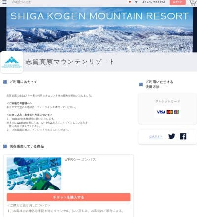
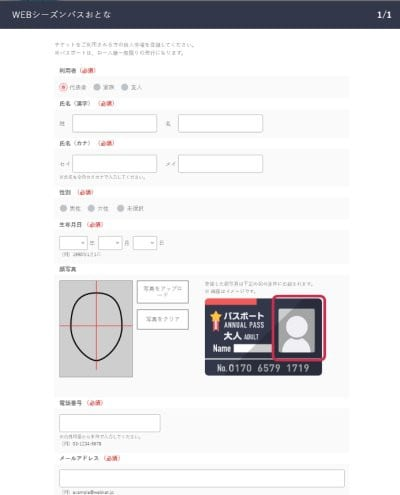
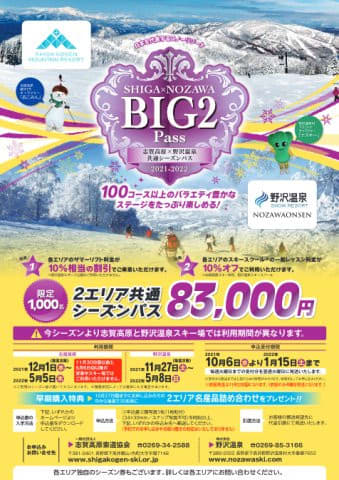
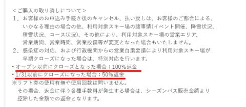

# 2022志賀高原シーズン券のWeb申し込みスタート！…野沢共通Big2パスは申込書郵送でWeb受付無し

📅 投稿日時: 2021-10-08 01:58:07

🏷️ カテゴリ: [スキー雑談](c1f9d2cb7478308da16419928ea3945e9.md)

いやー．

先ほどの地震，そこそこ揺れましたね…

ちょうど会議中だったので，

「今，日本は地震で揺れてるので

ちょっと待ってね！！」

…って感じだったんですが．

こっちは家具がミシミシいうくらい

揺れてるのに，画面の向こう側は

地震など関係なく，全く冷静に

説明を続けているのが不思議な

感じでしたね…

その瞬間，説明者側ではないこっち側は

カメラをONにしている人が少なかった

けど．

こっちがみんなカメラをOnにしていたら，

日本側がみんないきなり慌てだすのを見て，

「日本では一体何が起きたんだ？」

と不思議に思ったことでしょう…

そして．

画面の向こうがガタガタ揺れているのを

見た後，停電でも起きて，日本側が

みんな切断されたら，

「日本は地震で壊滅したのか？」

とか思われそう…

とりあえず，この地震で被害にあった方が

いないことを願うばかりですが．

皆さん，大丈夫だったでしょうか？

さて．本題．

最近ではすっかり忘れ去られてる気が

しますが．

一応，このブログがスキーBlogであることを

思い出して，今日はスキーの話題を行って

みよう！

えー．

本日，10月6日より．

[志賀高原のシーズン券申し込み受付](https://webket.jp/pc/ticket/index?fc=00304&ac=0201)が

スタートしましたね～…

（[Webket志賀高原シーズン券申し込みページ](https://webket.jp/pc/ticket/index?fc=00304&ac=0201)より）

一昨年まで，申込書を郵送するという，

極めて原始的な申し込み方法しか

許されなかった志賀高原シーズン券．

昨シーズンより，Webで顔写真を

アップロードすれば，クレジットカード決済で

シーズン券が申し込めるようになり，

便利になりました…！

…ただ．

志賀高原と野沢の両方で利用できる，

Big2パスの方は…

（[志賀高原索道協会ホームページ，Big2パス案内ページ](https://www.shigakogen-ski.com/uploads/21-22_BIG2pass-1.pdf)より）

相変わらず，申し込み書郵送での

江戸時代のような受付方法しか

認められないようです…←いや，江戸時代には郵便制度ないから

で．

志賀高原共通パスも，

BIG2パスも，

どちらも昨シーズン同様．

感染症対応や行政機関からの営業自粛要請が

あって，

シーズンイン前にクローズになれば100％返金，

1月31日以前にクローズになれば50％返金

というルールのようです…

うーむ．

おそらく今シーズンは，スキー場が営業

出来なくなるほどのひどい感染状況に

ならないと信じたいけど…

昨年も書いたけど．

1月ごろに状況が悪化したものの．

意地で2月1日ギリギリまで営業してクローズ

とかいう技を繰り出して．

返金もされないのに2月以降滑れない

という悲惨な状況にならないことを

祈るばかり…

## 💬 コメント一覧

### 💬 コメント by (なるなる)
**タイトル**: Unknown
**投稿日**: 2021-10-08 07:33:02

「意地で2月1日ギリギリまで営業してクローズ」コレ超怖いです。

去年は、GoToとかで宿泊費にリフト込みにすれば還元されるだろうとか、

クローズされるリスクを考えて、買わなかったんです。

結果、GoToは無くなったけど、宿もリフトも普通にやっていて、(自粛しているSさん

ごめんなさいと思いつつ)買っといた方が良かったです。

20日くらいしか行けないので、悩ましいです。

### 💬 コメント by (スシネコ)
**タイトル**: ズン券は無理でも
**投稿日**: 2021-10-08 14:41:04

昨日の地震には驚きました。真っ先に心配したのが「メンテに出したばかりのスキー板が倒れてないか」というのは内緒。

今までシーズン券というのは、近くですぐ滑れる地元の方々が買う羨ましいもので、首都圏から行く者には無縁だなぁ~と思い込んでいたのですが、昨年、それが大間違いだと知ることに・・・（笑）

コロナで懇親会が減って浮いた小遣いで、今シーズンは大いに滑りたいと思います。コロナが収束しますように。

### 💬 コメント by (レインボー74)
**タイトル**: Unknown
**投稿日**: 2021-10-08 15:12:01

古き良き伝統をかたくなに守り続ける(というか時代の進化についていけない)、私のような、今さら覚えてもという極めて冷静沈着な(カウントダウンまっしぐらな)若者にとっては、志賀野沢券(ビッグ2)のような、江戸時代的な方法が、とても安心できてありがたいのです。これ以上何を便利にしたいのか、わかりません。

ところがです。私は鮎釣りでずーーっと家に帰っていないのですが、今日、妻が「83000円もするの？」

そう、気付いてしまったんです。嘘は嫌いな私ですが、妻には何でも必要嘘をつき続けています。

スキーってこんなにお金がかかるんだ、なんて気づかれたら一大事。

「83000円を120日で割ると、１日あたり700円だよ。安いよね。」

うまく鬼嫁を納得させることに成功した、知能犯の私でした。

### 💬 コメント by (Skier_S)
**タイトル**: シーズン券
**投稿日**: 2021-10-09 06:49:11

＞なるなるさま

志賀のシーズン券，8万円近くしますから考えますよね…

でも，志賀は日券が高いので，10日券＋4日券でシーズン券より高くなりますから，

20日行けば圧倒的にシーズン券の方がお得ですよね．

＞スシネコさま

関東在住で，シーズン券を2枚も3枚も持っている人が

私の周りには何人かいますから（笑）．

おかしな人が焼額には集まってます…

＞レインボー74さま

あら！

今までリフト券いくらしているか隠してたんですか！！

でも，100日以上滑ったら十分以上に元を取ってますよね…

83000円でも安すぎるくらいじゃないですか（笑）

今シーズンは，もっと多くの日数滑って，さらに単価を下げてください！！

### 💬 コメント by (アリス)
**タイトル**: Unknown
**投稿日**: 2021-10-09 20:34:58

S様

こんばんは♪

早速シーズン券申し込みです♪

写真は自宅でデジカメで撮って編集して添付です。

Sさん海外のかたとWebで会議してるって、英語が堪能なんですね？

レインボーさん、イニシャルナンバーが73→74に変わりましたね・・・

### 💬 コメント by (Skier_S)
**タイトル**: ＞アリスさま
**投稿日**: 2021-10-10 01:27:23

シーズン券申し込みましたか！

どうせ今シーズンは12月からしか使えないので，私はまだちょっとのんびり

しています…

ちなみに，私は英語は大嫌いです．

ホントに嫌いなんです…

