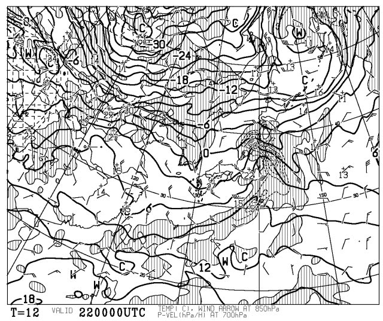
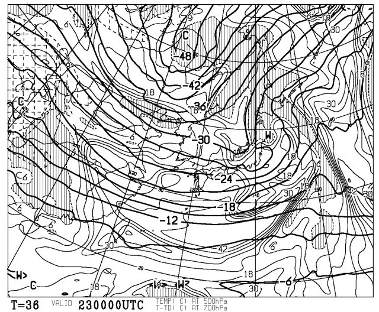
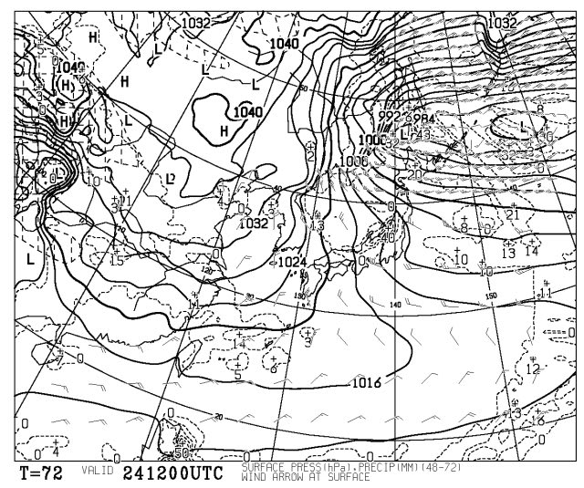
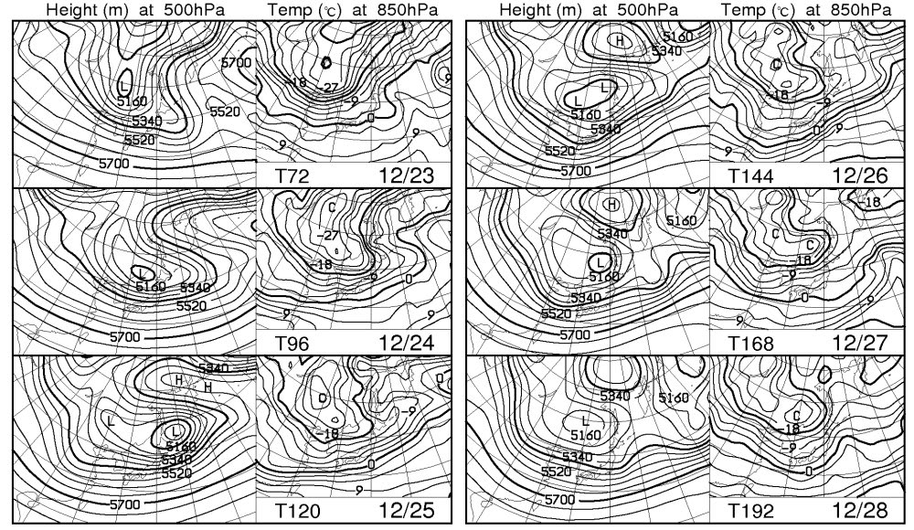

# 22日の朝を乗り越えれば今度こそ雪

📅 投稿日時: 2010-12-22 00:50:15

雪不足のこの12月ですが．

明日の朝，また微妙な天気です．

今は雪が降ってるようですが…

このまま朝まで雪であってくれればいいのですが．

こんな感じで，低気圧の通過に伴って，+3度や+6度の線がグニャっと北に

折れ曲がってます．低気圧に向かって，南の風が吹き込んでいるエリアです．

ちょうど信州や群馬のスキー場のある辺りですね．

んで，低気圧が接近しているので，降ります．

850hpaといえば，標高1500m．ここでも気温がプラス3度とか6度とかって

言ったら，降るものは…雪じゃないな…

…もしかすると，22日の朝は雨かも…（涙）

でも．その後．

これは23日の朝9時の500hpa図ですが．

-30度の線が能登半島付近にまで南下してます．

500hpaで-30度の線は，そこそこの量の雪が降る目安なので，23日木曜は雪ですね～

降りますね～

で．その次．24日の金曜は…

…なんじゃこりゃ．

強烈な冬型ですね．

かなり降りそうですね．

で，

これを見てわかるように，28日まで，日本はおおむねすっぽり850hpaで0度以下の

エリアに囲まれています．

冬型が続いて，山沿いは日が射さず，雪の日が続きそうです．

やっと冬が来たか？？？
