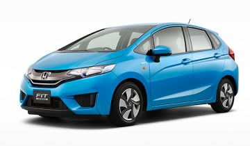

# FIT HYBRIDに乗ってみた…試乗レポート

📅 投稿日時: 2014-06-30 02:45:37

ってことで．

前回は，VEZELに試乗した際に．

実は，FITのHYBRIDにも試乗してみたんですね～

知らぬ間に，HYBRIDにも4WDが追加されていたみたいで…

今回の試乗車はFFでしたが．

ってことで，

時々散発的に入る自動車試乗レポート．

今度は，FITハイブリッドです．

では，どうぞ～！

---

FIT　HYBRID

（HONDAホームページより拝借）

VEZELのあとに乗ったので，内装やシートの質感，遮音性，

タッチ＆フィールはやはりVEZELに比べると

かなり落ちる感じ…

電動パワステも，しっとり感がない，

ちょっと安っぽい手ごたえ．

ただ，DCTの出来はいいですね～．

不自然な変速感やショックもなく，

何の違和感もなく変速されて行きます．

エンジンの始動・停止の衝撃も無し．

ただ，遮音は手を抜いているのか？

スタート時のモーター音がしっかり

聞こえてきます．

エンジンのかかり始めは静かで，

「あ？エンジンかかったんだ？」

って感じで，なかなか良いのですが．

アクセルを踏み込むと，

盛大なエンジン音がインパネを

透過してきます．

エンジンルームを開けてみると．

最近の横積みFF車の流行か，

排気ポートは後方．

キャタライザ付排気管がバルクヘッドの

直近に走っているので．

もう，インパネのすぐ向こうが排気管なわけですね．

…これは，排気ノイズがそのまま

インパネ側に伝わってくるわけだ…

VEZELと同様，このエンジン音の「頑張っている感」が，

実際の車の速さをスポイル．

アクセルを踏み込むと，回転数を

かなり引っ張ります．

VEZELより遮音が甘いので，アクセルを大きく

踏み込むと，エンジンが一生懸命頑張っている

感がひしひしと伝わってくる感じ．

実際速くて，そこそこのパワーが出てるんだけど，

軽々と引っ張っている…というより，

すごい汗をかきながら必死に頑張っている感じがして．

「パワー感」が感じられないのがもったいない…

アクセル開度が小さい領域では，このクラスと考えると

かなりの静粛さを保っているんですけどね．

＃モーター音はかなりはっきりわかるけど

でも，もう少し遮音がしっかりしてくれたらいいかな～．

街中のみの試乗だったので，

コーナーを攻めた時の感じなどは

分からないです…．

室内は，このクラス，外観のコンパクトさを考えると

十分広い！

2-3人での旅行なら，トランクもこれで十分！

まぁ，街中や郊外を走る足としての用途には，

これで十分なレベルですね～．

## 💬 コメント一覧

### 💬 コメント by (ゆうこ)
**タイトル**: 契約してきました
**投稿日**: 2014-07-05 19:22:01

悩みましたがやっぱりスバルのフォレスター契約してきました。

納車はお盆明けみたいです。

私もスバリストの仲間入りできそうです！

### 💬 コメント by (Skier_S)
**タイトル**: ゆうこさま
**投稿日**: 2014-07-05 21:00:35

フォレスター行きましたか！

おめでとうございます！

まさか，ターボですか？（笑）．

LEVORGもいい車なんですけど（＾＾；

スバル乗りの仲間入り，大歓迎です．

スバルの4WDはよくできてますから，

来シーズンのスキーが楽しみですね～

志賀の登り坂もすごい安心ですよ～！！

### 💬 コメント by (ゆうこ)
**タイトル**: さすがにターボは
**投稿日**: 2014-07-05 21:31:33

予算の関係からターボは無理でした。

営業の方ががんばってくれて16万キロ乗って熟成されたフィットの下取り額をアップしたりしてくれて、納得の値段になりました。ありがたいです。

早くスキーに行きたくて仕方ないです。

とりあえず、サーフィンで行って砂浜で4WDを試してきます。

### 💬 コメント by (Skier_S)
**タイトル**: ゆうこさま
**投稿日**: 2014-07-06 00:41:55

レガシィも2.5LのNAでなんら不満は

ありませんので，NAで十分では…

私のレガシィ君は，スキーシーズンは

通勤含めてリッター12km前後，

スキー往復だけならリッター13km程度，

高速だけならリッター15～16km走りますし．

ターボではこうはいかないかと…

フォレスターのアイサイト，自動で停止保持が

できないというのがちょっと惜しいのですが．

アイサイトも便利ですよ～！

