# 2019年8月，4度目のモアルボアル・小6の娘Cカード取得1周年！その24…午後のダイビングは，これまでと違う砂地ポイント！

📅 投稿日時: 2020-09-05 05:32:37

🏷️ カテゴリ: [ダイビング日記](ce3a7a8d424d112fce83ee85c81a0e344.md)

ということで．

昼休みにプールで遊びまくった娘．

懲りずにそのままボートに乗って，

3本目のダイビングへ向かうわけ

ですが…

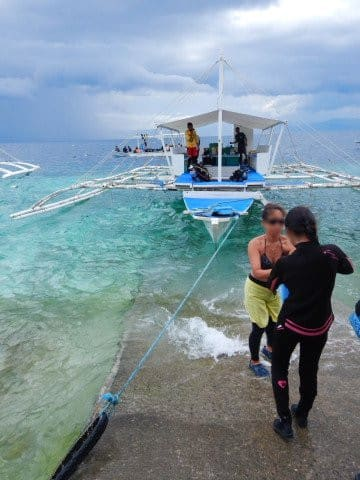

どうも，今日の3本目に潜りに行くのは，

わが家族3人だけのようで．

ボートクルー以外は，わが家族と

ガイドのアサミさんだけという，

我が家の完全チャーター状態！

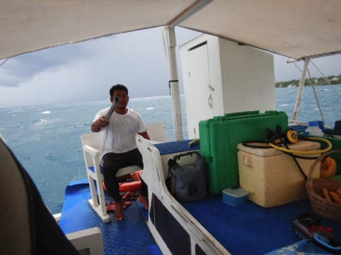

アサミさん「どこのポイント行きたいですか？

　どこでもいいですよ」

…そうか．

貸し切りということは，完全好きなところに

行けるわけだな！

うーむ．

どこに行こうか…

またハウスリーフのガンガン群れを

見てもいいんだけど．

さっき潜ったばかりだし．

それ以外は，ぺスカドール島やトブレサンクチュアリ

といった，サンゴとハナダイ・スズメダイ系が

乱舞するポイント…というパターンが続いて

いるので．

私「砂地ですかね…．ハゼとかがいる，

　砂地ポイントに行ってみたい！」

そう．

何度もモアルボアルに来ているけど．

本格的な砂地ポイントを攻略したことが，

これまで一度もなかったので．

たまには変わったポイントを…

と，口にしてみたのですが．

アサミさん「砂地…ですね（キラーン）」

と，それを聞いたアサミさんの目が

光ったのを，私は見逃さなかったのだった…

あんまり砂地ポイントをリクエストする

人は少ないだろうし．

滅多に潜れない砂地ポイントに行けるのに，

喜んでいるのかな…？

ってことで．

やってきたのは…

「トンゴベイ」というポイント．

その名の通り，ちょっとした

入り江っぽくなっていて．

最大深度10m程度の，超浅い

ポイントです…

早速エントリー！

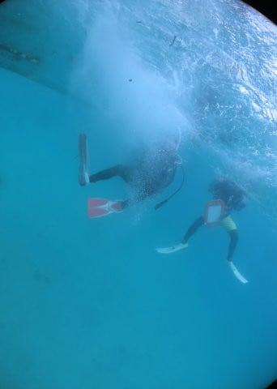

…って．

いきなり浅いですね…

ボート下，深度3-4m程度かな？

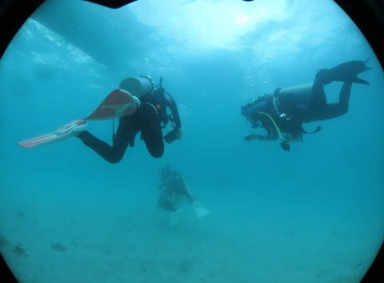

そして…

底がかなり細かい砂地なので，

ちょっと砂が舞い気味で，透視度は

5mちょい…

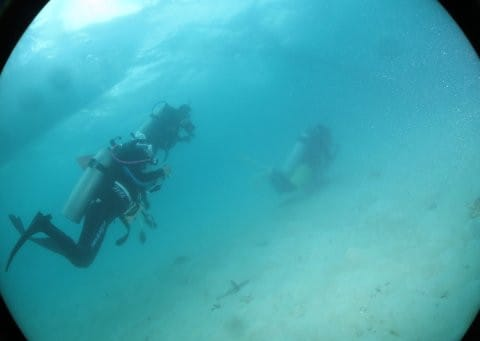

うむ．

さっきまでのポイントとえらい違い．

まぁ，何かがいそうな砂地ではある…

と，思っていたら．

まずはアサミさん．

ごあいさつ程度に，クジャクスズメダイを

ご紹介…

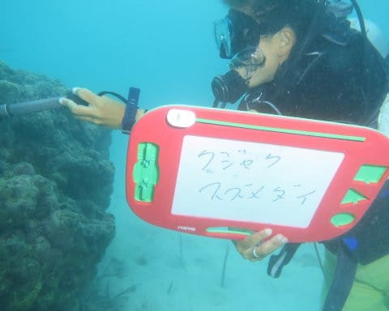

この右側のやつですね．

…あんまりきれいに撮れてませんが（涙）

ホントはもっと青くキラキラした

感じの，きれいなお魚です…

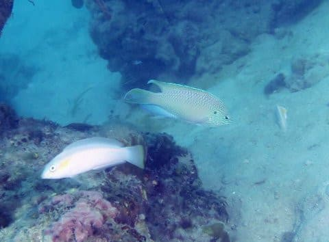

そして，次に繰り出すのは…

読みにくいけど，

ニセアカホシカクレエビ，

と書かれてますね

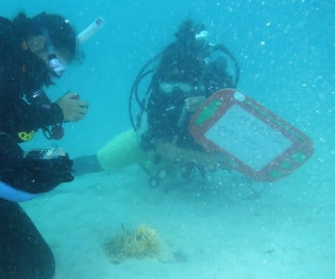

はい．

こいつです．

この，透明ボディに白と紫の

ストライプのエビ．

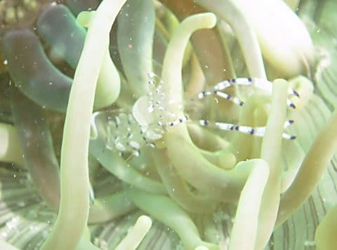

私のマクロ撮影がヘタなのは

突っ込まないでください…

そして，次々繰り出される

アサミさんのマグネットスレート．

今度は…カレイの仲間？

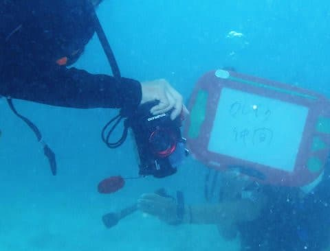

あぁ…

こいつですね．

砂と同化して分かりにくいですが…

真ん中に平べったい魚がいるのが

分かりますか？

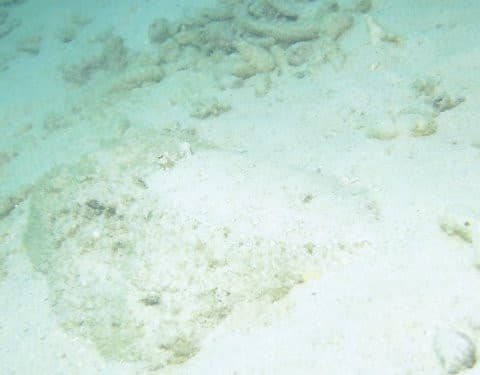

さらに，ミニサイズの

ヤスジチョウチョウウオの子供や…

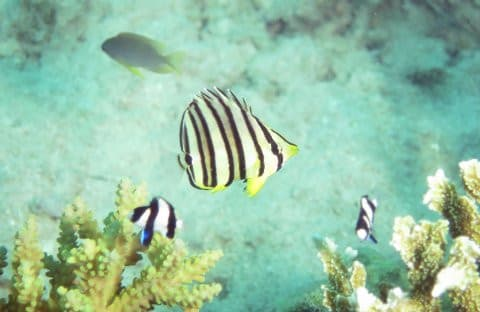

オトヒメエビ2匹を，まるで門番のように

従えるクマノミとか…

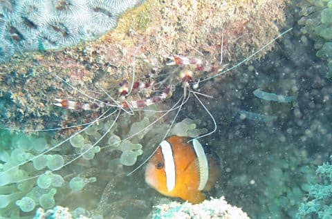

そして．

指先と比べるとその小ささが分かる

超ミニサイズのクマノミ赤ちゃんとか…

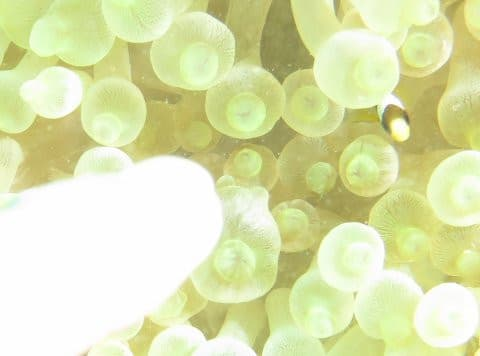

さらに，これは…

オトメハゼのペアですね．

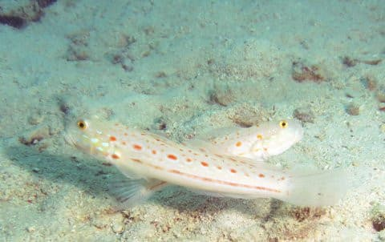

なぜ，これがオトメハゼって

名前なんだろう…

そして，砂の上には，

そこらじゅうにハゼが飛び回っていて．

これは…シノビハゼの仲間かな？

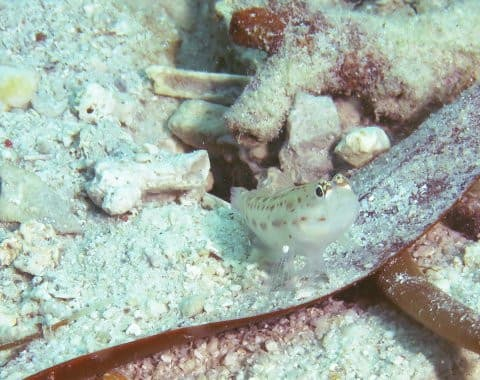

こいつは…ダテハゼの仲間だと

思うんだけど．

頭が黒いし，ハチマキダテハゼでも

ないよね…

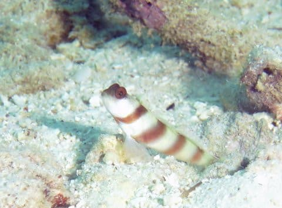

そして．

こいつはミニサイズのギンガハゼですね．

…なかなか近寄らせて

もらえなかった…

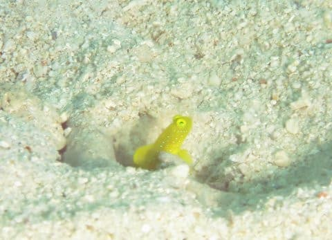

ってな感じで．

ハゼエリアで何度も匍匐前進を

繰り返し，ハゼに引っ込まれない

ように近づいて撮影することを

繰り返していると…

そろそろダイビングも終盤．

今度もアサミさんのマグネットスレート

が繰り出されますが…ミナミホタテウミヘビ！

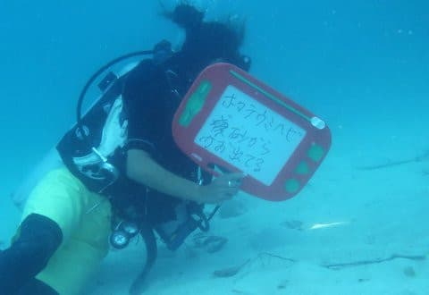

砂から顔を出している，こいつですね…

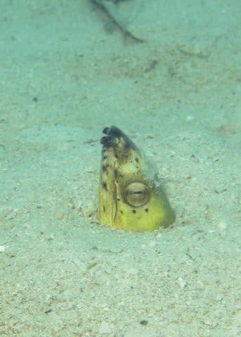

娘も撮影中！

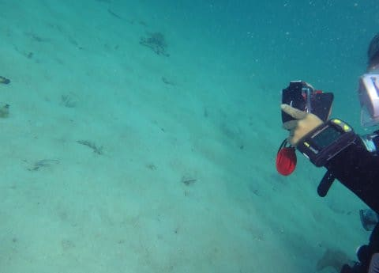

さらに一番最後に．

ストラップウィードファイルフィッシュ

とかいう長い名前の魚を見せてもらったら…

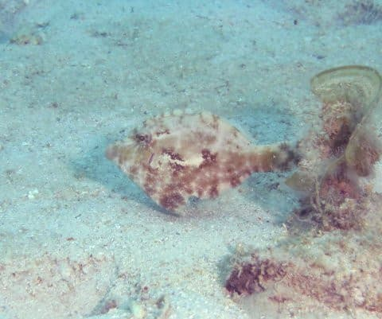

ダイブタイムも，もう50分．

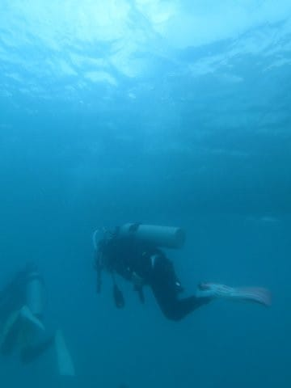

エグジットです！

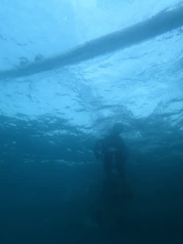

ってなことで．

ダイビング中，次から次へと

いろいろ見せてもらったこのダイビング．

ガイドのアサミさん，いっぱい見せたいもの

あったんだろうなぁ…

砂地ポイントと言ったとき，

目が光ってたもんなぁ…

久しぶりに，日本人ガイドさんらしい，

息つく間もなく次から次へ見どころを

繰り出してくれるガイディングを

堪能した，この1本だったのでした…
