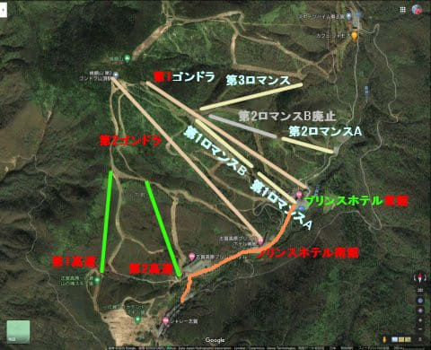
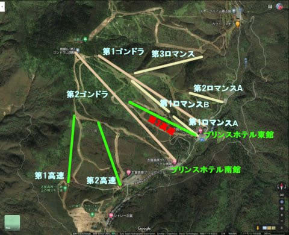
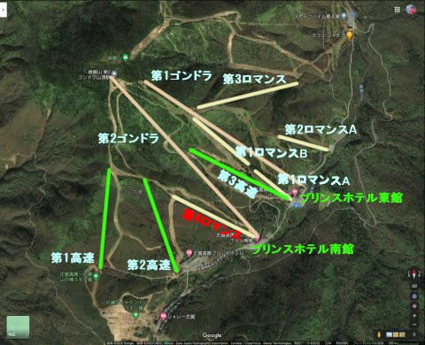
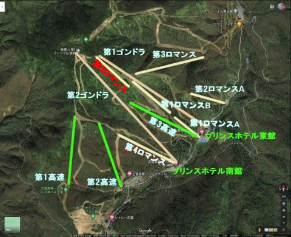
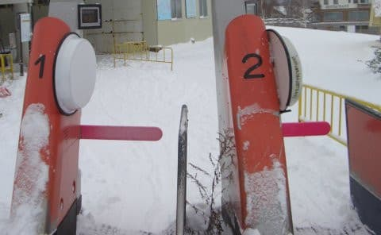
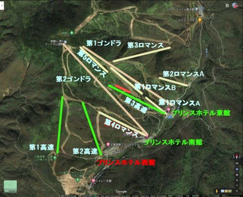
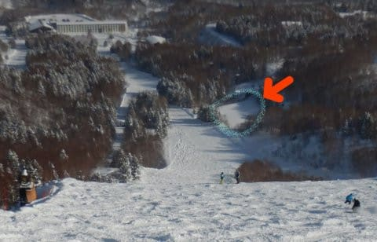

# 焼額山スキー場の歴史を振り返ってみる3…スキーバブルからオリンピックまでの，志賀高原スキー場ピークの時代

📅 投稿日時: 2020-09-24 03:48:00

🏷️ カテゴリ: [スキー雑談](c1f9d2cb7478308da16419928ea3945e9.md)

えー．今回は．

[第1回，焼額オープン時の1984シーズンの様子，](ecf9ef2318d00e5a9f4905a77d965f4f6.md)

[第2回，第2ゴンドラができる1988シーズンまでの歴史](ecbab91b3def3f225ca2f665143d0d3fc.md)

につづく，焼額山スキー場の歴史の第3回．

1989シーズンから，オリンピックの

1998シーズンまで．

黄金の10年間の歴史を振り返ります…

ということで．

5年目の1988シーズン，第2ゴンドラ側がオープンして

一気にエリアが倍以上に広がるとともに，一の瀬と

繋がったわけですが．

その翌年以降も，まだまだ焼額のパワーアップは続きます…

○6年目　1989シーズン

この年，第3高速リフトが完成！

第3高速につながるイーストコースと，

（できた当時はナイターコースって言ってた気が…）

…記憶が確かなら，そこにつながる

スーパージャイアントスラロームコースも

同時に完成したような気が…

あ，そうそう．

この年にはまだミドルコースはできてません．

で．この年から，東館のナイターは，

1ロマA線でのナイターが終わり，

第3高速がナイター営業になったんですよね…

…そういえば，前回の記事で書き忘れてましたが．

1ロマをA線，B線で2分割した大きな目的に

A線の緩斜面側でナイター営業ができるようにする

というのがあったことを書いてませんでした…

いやー．

しかし．

ゴンドラ＆高速リフト2本かけた次の年に，

フード付きクワッドを架けて，

ナイター設備も作るとは…！！

当時はまだ高速リフトが珍しかった時代．

高速リフトが3本もあるスキー場は，

激烈に贅沢で，当時ほぼ日本最高の輸送力を

もったスキー場だったんじゃないかな…

こんなものを，2年間で志賀高原に作り上げた

国土計画の恐ろしさ．

当時は長野オリンピック開催が決まり，

岩菅山もスキー場にするんだ！！！

と，国土計画の鼻息が荒かった時期でしたね…

○7年目　1990シーズン

このシーズン，私は志賀高原に行ってないのですが…

確か，焼額は何も変わらなかった気がします．

○8年目　1991シーズン

この年も，まだまだ焼額は投資が続きます．

バブルが続いてます．

この年，

第4ロマンス

が完成しました！

同時に，第4ロマンス沿いのナイター設備も

出来たんじゃなかったかな？

これで，東館宿泊者は第3高速，

南館宿泊者は第4ロマンスでナイターが

滑れるようになりました…

なので．

昨年ナイター設備を作り，「ナイターコース」と命名した

第3高速沿いのコースが「イーストナイターコース」，

第4ロマンス沿いのコースが「サウスナイターコース」

という名称になったんじゃなかったかな？（記憶不正確）

…いまは，「ナイター」が取れて

「イーストコース」

「サウスコース」

になってますね…

今は，サウスコースは貸し切り以外でナイターを

やらなくなって，寂しい限り…

当時は，昼間にスキー場がかなり混んで

あまりたくさん滑れなかったので．

ナイターまで滑ろう…って人が多かった

ですね～．

ナイターもかなり人がいた思い出があります．

で．そのほかに．

この年に，今はビギナーズコースと呼んでいる，

パノラマインコースを滑った思い出があるので．

この年かこの前の年に出来た気がするのですが…

当時はすごい幅の狭いコースで，

滑りにくかった思い出が…

○9年目　1992シーズン

そして．

この年，焼額にまた新しいリフトが架かりました！

そう．イチゴン山頂につながる，

第5ロマンス

です！

これで，焼額のゴンドラ＆リフト，全て揃いました！

リフト・ゴンドラに関しては，

この時に完成した11本体制がピークです…

この第5ロマンス．

乗り場が非常に見つけにくいところにあり．

GSコースとSGSコースの分岐をSGS側に

入ってから，突き当り右に大きく曲がるあたりに

あったのですが．

オリンピックコース側からは入りにくいし．

1ロマBから乗り継ぐのは大変…

だもんで，全く人気が出ず，人が乗っていた

ことは無いし．

そもそもシーズンでも，正月のすごい混んだ

時期とかしか動かず．

このリフトが架かったのはいいけど，

動いているのは数回しか見たことが

ありません…

焼額マニアの私でも，

2回しか乗ったことがない

という，超レアもののリフトでしたね…

焼額は…というか，志賀高原はこのころから

オリンピックの1998年までがピーク．

焼額は，この最大構成のリフト陣容がしばらく続きます．

○10年目　1993シーズン

この年は，コースやリフトの変化は無く．

志賀高原のゲートが自動化

して，全リフト・ゴンドラにゲートが

ついたのが大ニュースでした…！

○11年目　1994シーズン～13年目　1996シーズン

投資が一区切りついたのか，しばらく変化のない

シーズンが続きました…

○14年目　1997シーズン

この年，プリンス西館ができました！

…これにて，焼額に現在揃っている設備，

全て完成です！！

…あとは現在に向かって縮小するのみ…（涙）

そして，多分．

ここら辺記憶があいまいなのですが…

この年あたりに，第3高速の横，

イーストコースと逆側．赤く印した

ミドルコースが出来たんじゃなかったかな…？？

確か，ミドルコースと同時にミドル連絡コースも

できたような思い出があるんですが…

1999年の志賀高原全山マップを見ると，

ミドル連絡コースはこの年はまだ

なかったようですね…

ってことで．次はついにやってくる，オリンピックの年．

○15年目　1998シーズン

この年は長野オリンピックの年！

長野オリンピックのアルペン男女回転．

スノーボード大回転が，

当時のスラロームバーン，今の呼び名では

オリンピックコースにて開催されましたね…

オリンピック開催前，数週間前からガンタイプの

人工降雪機で雪じゃなく水を撒いて，

ガチガチに凍らせていたのが印象的でした…

…焼額のコース自体は昨年と全く変わりませんが．

イーストコースの競技ゴールになるあたりに

プレスセンターの建物とそこにつながる道が

造られ，ゴールをぐるっと取り囲むように

仮設スタンドが建てられてました．

今でも3高に乗ると建物の跡地と道路の

トンネルが見えますが．

オリンピックコース途中から下を見た時に

見えるこの平地が，プレスセンター跡地の

はずです…

で．

この年は．ミドル連絡コースと今は無きエキスパート

コースが無いくらいで，コース・リフトとも

ピーク．

この頃は，この平和がいつまでも続くと

思っていたのでした…

（まだ続く…[次回](ed91f8f5b9a240a0fb9ec5089bf2122a3.md)は1999年の志賀全山スキー

　マップから，ピーク当時の志賀高原スキー場

　全体の様子を掲載！）

## 💬 コメント一覧

### 💬 コメント by (アリス)
**タイトル**: 焼額山の歴史理解できました
**投稿日**: 2020-09-24 11:17:30

Skier_S様

15年にも及ぶ焼額山の増設と地形の変化やっと理解できました。

以前より拝見していて、西館がないって思っていたのですが、オリンピックの前年に出来たんですね。

長野オリンピックが懐かしいです。

ついこの前だと認識していたのですが、もうオリンピックから20年以上過ぎていました。

ヘルマン・マイヤーかっこ良かったです。

確か、あの年はアトミックのスキー板がめっちゃ流行った気がします。

### 💬 コメント by (Kon Suke)
**タイトル**: 見ればよかったかもですが！
**投稿日**: 2020-09-24 13:37:53

S様

「ちなみに，わたスキのスタントの方は，スキーが上手かったんでしょうか…？

ちょっと気になります．」

もちろん、さっさと滑り出してしまい、見ている暇はありません。

今も昔も変わりません。

### 💬 コメント by (はなげ親分)
**タイトル**: Unknown
**投稿日**: 2020-09-24 14:07:28

堤さん、反対があっても強引に岩菅山にリフトを架けて欲しかった・・・

### 💬 コメント by (Goku)
**タイトル**: Unknown
**投稿日**: 2020-09-24 21:16:41

和合会の猛反対を押し切って焼額山を造るにあたり、その代償として『ごりん高原』を造ったと言われています。

でも、本当は堤さん『町ごと売ってくれ！』と言ったとか言わなかったとか・・・

確かにあの頃、焼額山と苗場を結ぶゴンドラを掛ける構想もあったようなので、もしもですが、ごりん高原が残っていて、そこからヤケビにゴンドラが架かれば、湯田中からごりん、焼額山、岩菅、遥か苗場を結ぶ、スーパースキーエリアが誕生していたかもしれません。

夢のような話ですね。

### 💬 コメント by (Skier_S)
**タイトル**: 歴史はまだ続く
**投稿日**: 2020-09-25 01:03:30

＞アリスさま

そうなんです．

西館はオリンピック関係者用宿泊施設として，焼額スキー場

開設15年後に出来たんです…

長野オリンピック，私は見てないんです．

志賀高原が混むかと思って，遠くのスキー場に逃げてました（笑）．

でも，ヘルマン・マイヤーすごかったですよね．

…あの，八方のネットへの全力つっこみとか←そこか！

＞Kon Sukeさま

…そうですよね．

すぐ滑り出しちゃって，見てませんよね…

限りなく予想通りのご回答ありがとうございます（笑）．

＞はなげ親分さま

…でも，岩菅がスキー場になってても，焼額だけですら

次々リフトが消えていくこの状況だと

「岩菅山側ゲレンデ全面クローズ」

となってても不思議じゃないですよね…

おそらく，かなり高い確率でそうなってた気がします．

あの世界選手権をやった雫石でさえ，ゴンドラ2本が撤去され，

すごいしょぼいスキー場になっちゃうくらいですから．

＞Gokuさま

和合会の土地を通らなくても人が送り込めるように，

ごりん高原を作って，焼額までつなぐ予定だったという

噂も聞いているのですが…

そして，岩菅山をスキー場にして，苗場までつなぐ

壮大な構想．

実現していたら…すごかったですよね．．．

### 💬 コメント by (yumi)
**タイトル**: Unknown
**投稿日**: 2020-09-25 01:34:33

Ｓさぁ～ん🎿🏔️🎵

ごりん高原👉️焼額山を繋げるという噂は、ワタシも聞いた事が有ります👂️

もしも 繋がってたら 徒歩🚶👣💨２分だったんだぁ～😁

惜しい・・・・・😓

### 💬 コメント by (ゆーき)
**タイトル**: Unknown
**投稿日**: 2020-09-25 12:22:14

長野五輪は、大学受験と重なってみれんかった人です。生上村愛子見たかったなぁ。。。ってのは、さておき、白樺コースにリフトがほしいけど、新設は無理ですよね、そもそも損益が苦しそうなのに、なんとか、現状維持をお願いですね。

### 💬 コメント by (Skier_S)
**タイトル**: 結構盛り上がりますね…この話題
**投稿日**: 2020-09-26 01:28:12

＞yumiさま

ごりん高原と焼額繋がってたら，すごかったと思いますが…

ごりん高原，駐車場がすごい小さかったので，徒歩で行けるyumiさんみたいな

近所の人しか使えませんよね（笑）．

＞ゆーきさま

白樺コースの第1高速，復活してほしいですよね…ホントに．

でも，とりあえず第3高速もいろいろヤバそうだし，今は

なんとか現状維持でお願いしたいところ…

