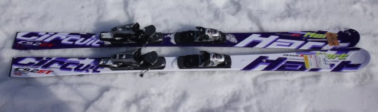
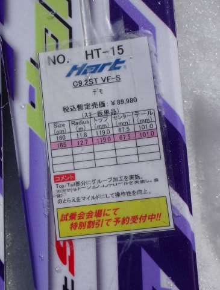

# これで一区切り…2015シーズンモデルのスキー試乗レポート第10回…HART編

📅 投稿日時: 2014-04-05 00:00:03

えー．

この週末も，当然志賀高原に行くわけですが．

明日は時折日も射しそうな，真冬の冷え冷えで

恵まれたコンディション．

楽しめそうですね～！！

＃午後はゲレンデが荒れて，アイスバーンが顔を

＃出すかもしれないけど…

で．

あと4時間後に出発ですが．

とりあえず．

今日は，3月に試乗した13機種のスキー板の，

最後の試乗インプレッション．

今度はハート編です．

では，どうぞ～！

---

HART C9.2ST VFS 165cm

小回り基礎用．

去年のC9.2STとほぼ同じ性格ですねー．

テールの張りが強めで，トップ側は比較的ソフトな感じ．

一瞬違和感を感じるけど，

谷回りでちょっとトップより荷重で落ちていくと，

トップの柔らかさで板のトップがたわみ，

板が回り込んでいき．

板が体の下を通過するときに，テールの強さで

しっかり板を走らせることができて．

板の後ろに荷重を抜いた後，また落ちていくと

トップからグリップしていく…

という，トップからテールに荷重を抜いていく

滑りをすると，その本領を発揮する板．

この滑りをするとすごく面白い小回りができるけど，

トップだけを抑えるとか，テールに乗って滑る…

という滑りをする人は，「うーん？」って感じで．

あまりよさがわからない板かも．

滑りの許容範囲が広いわけではいので．

万人におすすめではないけど．

この滑りをすれば，結構スピードに乗って

左右への振れ幅をとった深い小回りが

できるので，「お，面白い！」と思える板です．
