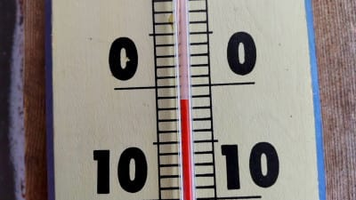
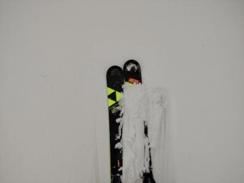
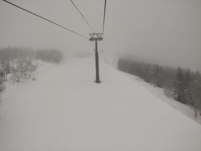
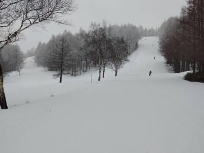

# 久しぶりにスキーに行かない週末…日曜の志賀高原は曇り，朝のバーンはかなり固そう．日が射さなければ昼間もそんなにひどく緩まない

📅 投稿日時: 2022-04-17 00:02:05

ってなわけで．

本日，志賀高原へは行けず．

家で資料を必死に作り，午後は会議に参加し…

と，仕事をした一日だったわけですが．

転勤で引っ越しした時も，

引っ越しした翌週には土日1泊2日で

スキーに行っていたし．

週末が海外出張出発日に重なった時も，

空港に行く前に滑りに行くなど．

よっぽどなことがあっても週末に

ゲレンデに行っていた私にとって…

仕事でスキーに行けないとは．

かなり悔しい…（涙）

ってなことで．

私が行けなくても．

特派員から志賀高原情報が送られて

来るわけで．

特派員情報によると，朝は久しぶりに

マイナス気温！！

そして，昨晩から2-3cmの積雪が

あったようです！！

ただ，むちゃくちゃ重い雪だった

ようですが…

でも，積雪のおかげでひどい

ガリガリバーンにはならなかったようで…

で，天気は予想を裏切り，

晴れでは無くて終日曇り空．

時折ガスも出たようです．

ただ，昼間は気温がちょっと

上がったので．

積もった雪が融けて，激烈な

ストップ雪になったようですね…

うーん．

この時期，雪が降るのはいいことか

悪いことか，微妙…

ってなことで．

私はまだ仕事が終わってません．

終わってませんが…

早く終われば，明日日帰りで行くかも？？

仕事を早く終わらせないと…

というか，終わってなくても

「必殺・終わったことにする」

という必殺技で行ってしまうかも？

とりあえず，明日の志賀高原は終日曇り．

朝はそこそこ冷えて，バーンは硬そう．

昼間は+5℃まで上がって，雪は緩むけど

そこまでひどいザブザブにならないかな…

しかし．

木曜，金曜と2日合わせて睡眠時間

5時間ちょいなのに．

今晩また睡眠時間2-3時間で日帰り志賀に

行けるのか？

ホントに仕事が終わるのか？？

乞うご期待！！←なにに？
