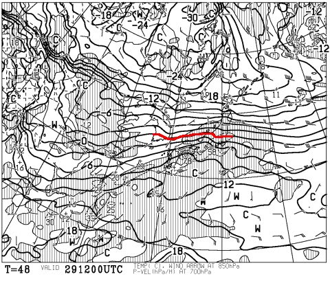
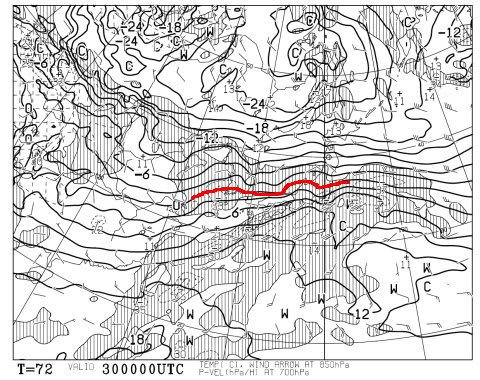
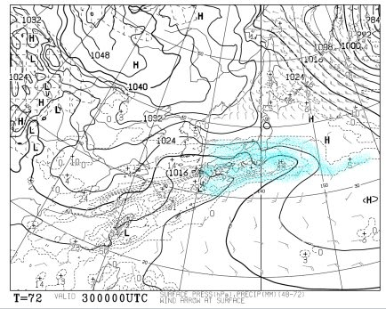
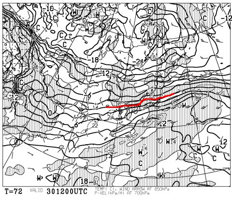
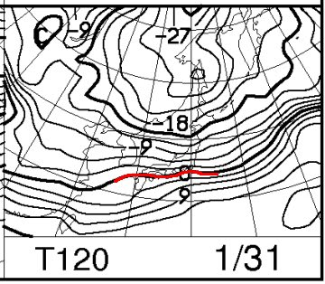

# 今日も天気予想…30日の志賀高原，雪か？雨か？？どっちだ！？？

📅 投稿日時: 2016-01-28 04:04:18

🏷️ カテゴリ: [スキー天気予想](c6554f5c3c106093b511a8daae23757e8.md)

えー．

ここしばらく，平日の睡眠時間が5時間台なのに．

週末，3時間の睡眠でスキーに行っていて大丈夫か？

と，心配になる今日この頃．

皆様いかがお過ごしでしょうか．

…本日も，御多分に漏れず，帰宅がこんな時間…（涙）．

だのに．

こんな時間にもかかわらず．

定例，水曜日の天気予想をやるのだ！←今日も天気予想なの？？というツッコミ多数

当然．

信心深い皆様は．

気温が冷える踊りを休むことなく踊り続けていることと

強く信じていますが．

…その，踊りの効果が出ているのかを見てみましょう…

まず，29日夜9時の850hpa気温図から…

うくっ！

微妙っ！

微妙に，志賀高原はぎりぎり0℃線の上…

これは，微妙．

夜なので，地上付近の気温は850hpa気温の

傾向より下がり気味になる…という要素と，

南風になっているので，850hpaの気温が低めでも

雨になる可能性ががある…という要素の，

両方を考えると…

微妙だけど．

現時点では，29日夜から30日朝にかけては，

かなり重い雪が降り．

朝には5～10cm積もってるかな～…という予想．

いや，標高が低いところは，雨です．

そして．30日の朝9時の850hpa気温図は…

うううううーーーむ！

これも，微妙っ！！！

しかし，なんだ，この能登半島付近で，

ポコッと0℃線が北に出っ張ってるのは？

…こいつが西から志賀高原に近づくので…

このでっぱりが志賀高原を通過するころは．

雨になる可能性，大（涙）．

地上天気図はこんな感じで，水色の降水域が

広く日本を覆っているので．

この日は終日，降ります．

でっぱりが志賀高原を通過する，朝9時ごろ以降は…

…降るのは，雨か…（涙）．

で．30日夜9時の850hpa気温図は…

うむ．

やっと，0℃線は志賀高原より南に下がっているので．

雪に変わってくれそう！

で，31日の850hpa気温ですが…

をを！

この日はしっかり冷えてます！

志賀高原には-6℃線がかかり，この時期としては

標準的な感じに戻ってます！

ってことで．

日曜は安心ですが…

未だに，0℃線のわずかなずれで，雨になるか雪になるかの

境界線上にある，土曜の志賀高原．

現時点の天気図のままだと…

土曜：朝9時ごろまで湿った雪．前の夜からの積雪は5～10cm．

　朝イチは，圧雪の上に，湿った重い雪が積もったコンディション．

　朝9時ごろから…雨になるか？？

　昼ごろにはみぞれ→雪に変わる．夕方には完全に雪．

　もし，午前中が雨なら…午後は雨で溶けたバーンが

　冷えて固まったうえに，モソモソと雪が積もっていき，

　ちょっと滑りにくいかな…

日曜：朝は意外と冷えてそう．朝は10cmちょいの積雪か？

　プチパフパフの朝かも．

　前日の雨がひどかった場合，下地は完全にアイスバーン化．

　…そうならないように祈りたいところ…

　天気は午前中は雪雲が残るものの，午後は晴れていく．

　気温は平年並みに戻る．

って感じですが．

とりあえず．

まだ，気が抜けません…

しかし，30日の予想天気図．

一昨日は「どうしようもなく終日雨」だったのが，

昨日は「もう少し頑張れば，雪になるかも…」

そして，今日は「午後は雪．午前も，あとちょっと頑張れば雪」

という感じで，予想がだんだん良くなってます！

…

…そうです．

その通りです！

これは，みなさんの踊りが効いているに違いありませんっ！！！

なので．

これからも休むことなく．

気温が冷える踊りを踊り続けましょう！←今日もこのオチか

＃そして，また明日の記事も，30日の予想がどう変化したかの

＃天気予想になってしまいそう…

## 💬 コメント一覧

### 💬 コメント by (ぴよ＠太田市)
**タイトル**: さすがに．．．
**投稿日**: 2016-01-28 10:24:30

さすがに会社では踊れないのですが

予報、変わってきましたね！

苗場、かぐらも雨から雪に変わりました

木曜日、雨降らないでくれると良いのですが．．．

### 💬 コメント by (デーコン)
**タイトル**: Unknown
**投稿日**: 2016-01-28 20:17:30

こんばんわ。

本日から、島根県出雲市に出張中です。

こちらは、冷たい雨が降ってます。(涙)

志賀も雨かな？

### 💬 コメント by (まいる)
**タイトル**: 雪になりそう
**投稿日**: 2016-01-28 23:37:03

お疲れ様です(^^)　冷え冷え踊りのおかげか週末は雪になりそうです(^^)

### 💬 コメント by (Skier_S)
**タイトル**: 踊りの効果が出ていますっ！
**投稿日**: 2016-01-29 00:39:56

＞ぴよ＠太田市さま

ダメです！

会社でも踊ってください（＾＾

…しかし，30日．

なんとか雪になってくれそうです！

木曜も雪です．ご安心ください！

＞デーコンさま

出雲は雨ですか…

大丈夫です．

明日も明後日も，志賀は，雪です．

…明日，またいきなり天気図が悪化しないことを

祈るばかり…

＞まいるさま

効きました！

効きましたよ～，

冷え冷え踊りっ！

これからも，雨になりそうな天気図になったら，

冷え冷え踊りを踊ればいいようです！

とりあえず，今のままの天気図なら．

土曜は雪になりそうです…

