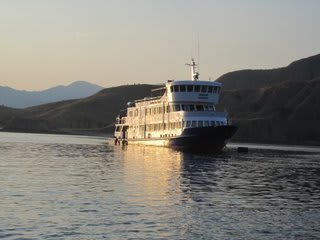
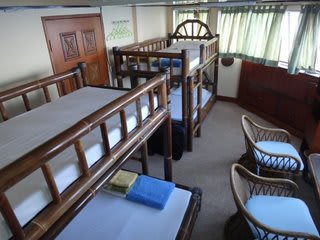
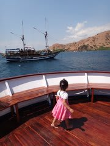
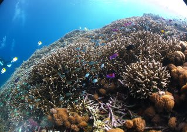
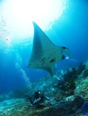
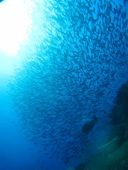

# さらば，コモドのサザンスタークルーズ

📅 投稿日時: 2012-06-26 01:48:44

🏷️ カテゴリ: [ダイビング日記](ce3a7a8d424d112fce83ee85c81a0e344.md)

えーーー．

まだ，スキーシーズンなんですけどね．

スキーシーズンに，ダイビングネタ書いてもあんまりウケないんですけどね．

私が夏の間，[こんな感じ](e71f0faf0d2dbf98590a16bb7abe5a502.md)や[こんな感じで](ed51443fc2a47ba9d20653f96ae4a0c2d.md)，子連れでお世話になった

コモドのサザンスタークルーズ．

残念ながら，[今年は運行しない](http://www.s-starcruise.com/maintenance.php)ことに決定したようです…

まぁ，いろいろあったようですが．

K澤さんが，ついに「しまじ」を下りることになったようで．

うーーーん．

「しまじ」のユーティリティーや，天国の6号室は気に入ってたんだけど.

運行しないとなったら仕方がない…

と思っていたところ．

個人的には非常に応援しているK澤さん．

「しまじ」を降りても，自前でクルーズを始める…という話で．

ウェブサイトが立ち上がってますね～．

[http://www.dream-asia-pacific.com/index.html](http://www.dream-asia-pacific.com/index.html)

むしろ，サザンスタークルーズのページよりおしゃれですね．

ブログも始まってます．

[http://d2i.blog.fc2.com/archives.html](http://d2i.blog.fc2.com/archives.html)

あー．

いつものとおりですね… 

ということで．

コモドクルーズレポートを見て，コモドに行きたい！と思った方．

ぜひ，[ここ](http://www.dream-asia-pacific.com/index.html)で予約をどうぞっ！

＃頼まれたわけでもないのに宣伝してしまった…

…でも，今年はもう，コモドじゃないところ予約しちゃったんだよな～．

## 💬 コメント一覧

### 💬 コメント by (KENKEN)
**タイトル**: コモドクルーズ残念です。
**投稿日**: 2012-06-26 22:38:31

ご無沙汰してます。

Skier_Sさんを通して知ったコモドクルーズ。

子連れでの参加を去年から狙っていたのですが、今年は運行しないことになってました。

残念無念です。

という訳で今年も去年行ったところへ行くことにしました。(実は既にGWに行っており今年2回目です。）

Skier_Sさんは今年はどちらへ行かれるのでしょうか？

今年のダイビングの報告も楽しみにしています。

### 💬 コメント by (Skier_S)
**タイトル**: お久しぶりです
**投稿日**: 2012-06-26 23:56:28

8ヶ月近く，完全スキーモードに入ってましたが…

お久しぶりです．

コモドクルーズ，残念ながら「サザンスタークルーズ」は運行を取りやめましたが，

メインガイドのK澤さんはDive Dream Indnesiaという会社を立ち上げ，

クルーズを続行しています．

本文中にリンクがありますので，そちらから

確認してみてください…

私の今シーズンの初ダイビングは7月海の日連休の予定です．

…9ヶ月のブランクダイバーです．

もぐれるかな～

