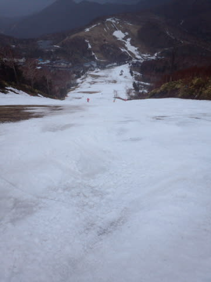
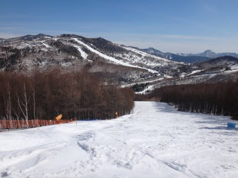

# 超雪不足な今年…GW，どうしよう…

📅 投稿日時: 2016-04-20 02:57:57

ということで．

ハイシーズンが来ないまま，シーズン終わりが来てしまった

としか思えない今シーズン．

この週末．

まだ，4月中旬．普段ならまだ全然雪がある時期に，

大変寂しい積雪量のゲレンデを滑ったわけですが…

とても，4月のゲレンデとは思えないんですけど…（涙）．

ちなみに．

去年は，営業最終日の5月6日でも，

こんな感じで．

…うーむ．

去年の5月上旬より，今年の4月中旬の

方が雪が少ないのですがっ！？？？

それどころか．

おととしの営業最終日の5月6日は…

え？全面可能？？

ダイヤモンドも，雪たっぷりですね…

…ということで．

おととしの5月上旬より．

今年の4月中旬の方が雪が少ないという…

おかしい．

まだ，GW最終日まで3週間近くあるのだが？？

おととしより，3週間以上早く雪が消えているという

ことだな…（涙）．

ちなみに．

この日曜の焼額はこんな風になっていました…

…とても，滑れるレベルじゃないですね．

この写真で，ほぼ土がコース幅全面で出ちゃってる，

この矢印の部分．

おととしのGWに，この部分に立って撮った写真が，

5月だというのに，こんなに雪がたっぷりあり．

普段の年はGWでも問題なく滑れることを考えると…

焼額の今年の営業終了を，12月の段階ですでに

例年のGWから短縮し，4月3日にしたのは．

何か予知能力が働いたスタッフがいたのでは

と思ってしまう今日この頃…

＃来年度以降，GWまで営業してくれることを切に願いつつ…

しかし．

今年のGWは．

このままだと，一の瀬は下半分のみが，廊下状態でつながっている，

というレベルだろうし．

あとは，熊の湯第2ペア下半分，横手山第2，渋峠くらいか…

滑れたとしても，

決して楽しめるゲレンデ状況ではない

感じですね（泣）．

うーむ．

今年はせっかくの10連休のGWだというのに．

…どこに行こうか…（涙）．

## 💬 コメント一覧

### 💬 コメント by (はなげ親分)
**タイトル**: ついに！
**投稿日**: 2016-04-20 11:51:51

GWの予定変更しなければならなくなりました。

横手山第２は今週末、渋峠は5月1日迄となったようです。

ダークサイドの恐怖の大王が、舞い降りたシーズンだったなぁ…。

オフシーズンは『降れ降れ踊り』の布教活動をしましょう!!

### 💬 コメント by (まいる)
**タイトル**: シーズン終わりました
**投稿日**: 2016-04-20 18:24:05

S さん、お疲れ様です。

私は、先週の天元台でシーズン終わりました。

天元台ですら、雪がなく、残念でした。

かぐらはどーなんでしょう？

### 💬 コメント by (KENKEN)
**タイトル**: 夏モードはいかが？
**投稿日**: 2016-04-20 21:39:38

少し(Sさんにはかなり)早いですが夏モードはいかがでしょうか？

GW前半は座間味で魚と戯れてきます。

まだショップも宿も空きがあるようなのでご一緒にいかがですか？

3月末のニセコも春雪が迎えてくれて、とうとう降雪の中滑ることなくシーズンが終わってしまいました。

スキー始めて以来始めてかも？

### 💬 コメント by (Skier_S)
**タイトル**: 雪が解けていく…
**投稿日**: 2016-04-21 01:36:59

＞はなげ親分さま

横手山がGWまでもたないなんて…

歴史始まって以来じゃないでしょうか…！？？？

ダメだ．

今シーズン，ダメすぎる…

来シーズンいっぱい積もるように，「冷え冷え降れ降れ踊り」を踊り続けるんでしょうか…（；_：

＞まいるさま

あら．

終わっちゃいましたか…シーズン．

かぐらは，田代含めてまだ滑れるみたい

ですね～．

＞KENKENさま

いや…まだ夏モードには早すぎます．

まだ．

自分の中でも，まだ整理がついてません（涙）

あと，5月ってまだ水温低くないですか？？？

