# 八ヶ岳の阿弥陀岳・赤岳ピストン登山！その7…赤岳から下山スタート

📅 投稿日時: 2022-10-05 06:47:20

昨日は，記事を書きかけている途中で

気づいたら床で寝てました…（涙）

疲れてたのかな？？

そして．気づいたら朝6時（泣）

だもんで．

急ぎ残りを書いて更新！

しばらく他の記事を書いてましたが，

今日は[前回](e9b52f2a54ecc64b8ce0048e1137bca48.md)に続いての阿弥陀・赤岳レポートです！

ーーー

ってなことで．

5時ちょうどに船山十字路駐車場を出発して，

だいたい4時間．

9:04に赤岳山頂に到着！

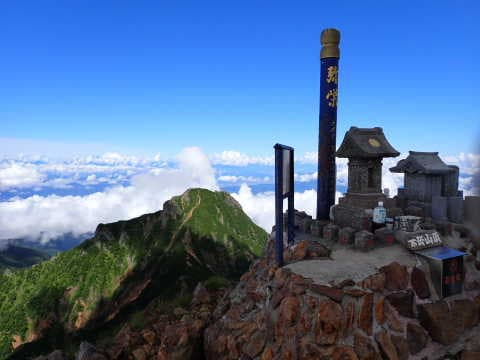

いやー．

山頂から，さっき登ってきた阿弥陀岳が

きれいに見えますが…

…また，あれに登らないと帰れないのか…

（この日おそらく100回目くらいは思ったであろう感想）

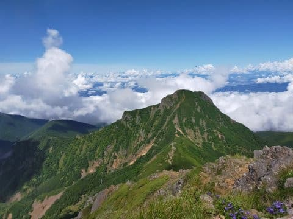

山頂ではおにぎり一個と残っていた

2本目のVAAMを飲みきったくらい．

うーん．これだけの山を登っておにぎり1個

で済むって，空腹感をそれほど感じないのも

VAAMの効果かな？

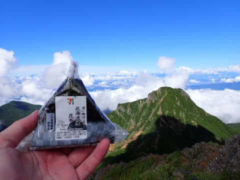

山頂そばの，赤岳山荘の方を見に行って

みますが…

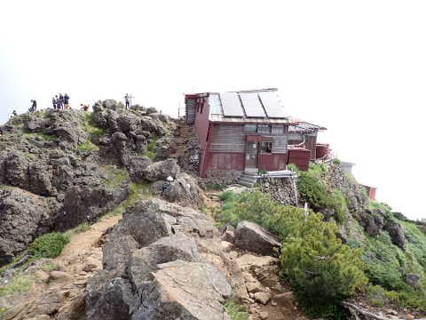

赤岳展望荘方面から登ってくる人が

めちゃくちゃ連なってるんですが…！！！

さすがは7月下旬，夏休みの週末！

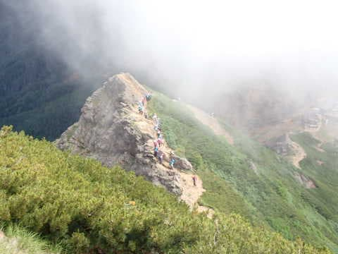

混んでるルートが嫌いな私．

「阿弥陀岳経由ルートで良かった・

さっき，

阿弥陀岳に登り返すのか…（涙）

と思っていたことを棚に上げる自分．

…しかし．

なんだか，赤岳展望荘が見えないくらいに

雲が出てきたんですが…！？？

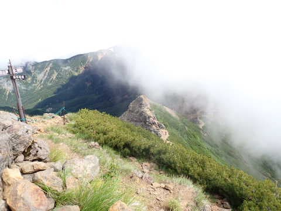

まだ，山頂付近は日が射しているとはいえ．

周りを見ると，モクモクと雲が

沸き上がってきているので…

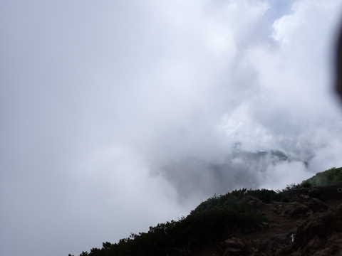

これはやはり，予想通り昼には天気が

崩れそう…

ヤバい…

と，急ぎの下山を決意．

まぁ，私にしては珍しく山頂で30分も

休んだので十分．

9:35には，下山開始！！

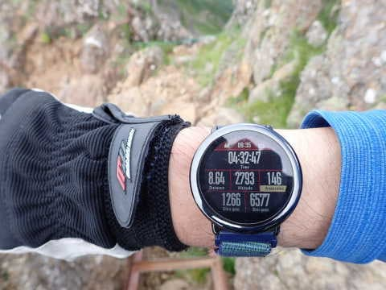

赤岳山頂付近の急坂を下りていきます…

この写真ではあまり斜度を感じませんが．

見上げると結構な急斜面です…

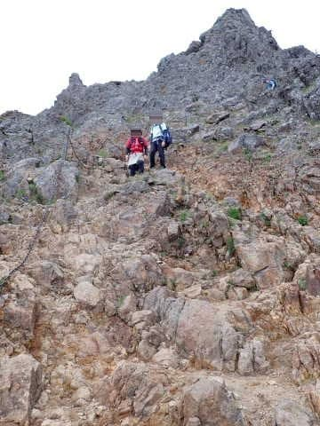

赤岳山頂を背に，グングン降りていき…

文三郎尾根への分岐点を通過します．

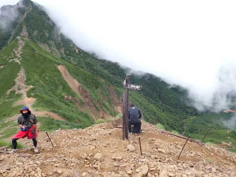

このあたりには，コマクサが群生してましたね…

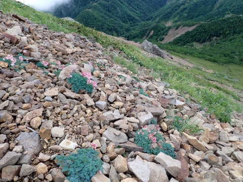

でも，下山が遅くなって，午後から予想されている

雨に降られるのが嫌なので．

立ち止まらず，ひたすら歩く！

赤岳からの斜面を降りきって，

中岳の登りへ向かうコル部を通過するころには…

周りにガスが迫ってきました…

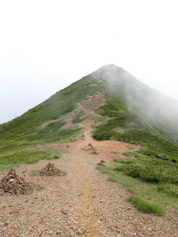

止まらず休まず，ハイペースで中岳へ！

中岳到着は赤岳山頂から27分の10:02．

周りの雲はだんだんヤバくなってきて…

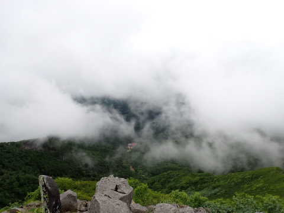

目の前にそびえる阿弥陀岳が全く見えないん

ですけど！？？

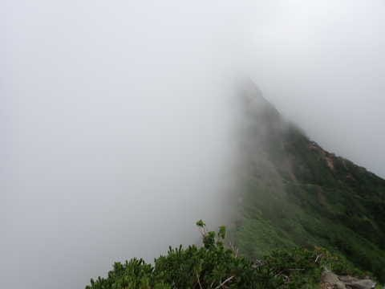
