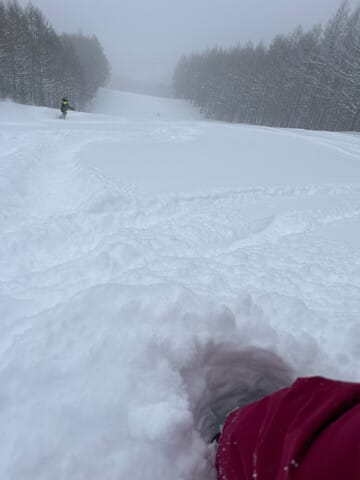
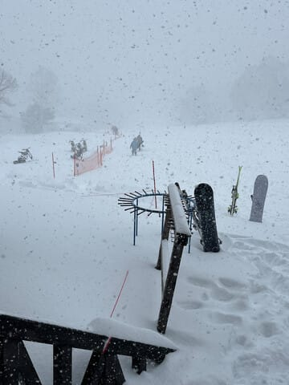
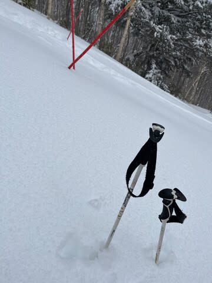
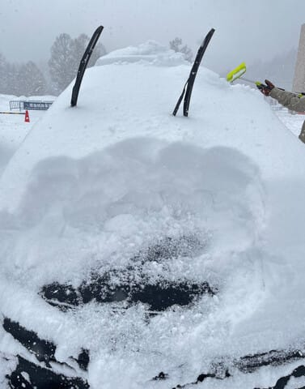

# 昨日，2月27日(火)の志賀は50㎝くらい積もったようで…ゲレンデ状況は改善！でも白樺・ブナコースは今日からクローズ

📅 投稿日時: 2024-02-28 09:09:51

いろいろクリティカルで，

夜に更新する時間が取れませんでした…

…要するに，また床で朝まで寝てました(泣)

気を失うように，床で寝てました…

で．

昨日火曜ですが．

積雪10cm，積もって20cmかな…

という天気図だったのに．

なんだか，朝までに40㎝ほど

積もったみたいです！

さらに昼間も激しい雪が降り続け…

昼間だけでも10~20cm積雪があり．

土が見えていたブナコースも，

完全に土は埋まって．

トップシーズンのコンディションが

戻ってきたみたいです~！！

まぁ，1日でこんだけ積もったみたいなので…

こういうのが続けて降ってくれると

うれしいんですけどね～…

まだ2月だから，まだまだ積もるはずなんですが…

とはいえ．

まだ例年より雪が少ないので．

焼額山は予定通り，春営業を伸ばすため，

本日から白樺・ブナコースをクローズして

パノラマコースへの雪出しに使うようです．

うーん．

早くも白樺コースが滑れなくなるのは

残念…

とりあえず．

コースは減りますが，

今週末はいいコンディションで滑れそう…！！！

だけど．

私は仕事が終わるのかなぁ…

## 💬 コメント一覧

### 💬 コメント by (横須賀のウルトラセブン)
**タイトル**: Unknown
**投稿日**: 2024-02-28 10:52:45

今シーズンはゲレンデでなかなかお会いできてませ

んが、セブンも元気で滑ってます！白樺クローズは

ヤケビで一番好きなコースだったので残念無念( 泣)

実は私も急な法事や仕事で、2/19～3/8まで3週間も

スキーに行けません！禁断症状も発症してます。

今週末徒然さんがコンデションのいいヤケビで滑れないことを祈念←あっ違う～僕の分まで滑れること

を祈念してます！

### 💬 コメント by (1kamakura)
**タイトル**: Unknown
**投稿日**: 2024-02-28 12:05:22

江戸の秋

雪積もりましたね！

私がブログで寒いオヤジギャグをかましたおかげかも😁

Sさんにはまだまだスキーを楽しんでほしいな。

私はもう今シーズンは終わりでーす。

### 💬 コメント by (大阪のK)
**タイトル**: Unknown
**投稿日**: 2024-02-28 13:14:37

白樺、アカンのかー😢

淡い期待を抱いていたんだけど、残念でなりません。

### 💬 コメント by (レインボー76)
**タイトル**: Unknown
**投稿日**: 2024-02-28 15:41:37

水曜日の志賀高原情報

朝の湯田中は積雪30超え。蓮池-7℃。白樺とオリンピックは閉鎖。

ニゴンからパノラマ、唐松は久々の快適バーン。イーストも完璧だけど、柔らかいので荒れるのも早く、GSもエキスパもモコモコしてきた。

歩くのが嫌なので、バスでいちゴンから、西館で昼食。

朝は小雪が舞っていたのに、昼には晴れてきた。

帰路、標高1050m程の大きな右カーブではスリップ跡がひどい。連絡があって気を付けていたのに、私も軽くスリップ。気温0℃位はやっぱり危ない。皆様、気をつけてくださいね。

### 💬 コメント by (Skier_S)
**タイトル**: 今週末はコンディション悪くなさそう
**投稿日**: 2024-02-29 02:53:05

＞横須賀のウルトラセブンさま

お久しぶりです~！

今シーズンは全然お会いしませんね…

来週まで来れなさそうなんですね．

私も今週はダメな感じです．せっかくコンディション回復しているのに…

＞江戸の秋さま

積もりました～！

やっとちょっとだけ冬っぽくなったかな．

私はいつも通り，雪がある限り滑り続けます～！

＞大阪のKさま

やっぱりだめでした…(涙)

＞レインボー76さま

今日は久々のトップシーズンらしい雪だったみたいですね．

柔らかい分，荒れるのが早かったようですが…

雪道運転お気をつけて！！！

