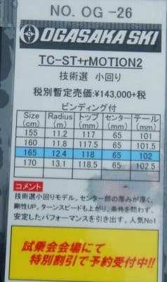

# 2022シーズンモデルのスキー板，試乗レポートその14…OGASAKA TC-ST　プレート無し

📅 投稿日時: 2021-07-02 05:57:27

🏷️ カテゴリ: [スキー板試乗](c0bd8048615710cee890e403a36cc9a2b.md)

なんと…

私が許可していないというのに．

2021年の野郎は，もう勝手に半分

終わっちゃったようです…！

なんて勝手な！

誰の許可を受けて勝手に半分

終わってるんだ！

許さん！←なぜあなたに許可を受けなくてはならないの？？

…しかし今年，上半期って2か月くらい

しかなかったっけか？

なんだか，今年は時空が歪んでないか！？？

…多分，１月と２月の2か月間，まともに

スキーに行ってなかったから，

このシーズンが異常に短く感じてる気が

するんだけど…

今年も残るは半分だけど．

残り半年．

夏のダイビングも行かずにSkier_Sは

4部署兼務の仕事に耐えられるのか？

こんな時間にBlogを更新する羽目になる

激務のストレスを乗り越え，

無事2022年後半を過ごせるのか！？？

こうご期待！←何を？

ということで．

今日は2022シーズンモデルのスキー板

試乗レポート．

今回もオガサカ編．

前回と同じTC-STですが，プレート有り無しの

フィーリングの違いになります…

では，どうぞ～！

○OGASAKA TC-ST プレート無し 165cm

基礎小回り用

前回も同じTC-STの試乗レポートでしたが．

前回は一番強いSRプレート付き．

今回はプレート無しの板です！

SRプレート付きは，かなり強めで

手ごわい板に感じましたが…

果たして，プレート無しの板はどうなのか？

…プレート無しも，滑ってみるとやはり

心材の強さ，コアの張りを感じる板ですが．

SRプレート付きに比べれば，

コントロールしやすくなります！

板の性格としては，やはり勝手に

サイドカーブなりにカービング

小回りを始めるオートマチックな

板というより，自分で積極的に

迎え角を作っていく性格の板に

感じますが．

板を動かして迎え角を作っていくのに

体力を必要としたSRプレート付きに

比べれば，板を動かしやすいです．

比較的楽に板を動かしてターン始動

できます！←対SRプレート付き比

プレート無しなら，ターン始動時に

板を動かし雪面を捉えて，一旦たわみを

出してやると，そんなにスピードが

出てなくても，たわみに沿ってカービング

小回りを始めてくれます．

ガンガンスピードを上げていかないと

板がたわまなかった，手ごわいSRプレート

に比べれば，何と優しいことか…

ただ，このプレート無しの板でも，

やはりコアの張りの強さは感じ．

オートマチックに谷回りで勝手に

トップが捉えてクルクル回ってくれる，

板が勝手に動いていく板ではなく．

乗り手がしっかりたわみを出していき，

弧を作っていくタイプで．乗り手の

操作に応える感じの，玄人好み

の板だなぁ…

と思いました．

プレート無しなら，そこそこのスピード

域で（でも，普通のゲレンデではかなり速め)

たわみも出せて，カービングにも入れる

ことができて．

それでいて，そんなに力を使わずに

ターンの仕上げで板を動かしていく

とか，いろんな小技も使えて．

普通の上級者がゲレンデで履くには，

プレート無しがちょうどいいんじゃないか…

と思いました．

あ，でも．

プレート無しでも，かなりの上級者

向けですよ！

どこに乗っても，どうやっても

オートマチックにターンしていく

楽な板ではないので，かなりレベルが

高い人向けです．

どうでもいいけど．

この板で滑った時に．

昔のイソコア時代のSALOMON(20年くらい前だよ…)

みたいなカラカラ音が板からするのを聞いて．

なにか懐かしさを感じた，Skier_Sでした…

## 💬 コメント一覧

### 💬 コメント by (ikkun)
**タイトル**: Unknown
**投稿日**: 2021-07-02 19:56:50

これは履けてません(笑) いわいる「オガサカファン」の皆様には好評なようですね？って今二本持ってる癖に(笑)

### 💬 コメント by (Skier_S)
**タイトル**: ＞ikkunさま
**投稿日**: 2021-07-03 07:45:56

オガサカ2本持ちなんですね．

私はTC-STはちょっとあまりにもレベルアップしすぎて，ゲレンデで

気楽に履けないな…

と思いました．

TCシリーズ，毎年かなり変わりますね…

### 💬 コメント by (ikkun)
**タイトル**: Unknown
**投稿日**: 2021-07-04 15:53:52

はい19年TCSA  17？LS とフォルクルGSでも19   ……LSは売りかなと🎵もしもフォルクル買えばTCはレッスン用にと  ちなみに昨年売ったダルベロはまだ並んでいました❗

### 💬 コメント by (Skier_S)
**タイトル**: ＞ikkunさま
**投稿日**: 2021-07-05 03:54:34

TC-SAは名機でしたよね…

