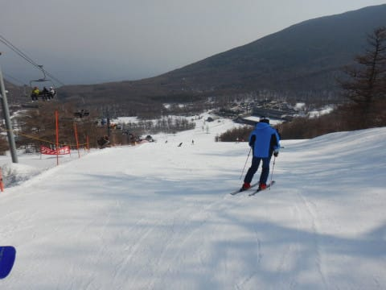

# 2020/3/22(日)，3連休最終日のアサマ2000スキー場，詳細レポート！…朝は晴天なれど，昼からびしょ濡れ雪が降ったりやんだり…

📅 投稿日時: 2020-03-25 02:54:32

🏷️ カテゴリ: [2020スキー滑走日記](c282e9230de179e245c7334eabeb0a3b3.md)

えー．

昨日の記事で．

　24日は終日冷え冷えの雪降りデーで．

　最高気温もマイナス5℃程度と，

　「真冬か？」

　と思う一日になりそう…！！

と書きましたが．

本日の志賀高原，その予想通りの天気に

なったようですね…！

複数の特派員の情報を総合すると．

焼額の朝イチの気温は-12℃と冷え冷え！

予想通り，朝までにかなり積雪があったようで…

そして，さらに終日雪降りだったおかげで…

今日は一日，冷え冷えパフパフパウダーデー

だったようです！！

（特派員の皆様，写真使わせてもらいました…）

一日の積雪，40cmを超えたようですね…

だもんで．

雪不足で非圧雪となっていたオリンピック

コースは，明日からまた圧雪してくれるようです！

（[焼額山Facebook](https://www.facebook.com/yakebitaiyama/?hc_ref=ARSrQVEsDUxJ51wxVoXdtEMon47u_Bb_NCKDgExnf2cNG1bYKK5hZ8CpKjqnrr3CUJY&fref=nf&__xts__[0]=68.ARBYtQnnFbx5rszj_K6tmhXqaWwJfrw33gpVOA8O81q0OXYyn-lM1q4GvArH727Nh_1_J_FG5AbBqFdUUEFRn7LF-qN-uJgyGCeEtjLqY7TFvv3ysL_KFvRuTFaZFxH5kM0iwOBifc2ztrbAxVDGygCnl9xssEwQ3jykCNNX2ShgmALn7i0SC_giDrQ_sH6uO7TW1wFAS4D2dCXlX-MsZst1T-HkfYa8mg_vE8gEJiLLYDYlNYqF2tTsJizwkA9DsJSD_UWDRbXTIrSBKgo16ziVANpVT5Ucdk3Qvqr6pQ0QaGCa9IIiQNXHXjsTL1k7QdjYPi5DycH-T2mUIW2yoQ&__tn__=kC-R)より）

で．

明日25日(水)も，朝はそこそこ冷えて

くれて，さらに晴れそうなので．（朝はちょっと雲が残るかも？）

25日(水）の朝は，今日積もったこの雪が圧雪されて，

太陽のもと，柔らかトップシーズンの

最高シマシマ圧雪が楽しめそうです…！！！

が．

明日は昼間に気温が上がり，日差しも

強いので．

昼前には，日当たりのいい斜面は雪が

緩んじゃうでしょうね…

西側斜面の一の瀬は，昼過ぎまでもつかな？？

ってな感じで．

明日の午前中までは，最高のコンディションが

楽しめそうですが．

その後…

26日，27日と，悲しいほど気温が上がり．

志賀高原でも，+10℃を超えそうで．

28日の土曜は，液体が空から

落ちてくる危機がやってきます…（泣）

29日の日曜は微妙．

雨になるか雪になるか．

朝までに晴れるのか，昼ごろまで降り続けるのか…

日曜の予想は，詳細予想図が出る木曜まで

確定は難しそうです…

とりあえず．

この週末に，また真冬並みの冷え冷え寒気が

やってきて，パフパフパウダーが積もるように，

狂ったように情熱的に，必殺冷え冷え踊りを

踊り続けましょう…っ！←いや，もう今さら踊っても手遅れなのでは…？？

ってなことで．

いつもより一日遅れで，いまさら感が

否めない，この日曜のアサマ2000の

ゲレンデレポートです！！

まず，この日の朝は…

気温は0℃前後と高めなものの．

いい感じの晴れでスタート！！

あさイチのゲレンデを見ると．

よだれもののピカピカシマシマバーンが

待ち構えています…！

ぐほーーー！！！

早く，

早く滑らせろ！！！

と，朝イチリフトで登りますが…

気持ちよさそうにみんな滑ってます！

そして．

ゲレンデに出てみると…

あさイチは，いい感じにエッジが効く，

快適シマシマっ！！

うはははは～っ！！

これは，アサマ2000も悪くないよ！

フラットでエッジが効く，

いい感じで締まった，

快楽ハイスピードバーン！

リフトもそれほど混んでないし…

それでいて，こんなにいい感じの

フラットバーンを飛ばせるとは…

いや，意外といいじゃないですか！←昨日から上から目線が続いてるな…

…と．

ちょっと人が増えてきてたものの，

10時ごろまではいい感じのハイスピード

フラットバーンを楽しめました…

が．

気温が高いのもあり．

10時を過ぎると，ちょっと緩んだ感じの

重い雪になっていき…

…そして．

なんということか…

11時に天候急変っ！！

なぜかいきなり激しい雪が

吹き付けはじめ…

吹き付ける雪は，ウェアに着くと

瞬間で溶けて，びしょ濡れになるような

湿った重い雪で．

リフト搬器もびしょ濡れです（泣）

そして，風も強く吹き始め，

「リフトが止まるかも？？」

というほどの状況に…（涙）

一体，これは何の報いだ…？？

そのおかげで．

試乗会場のテントが飛びそうになり．

慌ててテントを撤収したうえで，

「風が弱まるまで試乗会はいったん中断」

という憂き目に…（激涙）

せっかく…

せっかく試乗会に来たのに．

貸出中止とは…っ！！

「風が弱まれば再開しますが，

　このまま中断かも…」

…

せっかく．

せっかく朝早くに志賀高原から

時間をかけてアサマまで試乗しに

きたというのに，2時間ちょいで

試乗終了になというのか…！？？

なんて日だ…！

ってな悲しい状況で．

びしょ濡れになる雪の中．

試乗会も無いアサマ2000を

泣きながら滑ってましたが．

「いいんだ…天気が悪いから誰も滑ってない，

　この貸し切りバーンが滑れるから，

　いいんだ…」

と自分にいいわけしながら，

悪天候で誰も滑ってないバーンを

泣きながら滑ってましたが．

しかし．

中断から1時間ほどたった

12時30前に，何とか風も弱まり．

試乗会，無事に再開！

…なれど．

さっきのびしょ濡れ雪＆強風で，

ゲレンデの人はかなり減りましたね…

ただ．

このあとの天気は，時折日が射したり…

曇ったり…

また，びしょ濡れになる，

雨のような雪が降り始めたり…

と，かなり目まぐるしく状況が

変わる，安定しない天気．

…安定しない天気と，3連休最終日というのもあり．

ゲレンデは，午後3時前には誰もいなく

なっちゃいましたよ…？？

完全に無人バーンですよ…？？

雪質は，びしょ濡れ雪が積もり，

気温も高めというのもあり．

完全に湿気を含んだ，ずっしりと

重い雪になってますが．

でも，人が全然滑ってないので．

コースは全く荒れず…

最後まで大回り可能なフラットをキープ！

全く無人のコースを，好きなだけ滑りたい

放題！

…お金持ちになって，スキー場を

貸切っている気分…

…ってな感じで．

お約束通り，営業終了の16:30まで滑り倒しましたが．

まぁ，天気は安定しなかったものの．

人が少ない，フラットな一枚バーンを

好きなように滑れたし．

ステージ2は，リフトと反対側は

多少土が出ていたものの．

幅2/3以上は問題なく滑れたし．

まぁ，良かったかな～．

でも．

人工雪を付けてない，

この写真の左側のアンテロープコースとかは

もうかなり土が出てきてて，

滑るのは厳しそうな状況だったので．

ちょいと全面的に雪は薄い感じ…（涙）

まぁ，アサマ2000の営業もあと2週間．

STAGE2はあと2週間，もちそうかな～．

## 💬 コメント一覧

### 💬 コメント by (しんちゃん)
**タイトル**: 今年も楽しみにしています
**投稿日**: 2020-03-25 01:28:08

今年も試乗レポート、楽しみにしています。

あらゆるシーン（滑走スピード、ターン弧、斜度等）を想定したインプレッションで、分かりやすいし、自身の滑走シーンを思い描きながら読ませていただいています。

6月末ごろになると各地で展示会が始まるので、それまでに予備知識をつけて、展示会に参加したいなと思います。

### 💬 コメント by (Skier_S)
**タイトル**: ＞しんちゃんさま
**投稿日**: 2020-03-25 03:10:00

今シーズンは新マテリアル投入が無かったので，

来シーズンは物欲選手権開催ですね！！

参考になる試乗レポートを頑張って書きますので，

お楽しみに…！

### 💬 コメント by (ほっぽ)
**タイトル**: アルペン試乗会
**投稿日**: 2020-03-25 06:50:01

Ｓさん

4/18、19のアルペン試乗会、会場が一の瀬ファミリーから熊の湯に変更になっちゃいましたね。

2016年の悪夢が蘇ってきました。

3/23のASAMA2000をアップしておきましたが、

23日は終日カチカチ、10時過ぎにはツルツルのアイスバーンで

試乗で何かを感じられる状況ではありませんでした。

結局１日中、全然緩まなかったです。ASAMA。

http://www2.tokai.or.jp/nana_hoppo/

### 💬 コメント by (かず)
**タイトル**: Unknown
**投稿日**: 2020-03-25 11:07:19

レインボーさんの情報が更新されないので気になってましたが野沢でしたか！ゴンドラ動きました？本日日帰り検討しましたが10時終了と思い諦めました  この先の長期予報見ると雨ばかりなので週末多少条件悪くても行こうと思ってます

### 💬 コメント by (レインボー)
**タイトル**: Unknown
**投稿日**: 2020-03-25 18:00:33

水曜日の志賀高原

40cmの積雪を昨夕の圧雪、その上の数センチの積雪。考えただけでもよだれの出そうな今朝、いつものように2ゴンに並んでいたら、機械の故障！！

バスでニ高からスタートしたものの、オリンピックはすでにぼこぼこ！　ＧＳから素早く奥志賀へ。

ダウンヒルはマシュマロ絨毯で快適。もちろん今の時期の最大の目玉エキスパートはといえば、ベストもベスト。おじさまでも、おじいさまでも、楽しく滑れる恍惚ゲレンデ。

でも、ここでピーポピーポが2件も！

10時40分のバスで一の瀬へ瞬間移動。ファミリーも午前中なのに楽に滑れます。蕎麦屋でスーパードライのあと、寺子屋へ。地肌はほぼ埋まっているものの、魅力ないので西館へ。

西館の非圧雪が、ビールを呑んだ高齢者には辛すぎる。朝一なら楽しかろうが、ボコボコで表面が堅めの、素人には難しいバーン。汗だくで高天に逃げ帰りました。

明日こそ、今日は現れなかった妖怪板つかみを退治したいとおもいます。

その後も滑った友人によると、ＳＧＳからイーストへ行ったら、レインボーを過ぎても、まだシマシマが残っていたとか。

### 💬 コメント by (さいたま市民)
**タイトル**: Unknown
**投稿日**: 2020-03-25 21:17:03

アサマ2000試乗会前にリフトご一緒させて頂いた者です。あの日悪天候の中最後まで滑られたのですね！

私は前日のロードバイクで痛めた左膝の状態が悪くスキーを抑える事ができない試乗会でした。

毎週、どんな天候でもスキー場に行かれリフト開始から終了まで滑るなんて凄いです。

また、お会いしたら宜しくお願い致します。

ただ、今シーズン私はシーズン終了かも。

### 💬 コメント by (Skier_S)
**タイトル**: この週末，日曜はまだマシかな？
**投稿日**: 2020-03-26 01:56:55

＞ほっぽさま

23日は，試乗するには難しいコンディションだったみたいですね…

22日は強風で中断があったりもしたけど，22日に試乗で正解だったのかも？

＞かずさま

週末，日曜の予想はちょっと良くなってきました．

まぁ，重い春の雪だと思いますが…

＞レインボーさま

今日は良かったみたいですね…

うらやましいです…

なぜこのコンディションが週末に来てくれないのか…（涙）

＞さいたま市民さま

コメントありがとうございます～！

アサマではお世話になりました！

膝が痛い中，試乗お疲れ様でした．

私はリフトが動いていると帰れない人なので，

しっかりラストまで滑り倒してきました…

