# 11月27日　アサマ2000は激混み！

📅 投稿日時: 2010-11-27 22:08:23

気温：0～3度．風が冷たい

天気：晴れ

雪質：100％人工降雪．固い！！

積雪：40cm程度かなぁ．

リフト混雑：最大待ち20分，平均10分．午後は5分．

路面状況：夏タイヤで突っ切れます．積雪・凍結なし

とりあえず今週のアサマですが…

混んでた！

がらがらで満足できた先週とはえらい違い！

リフト本数にして，先週の半分より多いかな？ってくらいしか滑れない感じ．

あと，天然雪はないです．

100％人工雪です．

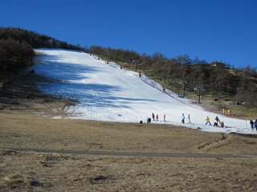

コース幅，積雪は先週と変わらず．

幅30mほど，積雪40cmほどでしょうかね～．

大回り十分可能な幅です．

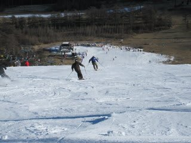

夕方まで，コース上に土が出てくるようなことはなかったです．

あー．

リフト降り場からしばらくは，ちょっと草が出かけてるところが

ありましたが，十分回避可能です．

とりあえず，

朝8時半からリフトスタート．

今週も，リフト1日券が3000円なのはうれしいのですが…

リフト開始時からすでに人が多かった…

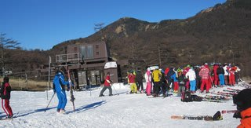

で．

9時には，リフト待ちが10分を超え．

9時半には，15分を超え．

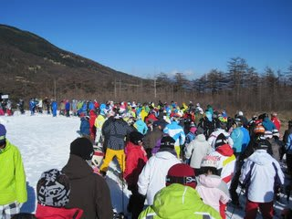

10時前後には，20分近くまで伸びました…

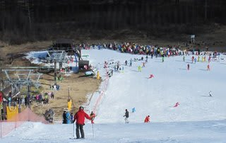

1時間3本しか滑れない…（涙）．

雪質は，先週よりかなり固め．

朝イチからしっかり固まった感じで，スピードが出る出る．

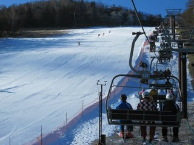

かなり早い段階からコースのところどころが

アイスバーン化しましたね～

11時過ぎには，小回り道ができ始め…

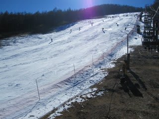

12時過ぎには小回り道は完全アイスバーンと化してました．

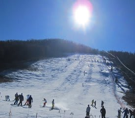

小回り道の両脇はモサモサの雪がたまっており，

モサモサ雪とアイスバーンが絶妙なコントラストを形作り，

このコントラストにトラップされて，雪面を体で滑り降りていく人が

幾人か…（合掌）．

しかし，ゲレンデ状況の悪化と共に，リフト待ちも減っていき，

12時には10分以下，1時ごろには5分以下と一気にリフト待ちは

短くなりました．

…ただ．

リフト待ちは減ったけど．

ゲレンデが滑っていて楽しくない…

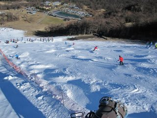

先週は固いとはいえ，まだ多少グリップしたけど．

今週の雪は，小回り道はうねったアイスバーンで，

かなり手ごわかった…

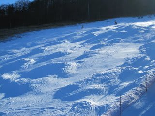

という感じで．

先週と比べると，楽しさ指数50％減，って感じです…

せめてもの救いは，天気が良かったことですね～

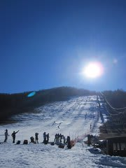

## 💬 コメント一覧

### 💬 コメント by (tatoyunota)
**タイトル**: ありがとうございました！
**投稿日**: 2010-11-28 21:45:45

２週続けてのアサマありがとうございました。

おかげさまでなんとなくスキーを思い出すことができました＾＾。

今シーズンもよろしくお願いします。

### 💬 コメント by (Skier_S)
**タイトル**: お疲れ様でした
**投稿日**: 2010-11-28 23:53:25

2週連続，お疲れ様でした．

今週はいまいちでしたが…

また，機会があればご一緒に．

