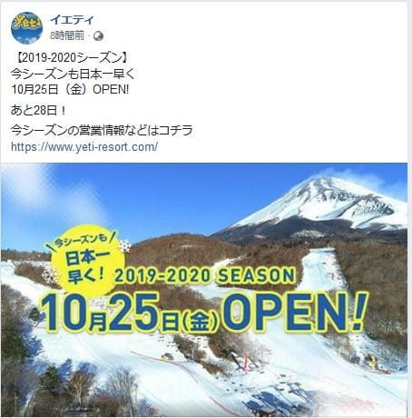

# 2019/2020シーズンのYetiのオープン日確定！10月25日(金)と予想通り例年の1週間遅れ（涙）

📅 投稿日時: 2019-09-28 02:01:32

えー．

決まりました．

決まったようです．

ようやく，2019/2020スキーシーズンの

スタートを告げる，イエティのオープン日が…

オープン日は，10月25日（金）です！！！

（[イエティ―Facebook](https://www.facebook.com/YetiSnowtown/photos/a.528061393949908/2456607924428569/?type=3)より引用）

…これって．

[今年狭山がオープン](e1881eba2527d0c90e45b427dce007c97.md)しないってニュースを

知った時に危惧した通り．

最大のライバル狭山が脱落した

今シーズン．

やっぱり例年よりも，オープンを

遅らせてきましたね…（涙）

あぁ…

10月最終週末にオープンの狭山に

負けないように，例年ならYetiは

10月3週にはオープンするのに…

そして．

10月3週にオープンしてくれれば，

19，20日の週末だけじゃなく．

22日の祭日にも滑れたのに…

ってか．

今年スペシャルの10月22日の祭日に，

Yetiもお客さんが集められたと

思うのに…

なぜ，10月下旬に祭日があるという

このスペシャルな年に限って，

オープンが遅れるのか…

惜しい．

実に，惜しい…

まぁ．

この結果として．

私のシーズンインは，10/26の週末と

決まりました．

あと3週間のつもりでいたのに．

まだ1か月近くありますね…（残念）

とりあえず．

あと1か月我慢すれば，

シーズンインです！！！

## 💬 コメント一覧

### 💬 コメント by (ほっぽ)
**タイトル**: Unknown
**投稿日**: 2019-09-28 11:49:23

残念なお知らせでした😫

ライバル不在で呑気に構えて、且つ消費税以上の値上げ。

これから先が不安です😫

ともあれ、私はオープン初日ナイターから参戦します❗👍

### 💬 コメント by (yama)
**タイトル**: Unknown
**投稿日**: 2019-09-28 16:08:43

駐車場や有料道路の料金が上がっていますね。都合をあわせて自衛するしかないでしょう。

### 💬 コメント by (Skier_S)
**タイトル**: 志賀高原も値上げ（涙）
**投稿日**: 2019-09-29 03:17:09

＞ほっぽさま

いや，この1週間遅れ，ホントに残念です…

そして，来シーズンはいろんなスキー場が

値上げしそうですね．

スキー宿も値上げしているところが多いので，

来シーズンはお財布に厳しいシーズンになりそうです…

＞yamaさま

駐車場1200円は痛い！

とりあえず，また一緒に乗りあって行きましょう…

よろしくお願いします．

