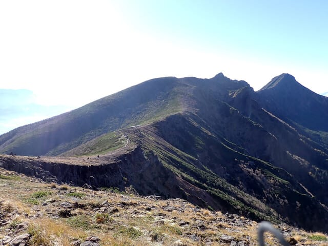
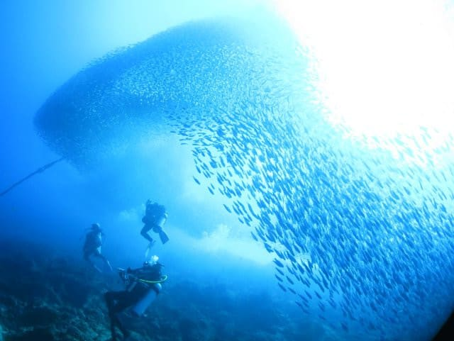

# 2024年8月，5度目の子連れモアルボアル，コロナ後初の海外へ！その8…2本目のダイビングはハウスリーフでイワシの群れを見るぞ！

📅 投稿日時: 2024-10-16 01:48:18

🏷️ カテゴリ: [ダイビング日記](ce3a7a8d424d112fce83ee85c81a0e344.md)

えー．

実は，この3連休．

久しぶりに1日は仕事を休むぞ…！！！

そして，久しぶりに体を動かすぞ…！！

と．

金曜の深夜12時ごろ仕事から戻ってきたと

いうのに．

睡眠時間2時間で，とある山に登りに行って

来ました～！

…この夏は仕事が忙しかったこともあり．

何とか夏休みはダイビングにいったものの，

実はあまり本格的な山歩きはできておらず…

陣馬山に走りに行く以外での，今年初の

（そして多分今年最後の）山歩きでした～！！

しかし．

最近は暑い日が続いていて．

この日も下山したら28℃くらいあったのに．

山の上は，水がガチガチに凍っていて…

そこらじゅうに霜柱がびっしり

出ていたのに驚き…！

…どうでもいいけど．

決して3連休だから余裕があって

山に行けたわけではなく．

深夜1時に寝て3時に起きて山に行って，

さっくり午前中でピストン登山してきたけど．

Garminユーザーなら，この状態で運動

しているヤバさが分かるはず…（笑）．

かなり無理して行ってしまったけど．

良い子は睡眠不足で山に行っちゃダメです

から～！←どの口がそんなことを言うんだ…

ってなことで，本題へ．

本日も，モアルボアルのダイビング旅行記です～！

ーーーー

（[前回はこちら](eb4d7fe5c6cbfc110b23a2b014eb118ad.md)）

という感じで，

無事1本目のダイビングを終えたわけ

ですが…

次のポイントはダイビングショップ前の

ハウスリーフの予定なので，ボートは一旦

ショップの方向へ戻ります．

もう，殿様ダイビングスタイルのフィリピン

なので．

タンクの付け替えもしなくて良ければ，

上がってすぐに，スタッフが紅茶・

コーヒーなどのお好みを聞いて，

暖かい飲み物を入れてくれるし…

ボートの上では，出された飲み物を飲みながら

景色を見てくつろいでいればよいだけという，

優雅な身分です．

わずか20分ほどでショップ前へ到着！

午前2本潜るスタイルのこのショップ．

普段は午前中の1本目と2本目の間の

インターバルは海の上で過ごすのですが，

今回は2本目から参加の人がいるので，

2本目をハウスリーフにしてショップに

戻ってきたようなので…

トイレ休憩ぐらいの短い時間ですが，

一旦ショップに寄って10分ほど休憩して…

そして，再びボートへ戻って10時半ごろ．

2本目の準備です．

…そういえば，今回はいつものショップの

ボートが故障して修理中らしく，どこかから

ボートを借りているとのことで…

いつもの快適なトイレ付きのボートと違い

ましたね…

2本目はハウスリーフ．

この，ショップ目の前の海で潜ります．

ショップ前からのビーチエントリーでも

行けるんですが，器材はボートに積みっぱなし

なので，どうせならボートエントリーで，

ボートの係留場所から20～30mくらい沖合に出た，

流れの上流になるところまでボートを動かして，

そこからエントリーします．

この写真には写ってないけど．

ボートの上からも，この透明度の高い海の

中に，イワシの巨大な群れが泳いでいる

のが見えますよ…！！！

ってなことで．

係留場所からわずかにボートを動かした

ところで2本目のブリーフィングを受けたら…

今日の2本目，ハウスリーフにエントリー！！

エントリーしたら…

うはーーーー！！

来た！

いきなり目の前に，イワシの群れが…っ！！

きたーーー！

きた！

これが見たかった．

5年ぶりにモアルボアルに戻ってきて，

これが見たかったんだよ…！

流れの上流から入ったからか，今日は

かなり透明度が高いハウスリーフ．

もう，果てしなくどこまで続くかわからない

イワシの群れが，目の前でダイナミックに

動きます…！

エントリー直後からこれだよ！！

すごいよ！

今日は1本目がペスカドール，

2本目がイワシダイブと，

モアルボアルに来て潜りたかったポイント

2か所，到着後の2本で続けて潜れて，

すごい満足…っ！！

ダイバーで，こんな景色を見てみたいと

思わない人はいないんじゃなかろうか…？

いや…

コロナ期間中のダイブ断ちの間，ずっと

またこれを見たい…

と願っていた景色．

また戻ってきて，見ることができたよ…！！

（[続く](e4e6cc6a31280bcc0d840796ac7e69b19.md)）

## 💬 コメント一覧

### 💬 コメント by (新米パパ)
**タイトル**: Unknown
**投稿日**: 2024-10-16 07:09:32

これはまた見たい！

復帰ダイブはモアルボアルにしよう、いつになるか分かりませんが。

えー、日曜、上高地に知人が行ったら駐車場入らず帰宅した模様、、秋の山は大混雑みたいですね、、

### 💬 コメント by (Skier_S)
**タイトル**: ＞新米パパさま
**投稿日**: 2024-10-17 00:08:40

いやー．

このイワシの群れだけでも，見る価値はありますよ！！

そして，ここでは運が良ければジンベエザメも見れますから…

まぁ，5回行って1回しか見れてないけど，モルジブクルーズでも見れなかった

スキューバでのジンベエが見れるし，マクロポイントも充実しているし．

モアルボアルはおススメです！！

