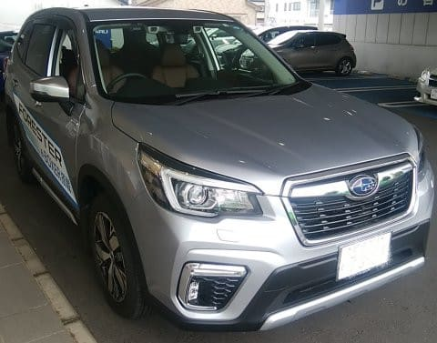

# スバル フォレスター，e-Boxerに試乗してみた

📅 投稿日時: 2019-08-04 03:51:14

ということで．

ちょっと古いネタになりますが．

我がVMGレヴォーグを1年点検に出した際に，

一緒に試乗した車，2車種目の

試乗レポートです…

今度乗ったのは，フォレスターのe-Boxerです！

[フォレスターの2.5Lガソリン車](e2e65af0ff6614f3327d110340b5df5ae.md)は試乗したことが

あるのですが．

ハイブリッドのe-Boxerには乗ったことが

無かったので，今回試乗してみました…

ただ．

もうフォレスターはモデルチェンジから1年，

すでにB型が出ているのですが．

今回試乗したのはA型でした．

ってなことで．

A型フォレスターのe-Boxerですが．

このディーラーさんでは，フォレスターの

半分くらいがe-Boxerのようです…

まさか，ハイブリッドが半数も売れていようとは！

ガソリン車とほとんど価格差が無いのが，

売れている理由でしょうか…

とりあえず，試乗！

走り出してみると…

うむ？？

気のせいか，XVより軽快に走る気が…？？

たしか，エンジンもモーターも，スペック上は

XVとフォレスターで，全く同じ出力のはず．

そして，車重はフォレスターの方が100kg近く

重かったはず…

だのに，なぜかフォレスターの方が，

軽快に加速するように感じる！

なんでだ？

なんでだろう…

あとでスペックをじっくり比較してみて，

原因を考えてみたのですが…

考えられるのは，フォレスターの方が

わずかにファイナルのギヤ比が

高くなっていること．

リニアトロニックのギア比はXVも

フォレスターも変わらず，

ファイナルギア比のみ，

XV e-Boxer:3.7

フォレスター e-Boxer:3.9

と，フォレスターの方がギア比が

高くなっています．

ファイナルギア比を高めると，

高速定常走行時のエンジン回転数が

高めになるので．

高速燃費が多少悪くなるのですが…

それを覚悟で，出だしの加速感の軽快感を

取ったのかな…？？

とりあえず，アクセルを踏み込んだ時の

加速感は，なぜかXVより軽快に感じます．

…ただ，2.5Lエンジン車より軽快かというと．

うーん．あんまり差は感じないかな…

モーター出力トルクがせいぜい6kg-m程度なので，

2.5Lと2Lエンジンのエンジントルク差が5kg-m

ということを考えると，

2.5Lエンジンと，2Lエンジン＋モーターの

トルク差は，それほど大きくは無いので．

2.5Lと2Lハイブリッドで，絶対的な加速感は

それほど差がなく感じます．

厳密にいうと，アクセルを踏んだ瞬間から

最大トルクが出るモーターの特性から．

アクセルを踏んだ一瞬の加速感は，

さすがにe-Boxerのほうがいい感じが

ありますが．

そのあとの加速感の伸びが，2.5Lの

方がいい感じ…

2L e-Boxerと2.5Lガソリン車，優劣をつけるというより．

両者，味わいが違うので．

アクセルレスポンスが良くて，加速がリニアな感じの

e-Boxerと，

トルク感があって，加速の伸びがいい2.5L．

好きな方を選べばよいのかな，と．

でも．

フォレスターの2L e-Boxer．

XVと同じで，ブレーキのフィーリングは

ハイブリッドと思えないほど自然だし．

さすがにXVほどクイックな感じではないけど，

バッテリーを積んで，かつ4WDという

重めのSUVと考えれば，ステアリングの反応は

軽快だし．

ハイブリッドなのに，運転して楽しいと思える車

じゃないかな～…．

ただ，ガソリンタンクが48Lしか無くて．

高速道路モードのWTLC燃費のカタログ値が，

2.5Lガソリンが16.4km/L，

e-Boxerが16.0km/Lと，

e-Boxerの方がちょいと悪いということを考えると．

高速での長距離移動が多い人には

e-Boxerは辛いかな？？

うーん．

高速燃費の悪さは，やっぱりファイナルのギア比が

高いのが効いてるのかな…

うん．

私がフォレスターを買うとすると．

高速の長距離走行が多いから．

やっぱり2.5Lガソリンを選ぶかな～．

## 💬 コメント一覧

### 💬 コメント by (最近のスバルパンチがない。)
**タイトル**: Unknown
**投稿日**: 2019-08-05 05:20:45

e-boxerなんて長年のスバル乗りとして贔屓目に見ても、どうしても他社と比べるととりあえずハイブリッドというイマイチ感が。

スバルはエンジンに付加価値があるのに、中途半端な事をする位なら、日本では一番外車ブランドに近いなんて過去に言われていた事もあるわけですし、外車ブランドは軒並みディーゼルを出しているのだからスバルも出すべきです。

世界で唯一無二のボクサーディーゼル、そんな付加価値がある車に日本で乗れたらワクワクじゃないですか。

### 💬 コメント by (naoちゃんねる)
**タイトル**: Unknown
**投稿日**: 2019-08-05 05:21:37

フォレスター、ターボが無い代わりにギア比で軽快さを出しているんですかね。

やっぱりスキー場とかアウトドアにはスバル車がめちゃめちゃ似合いますよね…

私も3列シートの制限が無ければ、フォレスター欲しかったなぁ…

そして焼額山ではアウェー感が半端ないです(笑)

### 💬 コメント by (Skier_S)
**タイトル**: e-Boxerは売れてるんですよね…
**投稿日**: 2019-08-06 00:36:00

＞最近のスバルパンチがない．さま

e-Boxerは，トヨタ・ホンダのハイブリッドに比べると，

モーターアシストが弱めで，かなりエンジンに頼ってる感じです．

ただ，日本はハイブリッド信仰があり，ハイブリッドモデルが無いと

売れなかったりするし，

それ以外にも炭素排出規制やらNOx規制やらがガンガン厳しくなったりと，

「この規制下で，パワーのある楽しいエンジンを作るのは

無理なのでは…」

と思ってしまいます．

ディーゼルも次のEURO7規制はかなり厳しそうで，

これをクリアするには相当の投資が必要そう…

おそらくスバル1社の開発要員をすべてかけても厳しいん

じゃないかと思っちゃいます…

私も楽しいエンジンの車に乗りたいのですが，

今のエンジン開発者の状況を見ると，同情を禁じ得ない感じです…（涙）．

＞naoちゃんねるさま

うーん．

XVとフォレスターのスタートダッシュに差を感じたので，

リニアトロニックの設定が違うのか？

あるいはモーターが大きいのか？と思いましたが．

リニアトロニックのギア比は同じで，モーターも同じもののようなので．

おそらくファイナルギア比のせいではないかと…

そして，焼額朝礼メンバーがほぼスバル車になった今．

たしかにアウェー感が強いですよね（笑）．

