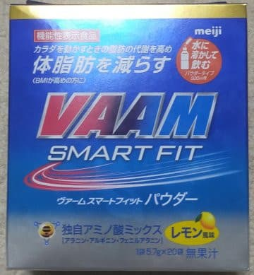

# なぜ登山でVAAMを試してみようと思ったのか？その7…VAAMに関する衝撃の事実に気づいた

📅 投稿日時: 2022-10-28 02:33:14

さぁ．

連載が続く，VAAMの記事．

[前回の記事](e1b7a2cf9cf59ddf5cfc87617909dad46.md)もほとんどの読者を振り切って

しまいましたが．

もう，いい．

この記事は，自分の備忘録として書いたんだ…

と諦めて．

今回もいさぎよく，読者を振り落としていきます．

ってなことで．

前回．

もしかしたら．

スズメバチと人体で，全く違う理由で

たまたま同じアミノ酸ミックスが効いていた

ってことなんじゃないか…？？

という疑問がでてきたわけですが．

とりあえず，さらに論文を探してみると…

人体で実験した論文も見つかりました！

論文誌というより，筑波大が出版している

雑誌のようです．

[齊藤 愼一　他，
昼食後の持久性運動時の血中ケトン体濃度に及ぼすスズメバチ幼虫
分泌アミノ酸混合液（Vespa Amino Acid Mixture: VAAM）摂取の影響
筑波大学体育科学系紀要 Bull. Inst. Health & Sport Sci., Univ. of Tsukuba 24：71―78, 2001](https://www.google.com/url?sa=t&rct=j&q=&esrc=s&source=web&cd=&cad=rja&uact=8&ved=2ahUKEwjL5eLH1LX6AhUWEYgKHQ4fBgsQFnoECDAQAQ&url=https%3A%2F%2Ftamagawa.repo.nii.ac.jp%2F%3Faction%3Drepository_action_common_download%26item_id%3D944%26item_no%3D1%26attribute_id%3D8%26file_no%3D1&usg=AOvVaw3fd1LNbnxNBApAOX-EkMPb)

これ，査読があるのかな…？

未査読だとすると，どこまで

信頼していいのか分かりませんが．

VAAMを商用化した明治と，

理研の阿部先生の連名の論文です．

この論文は，男子学生にVAAMを飲ませて

運動させた…というものなんですが．

読み進んでいくと…

心拍数は両群とも運動強度に応じて高まったが，

安静時と各運動中および回復期のいずれの場合にも，

対照群に比べて，VAAM群が低い値を示し，なかで

も運動終了直後には両群間に有意差が認められた

ってことが書かれており．

VAAMが運動時・運動後の心拍数を下げる

という，知られざる効果も出てきましたが…

本題はこれではない．

さらに読み込んでいくと…

血中中性脂肪濃度は，安静時と運動直後

および回復30分のいずれの場合でも，対照

群に比べて，VAAM群が有意に高かった。

と書かれていて．

マウスだけでなく，人間においても

VAAMは脂肪分解を促す効果があり，

血中中性脂肪濃度を上げる

ことが明らかにされました！

ただ…さらに読み進むと．

なぜVAAMドリンク摂取が

血中中性脂肪濃度を高めたかの

理由は不明である。

と書かれていて，

「理由は分かってないんかい！！」

とツッコみたくなるのですが．

考えられる理由としては，

運動後の血中ケトン体濃度の増加に

肝臓の関与が考えられる

とか，

グルカゴン濃度は…（略）…投与30分後には，

投与前に比べて，VAAM群は有意に上昇した

って書かれていて．

何らかの理由で肝臓がその分泌を

コントロールする，

アドレナリン・ノルアドレナリンや

グルカゴンといった脂肪分解を促進する

ホルモン分泌が促進され，

血中中性脂肪が増えたんじゃないか…という

推測が書かれてます．

皆さんご存知のように，アドレナリンは

交感神経が支配的な「興奮時」に分泌される

ホルモンで．

これから戦うぞ！という準備を整えるために，

心拍数を上げて，インスリンを抑えて

グリコーゲンを分解して血糖値を上げて，

さらには脂肪分解を促すという効果があります．

…アドレナリンは心拍を上げるので，論文にかかれている

「VAAMが心拍を下げた」結果と逆なのが謎なんだけどな…

とりあえず．

アドレナリンもノルアドレナリンも，

脂肪を分解する効果があるのですが．

その仕掛けについて書くと，志賀の

ジャイアントリフトの乗車時間くらいに

めちゃくちゃ長くなるので，ここでは

詳しく述べません．←志賀高原に行った人しか分からん比喩だな

が．ここまで読んだ奇特な方は

そういうのに興味がある方だと思うので．

興味があれば，

[こちらを参照してください](https://www.sci.u-hyogo.ac.jp/life/molbio/KOKAI.pdf)…

で．

グルカゴンは，細胞内に貯えられている

グリコーゲンや脂肪を分解させる作用を

持つホルモンで．

グルコース(糖)やアミノ酸などを血中から

細胞内に蓄えさせるインスリンとは逆の

働きをするホルモンです…

いや．

ってことは．

無脊椎動物のスズメバチって，

肝臓はないし．

アドレナリンやノルアドレナリンって

ホルモンもないし．

肝臓がなくて，代謝に利用するアミノ酸も

結構違うわけだし…

やっぱり，

VAAMって，人体に使う場合，

スズメバチと同じ17種類のアミノ酸じゃなくて

いいんじゃない？

という考えに行きついた時．

衝撃の事実に気づいたのだった…！

うん？？

えええ？？

なに？？

独自アミノ酸ミックスって，

アラニン，アルギニン，フェニルアラニンの

3種類だけ？？？

VAAMのアミノ酸，

スズメバチの17種類のアミノ酸ミックスじゃなく

なってる！！！

（完全に読者を振り切った自信があるが，[まだ続く](e87248d3a73772a3291b803b6d10e11f0.md)．

　この続きを読みたい人がいるのか？？）

## 💬 コメント一覧

### 💬 コメント by (普段はRO)
**タイトル**: 自分の時とは
**投稿日**: 2022-10-28 11:59:38

生理学で耐寒性の脂肪細胞について分析していた1970年代とは別天地になっていました。

### 💬 コメント by (スシネコ)
**タイトル**: Unknown
**投稿日**: 2022-10-28 12:35:24

ハーイ！読みたいです。

なんだか小説みたいになってきました。最後にオチがありそうな予感が・・・ ((o(´∀｀)o))ﾜｸﾜｸ

（それにしてもこの時間にこれを書いているなんて・・・）

### 💬 コメント by (Skier_S)
**タイトル**: やはり読者を振り切ったかな
**投稿日**: 2022-10-29 00:32:25

＞普段はROさま

耐寒性の脂肪細胞って…脂肪による断熱性の研究でしょうか…

あるいは褐色脂肪細胞の話とかでしょうか．

私はこの分野は全く専門外なのですが，生体の代謝ってすごい上手いことできてる…

と感動しました．

しかし，この分野でもやはりここ50年の研究の進歩はすごいんですね．

＞スシネコさま

この記事，書くのに時間がかかりすぎるのが欠点です…

そして，次回が最終回の予定！

### 💬 コメント by (普段はRO再投稿)
**タイトル**: 褐色脂肪細胞です
**投稿日**: 2022-10-29 07:27:37

1960年代後半から流行したミニスカートは脂肪細胞の分布に影響するのかという課題・・・サンプルは交通事故の被害者という恐ろしい話です。

### 💬 コメント by (Skier_S)
**タイトル**: ＞普段はROさま
**投稿日**: 2022-10-30 01:26:59

えええ！ミニスカートと脂肪細胞の分布に相関が見いだせたんでしょうか！？？

なぜそのテーマが研究テーマになったのかという経緯が気になって仕方ないです…

でも，交通事故の被害者がサンプルだと，N数取れないので統計的に有意な

データがとれたのかも気になっちゃいます…

すごい．

すごい気になる研究です…

