# 2月1日の志賀高原のゲレンデ状況は…晴天！あったかかったよ

📅 投稿日時: 2014-02-01 22:21:04

🏷️ カテゴリ: [2014スキー滑走日記](c992167609b6415052179ee69ea1ea7d8.md)

ってことで．

本日は，昨日の予想に，

土曜は気温が高めになりそうだけど．

スカッと晴れて気持ち良いかも．

って書いたとおりの，

終日晴れの気持ちよい天気でした～！

んで．

朝，ゲレンデに出ると…

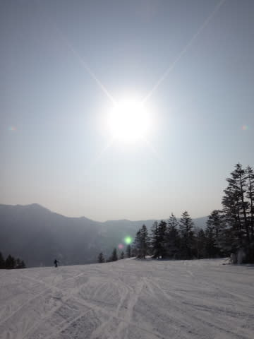

うほほほー！って感じの，晴天がお出迎え．

…でも．朝イチで気温がマイナス3度と高いのが

ちょっと気がかり…

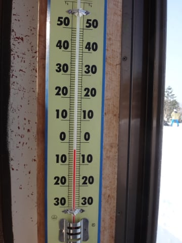

んまぁ，志賀としては高めの気温だけど．

まだマイナスの気温なので．

朝イチの雪質は…

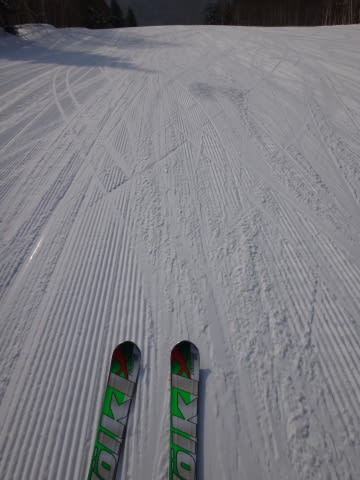

昨日積もった新雪にピステンが入った，エッジががんがんに

食い込む柔らか圧雪っ！

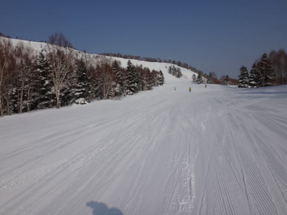

エッジが食い込む，切れきれの超快適整地っ！

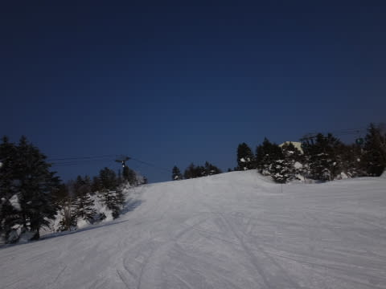

どわはははっ！

晴天の中，人のいない朝イチは超最高の快楽大回りの

出血大サービスバーンだっ！！

…って感じで．

朝10時まで，いつものシアワセ朝イチ焼額を堪能したのですが．

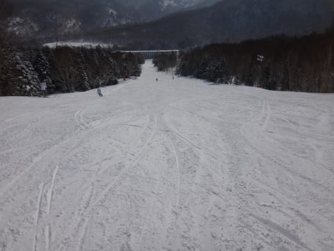

まぁ，10時過ぎても人はそんなにいっぱい出てこず．

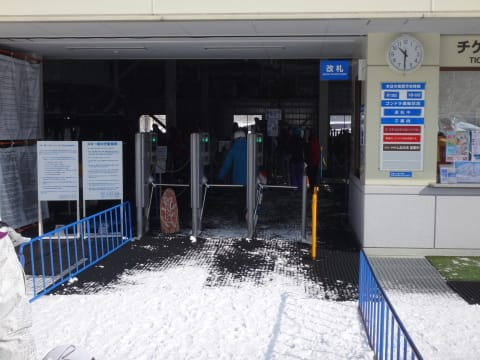

ゴンドラ待ちもなく…

いやー．

今日も快適…

と，思っていたら．

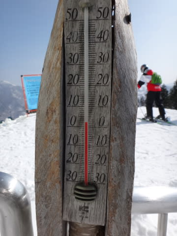

あうーん．

昼間の気温は，プラスに上がっちゃいました．

そして，日差しも強いので．

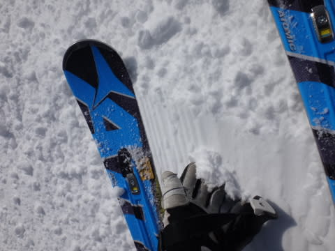

うむ．

雪がちょいと固まりだしちゃってますけど．．．

そして．

しばらくたつと．

日差しが当たる斜面は…

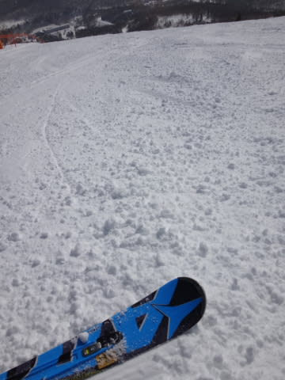

固まったダマダマがゲレンデ上に…

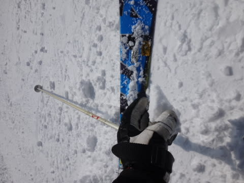

凍ってるわけではないけど，こんな塊がゲレンデ上に

ばら撒かれているので，ちょっとハイスピードで

飛ばすのは怖くなってきました…(ちょっと悲しい)

で．

今日はそこそこ，人もいましたね～

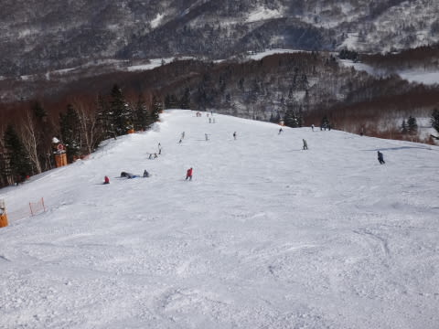

＃先週までとの比較．絶対的に少ないことには変わらない(笑)

ってことで．

人が比較的多かった上に，

日が当たった斜面は，ちょっと雪が緩んだので．

緩んだ雪がスキーヤーに蹴散らされ…

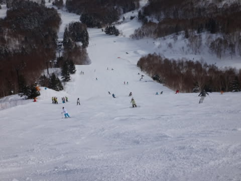

午後にはちょいと凸凹の荒れたバーン状況に．

うーむ．ちょっとハイスピードは厳しいかな～．

そして，昼間，南斜面で緩んだ雪は…

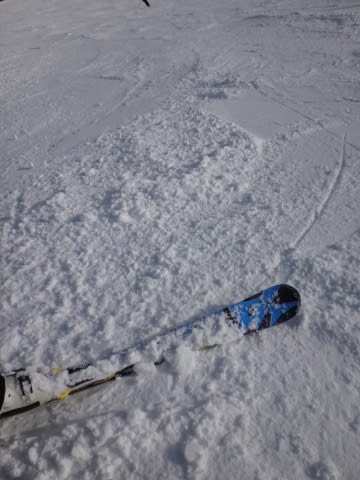

日が暮れるにしたがって…

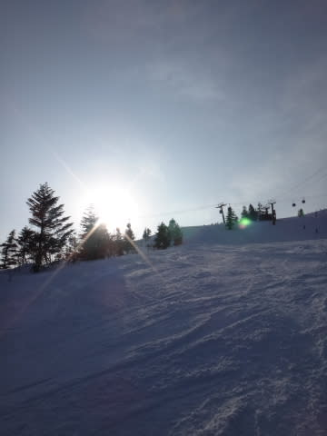

ちょっと硬くなってきたのでした．

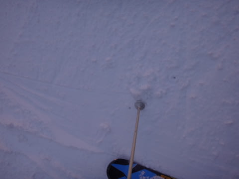

まぁ，日が当たらない場所は，雪質いいままだったんですけどね～．

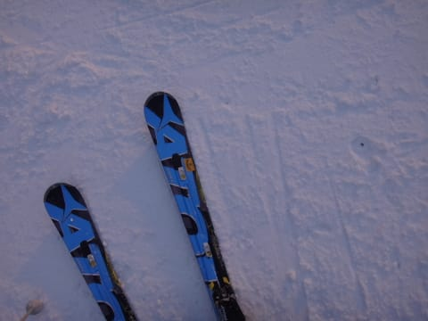

とりあえず，気温が高かった今日．

なんと．リフトストップの夕方でも気温は0度．

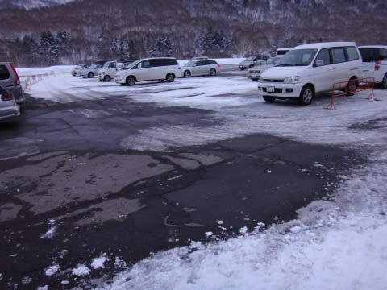

駐車場の雪も，この時期としてはありえないことに，

結構融けちゃってますね…

さすがにナイターの時には氷点下まで冷えてましたが．

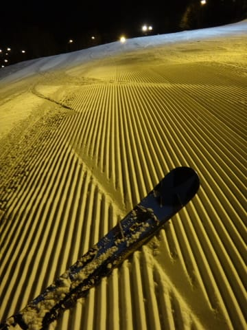

それでも，この時期のナイターとしては，記録に残る

あたたかさかも…．

でも，誰もいないピカピカ圧雪バーンをたらふくいただきました．

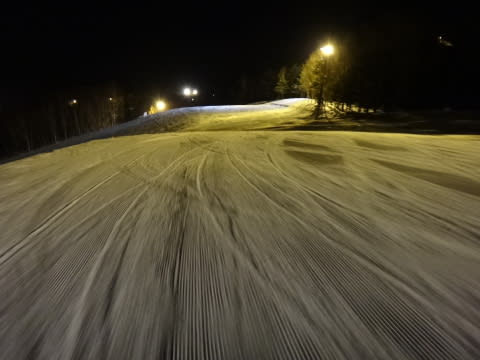

うーむ．

満足っ！

とりあえず．

今日は，気温が高く．

午後はちょっと荒れ気味の雪だったけど．

終日晴れて，気持ちよく滑れましたよ～！

PS.

ナイター終了時まで，星がきれいに出ていたので．

…あした，雨になるって信じられないなぁ…

＃でも降りますので，覚悟のほど(;_;

＃ほとんど降らず，降ってもぽつぽつ程度で収まりそうなのが救い…

## 💬 コメント一覧

### 💬 コメント by (Goku)
**タイトル**: Unknown
**投稿日**: 2014-02-02 08:23:34

それにしても空いてますね～。

コレで飯山まで新幹線が通れば、益々人が野沢に流れちゃうかも。

### 💬 コメント by (ゆうこ)
**タイトル**: ヤマボク
**投稿日**: 2014-02-02 21:37:56

私は今週末志賀高原の反対側のヤマボクにいってました。

今日はいい天気でしたね。

でも、あまりにいい天気すぎて、全然板が滑らなかったです。

せっかく行ったのにパウダー滑れなくて残念でした。

水曜日から一週間ニセコに行くので、すっごく楽しみです！

### 💬 コメント by (Skier_S)
**タイトル**: 今日は午後は晴れ…
**投稿日**: 2014-02-02 23:29:02

)Gokuさま

いやー．すいてますね～．

でも，先週よりは混んでましたよ(笑)．

今日は久しぶりに一ゴン10分以上待ちました…

っていっても，ほかのゴンドラがみんな強風で

止まってたからですけど(＾＾；

)ゆうこさま

山田牧場ですか？

これまた，マイナーなスキー場へ行かれたのですね…

今日は4月並みの気温と雪で，板が走らず悲しかった

ですが，土砂降りよりましかとあきらめました(笑)．

火曜から冷えますよ～！

でも，水曜は激吹雪かな？

飛行機が無事飛ぶことを祈ってます(＾＾

