# 3月27日の志賀高原焼額は…

📅 投稿日時: 2011-03-29 00:22:25

というわけで．

昨日，概要をレポートしましたが．

日曜の焼額，詳細レポートです．

本来，休日は8時オープンの焼額．

地震以来，営業時間短縮で8時半オープンとなったので，

いつもよりちょっと遅めに出かけます．

…なのに，高速がありえないくらいがらがらだったので，

かなり早めに到着してしまったという…

朝，結構な勢いで雪が降ってます．

気温は寒いです．

山頂の気温はマイナス10度！

寒いです．

先週までとはぜんぜん違う…

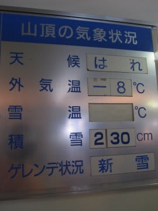

（これは午後の情報…朝イチはもう少し寒かった）

雪は真冬の雪です．

昨日結構積もったので，下地もしっかりやわらかい，

まさにトップシーズンのバーンコンディション．

ゲレンデは，圧雪の上に数cmの新雪が乗った状況．

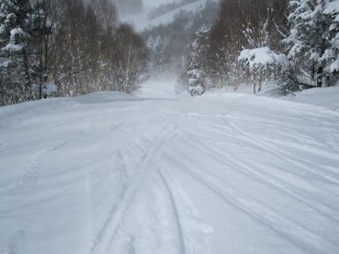

でも，この新雪はすごく軽いです．

ほとんど，下の圧雪を滑っている感覚．

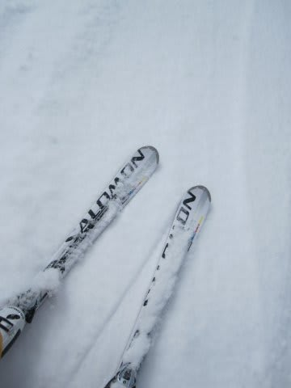

オリンピックコースは非圧雪．

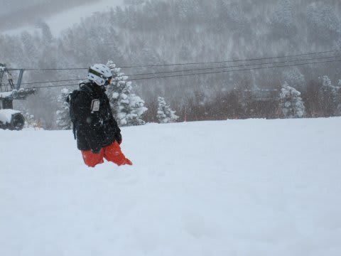

この時期に，こんな軽い雪のひざ下パフが楽しめるとはっ！！

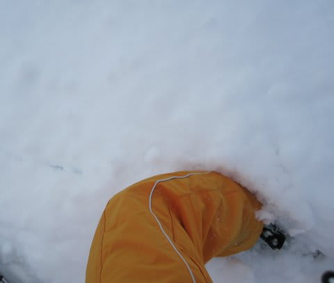

マイナス10度のトップシーズンの雪．

ホントにあと数日で4月なの？？

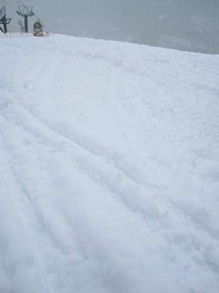

…しかし．

本来なら来週まで営業予定だった焼額第1ゴンドラは動いてません．

この日動いていたのは，第2ゴンドラ，第2高速，第3高速の3本のみ．

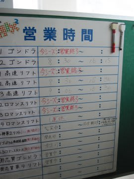

オリンピックコースを滑るためには，

焼額第2ゴンドラ→第3高速

と乗り継がないと行けません．

さらに．本来なら2本のゴンドラが動いているこの時期．

輸送力の高い8人乗りゴンドラが動かず，6人乗りの第2ゴンドラ

しか動いてないので．

9時過ぎからゴンドラ5分待ち．

10時には，ゴンドラ10分待ちに…

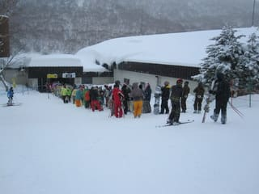

うーーーん．

ちょっとはお客さんが戻ってきているのかなぁ．

しかし，ただでさえ乗り継ぎが悪いオリンピックコースは，

さらにリフト待ちがあるため，がんばって1時間に2本が

限度…

まぁ，11時半にはお客さんが帰りだしたのか，

ゴンドラ待ちは1-2分に短くなってきました．

…っていうか，12時過ぎるとお客さんがほとんどいなくなっ

ちゃったんですが．

昼を過ぎても，最高気温は山麓でもマイナス4度程度．

ゴンドラ乗り場の，建物内の温度計でこれです…

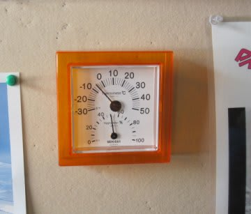

冷えてて，人も少ないので，コースがあれず

ずっときれいなフラットバーンのまま．

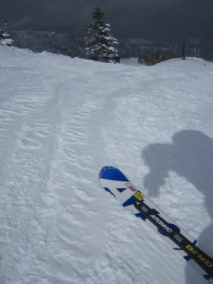

さらに，昼ごろには日も射してきて，かなり最高の

コンディションに．

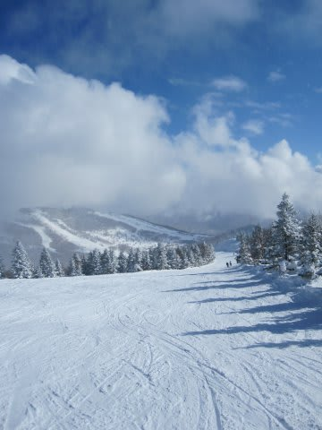

トップシーズンでも，これだけ雪が良くて，人が少なくて，

天気がいいという3拍子そろった日はないなぁ…

しかし．

ホントにさみしい．

ゴーストタウンのスキー場か？ここは．

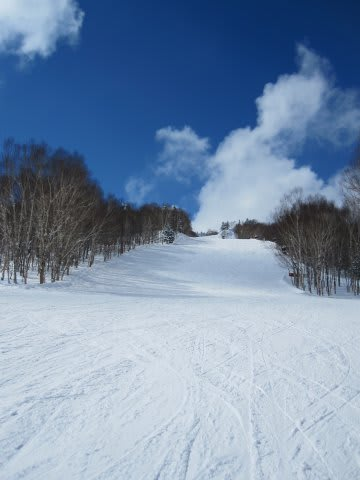

前後に全く人がいない…

という感じで．

ゴンドラ営業終了の4時15分まで（地震の影響で，

本来4時半だけど早めに終了），コースは快適な

フラットバーンのまま保たれたのでした…

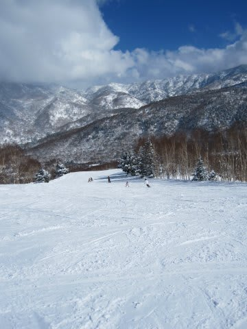

で．

帰りの高速は．

先週までの「全く他の車がいない！」

って状況から，かなりの回復を見せ．

渋滞するほどではないけど，結構な車が

戻ってきたなぁ…と思わせる交通量でした．

## 💬 コメント一覧

### 💬 コメント by (Yuki)
**タイトル**: はじめまして。
**投稿日**: 2011-03-30 19:42:03

はじめまして。

ここ最近スキー行ってないなぁって思いながらブログ探索をしていたら、こちらにたどり着きました(笑

３月も終わりだってのに凄い積雪量ですね(^^)

高校生なのでお金も無く、移動のアシもなく…自分は今シーズンはもう終わりですが、とても楽しい記事を見せてもらってよかったです(^^)/

### 💬 コメント by (Skier_S)
**タイトル**: いらっしゃいませ
**投稿日**: 2011-03-31 00:01:25

今年の3月は，雪に恵まれましたね～

私にとっては雪がある限りがシーズン．

昨シーズンは6月下旬の月山まで滑りました．

大学生になったら，スキー場アルバイトで滑りまくるのもひとつの手ですよ～

