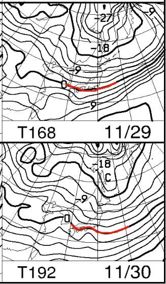
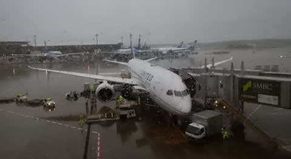
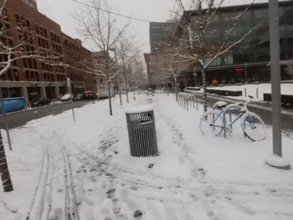
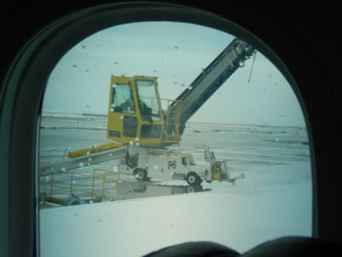

# 志賀高原は熊の湯が本日オープンしたけど，明日は営業中止（涙）…私は無事帰国，明日はYeti！

📅 投稿日時: 2019-11-24 00:04:15

🏷️ カテゴリ: [日記](cc4b5682fb7b8b144980957a978653fb0.md)

ということで．

大変残念ですが．

23日に強引に

オープンした熊の湯は．

昼ごろには[ゲレンデがすごい状況になり](https://red.ap.teacup.com/gokurakuskier/1135.html)．

…24日の日曜の営業は中止になったようですね（涙）

うーむ．

危惧してたことが事実になったか…

このあと，しばらくはかなり暖かい日が

続きます（涙）．

しかし，26日(火）あたりから

やっと平年並みの気温に戻り．

…そして．

29，30日は冷え込みそう！！

850hpaの0℃線が，太平洋近辺

まで下がってます！

真冬の冷え込みがやってきます！！

…ただ，降水量がなさそうなので．

天然雪はそれほど積もらなさそう（涙）

なので，人工降雪だよりですが…

とはいえ，熊の湯は次の週末には

また再オープンしてくれるんじゃ

ないかと期待！！

ってなことで．

私の方は．

本日夕方に成田空港へ降り立ち．

夜に，無事帰宅しました…

現地時間金曜朝に出発して．

日本時間土曜夜着．

ホテルから家まで，はるか20時間の

道のりでした…．

現地はかなりの積雪で．

飛行機も，出発前の機体上の

除雪＆除氷作業で出発が遅れましたが．

…でも．

今回は，前回の出張のように．

・朝からの打合せが終わった夕方，そのまま空港に行き，乗り継ぎ含め16時間のフライト

・帰国が早朝，そのままスキーへ

というご無体日程ではなく．

・打合せ後ホテルで一泊，翌朝のんびり空港へ

・帰国が夜で，帰宅後寝られる

という，優しさにあふれる日程（？）

だったので．

かなり楽でした…

しかし．

某国で雪が降らなくてもいいから，

日本のスキー場に降ってほしかった…

うーーーむ．

日本に向かって冷え冷え踊りを

情熱的に踊っていたのですがが．

どうやら，日本には効かず，

強烈に現地に効いてしまった

ようですね…←いや，違うと思う

さすが，私の冷え冷え踊りは

効きますね！！←だから，絶対違うと思う

ということで．

たった今，帰国後の片づけが終わったところで．

これから寝ます…

明日はYetiに行く予定！

Yetiは，残念ながら朝のうちは結構

雨が残りそうだけど．

…昼前には止んでくれるかな？？

とりあえず．

明日も朝早いので．

4時間ちょっとしか寝れない…（涙）

でも．

飛行機でたっぷり寝たし，元気なはず！！←強引な自己暗示

## 💬 コメント一覧

### 💬 コメント by (五輪の書 u Time)
**タイトル**: Unknown
**投稿日**: 2019-11-24 10:41:19

Skier_Sさま

凄すぎるスケジュールでの大活躍

気を付けてくださいませ

冷え冷え踊り指令出た時は踊ってます

問題は振り付けですが熟考の末

ちょと前の嵐の「年賀状ください～」のCMにしました

(そこ問題じゃないから)

セルフ突っ込み技伝授頂きありがとうございます

https://ameblo.jp/athlete-0718/

### 💬 コメント by (Skier_S)
**タイトル**: >五輪の書 u Timeさま
**投稿日**: 2019-11-25 01:13:42

Blog拝見しました～！

かなりのハイペースで更新されてますね．

そして，いろんなスキー場に行かれているみたいですね…

私も120～130カ所くらいスキー場を巡っていますが，

150か所はすごいです…

とりあえず，このシーズンはどうやら雪のスタートが

遅そうなので，これから12月まで，ひたすら冷え冷え＆降れ降れ踊りを

踊り続けましょう！！

