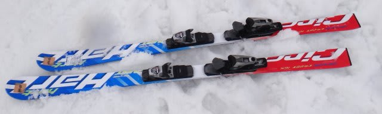
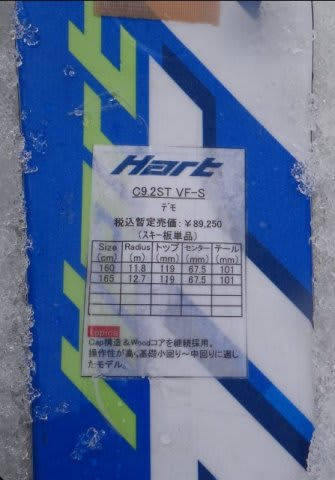

# 2014シーズンモデルのスキー試乗レポートその15…HART編

📅 投稿日時: 2013-05-25 01:09:31

🏷️ カテゴリ: [スキー板試乗](c0bd8048615710cee890e403a36cc9a2b.md)

えー．

この週末ですが．

日曜日帰りでかぐらに行くことにしました…

ということで．

土曜はかぐらレポートはありませんので，ご容赦のほどつかまつりたく…(平謝り）．

で．

今日は，試乗レポートの続きをば．

今回は1種類，ハートの板です．

---

HART 

CIRCUIT9.2ST 165cm

うむ？

特殊だ．この板．

トップのフレックスがやわらかく，テールがかなり硬い…

最初はちょっと戸惑いましたたけど．

…前後動を使って滑っていくとすごい面白い！

ターン始動で，板と一緒に落ちていくと．

やわらかいトップがたわんで自然に小回りターンが始動．

マキシマムから切り替えに向かって，テールに乗っていくと．

テールの張りが強いため，しっかり板が走ります．

ターン後半のテール荷重で，テールが逃げたり切れ上がったりせず，

すっと板が次のターンに向かって抜けていく感じを受けます．

強くたまった圧が，テールまでしっかり抜けていく感じ．

切れ上がり過ぎないので，スピードを落とすことなく次のターンにつないでいけ，

小回りでもしっかり長い谷回りを作っていけます．

板にたまった圧が，テールまできれいに抜けていき，

今度はまた板と落ちていくとトップで捕らえて谷回りが始まる…

って板です．

この滑りに慣れると．

気持ちいいくらい楽に，スピードを殺さない深回りができるようになります．

どんな風に滑っても，どこに乗っても滑れる板ではないので，

乗り手を選ぶかもしれませんが．

この板の乗り方に慣れると，結構楽しく攻撃的に滑れる板ですね～．

## 💬 コメント一覧

### 💬 コメント by (komu)
**タイトル**: Unknown
**投稿日**: 2013-05-25 08:50:37

いやー待ってました。ほとんど同じ感想ですね～。

この板でテールの強さを使った小回りをすると幸せになれます。

でも合う合わないがハッキリするので試乗してから買った方が良いデスね。

で、この板に4日試乗して…

レッスンもこの板で受けて…

板から「名前を書けよ」と言われ…

早期予約してしまいました(・Д・)ノ

### 💬 コメント by (Skier_S)
**タイトル**: やっぱり同じ感想ですよね…
**投稿日**: 2013-05-25 20:50:15

特徴的な板でしたね～．

この板の乗り方を見つければ，楽しい板だと思いました．

来シーズン，この板を使ってばしばし滑ってください！

