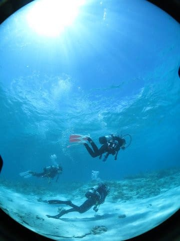
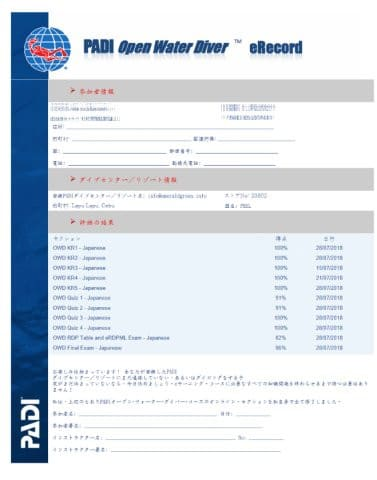
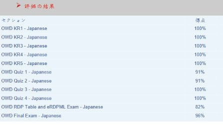
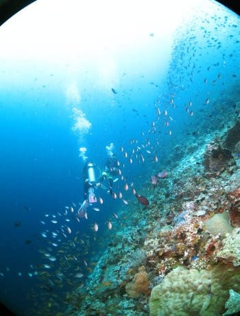

# 小学校5年生（10歳）の娘に，ジュニアオープンウォーターのダイビングCカードを取らせてみた…その3

📅 投稿日時: 2018-09-18 02:45:22

ってことで．

いろいろあって．

私としては極めて大変珍しいことに．

我が家の半径5kmから脱出しない3連休でした．

…いや．

丸2日ほど．

PCの前に張り付いて，仕事してました…（涙）

ってなわけで．

ここ2日間，スキーネタ（一部車ネタ含む）でしたが．

本日は，娘のCカード取得体験記です．

では，どうぞ～！

--

で．

学科講習は，自宅でのe-Learningにしたわけですが．

学科もテストも家でやっちゃうなら．

親が適当にテストをやってごまかせるのでは…？

と，黒い思いが一瞬頭をよぎりましたが．

実際，実習のために現地に行くと．

紙の理解度テストを改めて受けさせられます．

そこであまりにもひどい点だと

一発でばれちゃうので，

残念ながらごまかせません（笑）．

わが娘は，一か月以上かけてしっかり仕込んだ

おかげか．

現地でのテスト．かなりいい点だったようで．

一安心…

やはり，小学生にとって難しいのは，

気圧と体積の関係．

テキストの一番最初の第1章が，

この最大の難関から始まるので．

5章あるテキストのうち，第1章だけで

3日ほどかけてしまったので．

「…1章で3日ペースだと…5章で15日？？

　これは，小学生に1-2か月で教え込むのは

　難しいか…！？？？」

と思ったけど．

2章以降は，ひたすら覚えるだけの内容で．

テストに出そうなところだけ覚えれば

何とかなります．

大人がついて説明してあげれば，1章1－2時間

程度あれば十分でしょう…

気圧と圧力の関係と，

ダイブテーブルを使ったダイビングプラン

という，2大難関さえクリアすれば．

あとは私がテストに出るところをピックアップして

重点的に教えてあげれば，小学5年生でも

理解できるレベルでした…

ってな感じで．

何とか実習を行うフィリピンへ出かける3日ほど前に，

ギリギリすべてのテストを合格し，

試験の合格証がGetできました…！！

画面に表示されるこいつを，印刷して

もっていけばOKです．

この，合格証のテスト成績部分．

一見，100点が並んでいて．

かなり高い点数のように見えますが…

これはですね～．

前回書いた通り，テストは合格するまで

何度でも受けられます．

2回目を受けると，さすがに間違えた問題は

覚えているので，ほぼ満点になる，ということ

なんです…

決して一発で，こんなにたくさん100点を

取れたわけではありません(笑)．

そうそう．

現地に行って，ダイビングの実習前にも軽くテストを

受けると書きましたが．

その問題も，ここで受けたテストと全く同じ問題です．

はっきり言って，テストだけ何度も繰り返し

やっていれば，必ず合格して．

その時の答えを覚えていれば，現地でのテストも，

間違いなく合格点が出ます…

…極論すれば，テキストを読まなくても．

テストだけ何回も受けて，どれが正解か覚えておけば良いとも

いえる…←あえて目立たないよう小さく書いておく

だもんで．

それほど恐れることはありません．

10歳児でも，学科テストは合格できます！

ってな感じで．

学科テストの合格証がもらえたら．

後は現地へ行って，実習を受けるばかり！

いざ，現地へ…っ！
