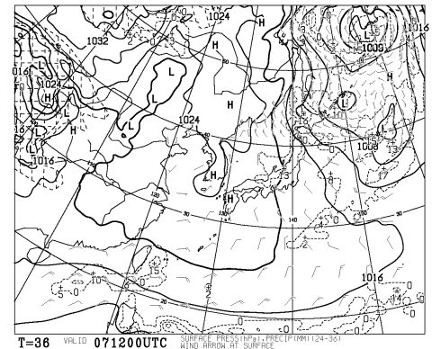

# 明日は今シーズン初の志賀高原なのだ

📅 投稿日時: 2013-12-06 22:59:01

ついさっき．

飛行機で遠い地の出張から戻ってきて，

へろへろなSkier_Sです．

えー．

残念ながら今週はそれほど雪が積もらず．

明日の焼額．

残念ながら，昨シーズンのように，

オープン日からゴンドラ運転となりませんでした…

明日動くのは，[第2高速と第4ロマンスの2本](http://www.princehotels.co.jp/page.jsp?id=81119)みたいです．

でも，運が悪い年はオープン日に第4ロマンスしか動かない

年もあるので，2本リフトが動くだけマシか…

で．

スキー場の天気ですが．

…これから，降ってくれそうな感じです！！

27日はこんな感じで，夜まで冬型，縦じまの気圧配置で．

しっかり北風が入ってくれます！

今晩から明日一日中，

…いや，日曜の朝方まで，雪が降り続けるでしょう．

…上空の寒気がそれほど強烈では無いので，どさどさと

いう感じではないですが，そこそこ積もってくれそう！

という感じで．

この週末の志賀高原．

・土曜は結構冷え込み，前日の夜から5～10cmほど積もる．

　土曜は終日雪．でもどさどさ降るほどではない．

・日曜は朝まで小雪．その後，雲が上がり晴れてくる．

　午後は完全に晴れ．でも気温はそれほど上がらない．

…っていう感じでしょうか．

明日の朝，志賀に登る道はちょっと注意が必要かも…

とりあえず．

今シーズン初の焼額！

楽しみです～．

　

明日朝3時出発なのに…

こんな時間まで起きてて大丈夫なのか？？

## 💬 コメント一覧

### 💬 コメント by (いか)
**タイトル**: Unknown
**投稿日**: 2013-12-07 13:17:28

今週はコンディションよさそうですね。

楽しんでください…！

ホームの八方では、新雪祭りらしくうずうずしております(・_・;

### 💬 コメント by (Skier_S)
**タイトル**: 今日の志賀は
**投稿日**: 2013-12-07 16:42:43

う～ん

ちょっと積雪は少な目。

人工雪のコースはいいんですが…

もう一降り欲しいところです～

### 💬 コメント by (ゆうこ)
**タイトル**: お疲れ様です。
**投稿日**: 2013-12-07 18:22:51

今日は、お疲れ様でした。

お会いできてよかったです。

私は久しぶりのスノーボードで、足が痛いです。

雪が少なかったので、来週は白馬行こうかなと思います。

### 💬 コメント by (Skier_S)
**タイトル**: 今シーズンもよろしくです～
**投稿日**: 2013-12-07 22:15:01

いやー．無事お会いできましたね～．

でも，ゆっくりお話できなくてごめんなさい．

宿が一緒かと思いましたら，違いましたね…

明日は滑らないんですか？？

私は明日も来週も，当然焼額です！！

