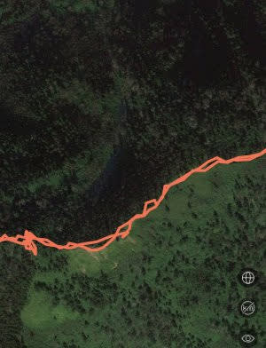

# Amazfitのスマートウォッチ，Amazfit GTRとPACEをしばらく使ってみて…2020/10/29のアップデート以前では，圧倒的にPACEのGPSが高精度だった

📅 投稿日時: 2021-02-10 02:12:58

えー．

本日も本題に入る前に，志賀高原特派員情報を

お送りするわけですが．

…昨晩から，すごい積もったようです…！！

…いつものおこみん人形が，

積雪量の比較対象として全く役立ってませんね

もう少し積雪が分かる写真を…

これでどうだ！

これは，人形ではないです（笑）．

2ゴン乗り場前で膝パフパウダー！！

…結構積もってますね．

で，あさイチの気温は-15℃と，

むちゃくちゃ冷え冷えで…

そして，気温は私の予想がぴったり！

ふはははは！

駐車場で40cm以上，コース上は50cm

ほど積もっていたみたいですが…

（新雪が覆う焼額SGSコース）

ただ，雪質は私の予想と違い．

思ったほど軽くなく，結構重めで，

ところどころゴキブリホイホイ化していたようです…

結局，この日は一日雪が降り続け．

朝の雪は多少重めだったものの，

終日パウダーが積もり続ける

冷え冷えパウダーデーだったようです…

でも，視界が激悪の吹雪ってほどじゃ

無く，レインボーさん曰くシーズン一番

楽しかったとのことだったので．

…今日も，いい一日だったようですね…

…でも．

[昨日の記事](e25a22390af40d3f0b645aff644c487ee.md)に書いたように．

この冷え冷えは11日まで．

12日から気温が上がり．

14日，果たしてどうなることか…？

とりあえず，スキーに行く人は，祈って踊って

おくことをお勧めします．

…私？

いや…槍やミサイルが降るようには祈ってませんから…！！←本当かな？

ってなことで．

本題へ．

スキーや運動記録用のスマートウォッチとして，

[Amazfit GTRを1年半近く，

Amazfit PACEを1年ちょい使ってみて
いる](e8ecb713cae6d59127adb9caa4875fa96.md)わけですが．

まぁ，私の場合は，運動ログを取るのは

ほぼ登山とスキーに限られています．

まずは登山に関して．

Amazfit GTRは，これまで何度もGPSの

ファームアップがかかって．

精度が多少改善していますが…

やはり，金属ケースのGTRは，樹脂＆

セラミックケースのPACEに比べると，

GPS電波の感度が悪くなってしまうようで．

やはり，PACEの方が精度がいいです．

最後に，2020年の10月にGPSのファームアップが

かかって，これ以降はちょっと精度が上がった

感じはありますが．

このファームアップ前の状態で話をすると…

Amazfit GTRでは，山の木々に覆われて見通しが

悪いところではGPS電波をつかみにくく．

その場合，このように軌跡がぐちゃぐちゃに

なってしまう場合があります…

そのせいか．

岩菅山を登った時の記録を，

左腕にGTRを，右腕にPACEをつけて

記録したんですが．

PACEだと全行程11.4kmと示しているところ…

同じルートなのに，GTRだと15.77kmと

なっていますね…

拡大するとこんな感じで．

PACEだと道に沿ってまっすぐ進んでいる

ところ…

GTRだと，軌跡が乱れていて．

この分距離が長く出ちゃってるようです…

当然，実測距離に近いのはPACEの方．

GTRでは，かなり実際の移動距離より

長く出てしまいます（涙）

南八ヶ岳の編笠岳を登った時の記録を

見てみると…

Amazfit GTRでは，片道の山頂までで

12.36kmとなっているところ．

Amazfit PACEの記録では，

ぐるっと回った往復で12.86kmとなっていて．

この水色部分だけで12.36kmとなっている

Amazfit GTRでは，距離が大体実測の

倍くらいになっちゃってます…

PACEでは，こんな風にちゃんと道に沿って

まっすぐ進んでいるんですが．

GTRの軌跡を見ると…

これはちょっとひどいですね（涙）

GPSビューワーを使って，GPSの軌跡を

より詳しく比較してみると．

GPSをちゃんと拾っているところでは，

PACEでの軌跡も…

GTRでの軌跡も，概ね道に沿って残っていて．

誤差は数mってところに収まっており．

どちらも精度は高そうに見えるのですが…

ただ，GPS電波が弱いところでは，

PACEの軌跡がこんな感じできれいに

道に沿って残っているところ…

GTRだと，ちょっと軌跡が乱れてますね…

両者を重ねてみると．

うーむ．

どんなルートを通ったかを見るには，

どちらでも行けそうな感じの精度ですが．

やっぱり，GTRの方は乱れがあり，

これだとちょっと距離精度は出ないかな…

ということで．

10月29日のGPSファームのアップデートが

かかる前の比較では．

…GPSの電波が強いところではそこそこの

精度が出てはいるものの．

GPS電波の受信感度が高くなく，

電波が弱いところでは，Amazfit GTR．

ちょっと精度が落ち気味です…

登山で移動距離を正確にとろうと思うと，

Amazfit GTRは適さない感じ．

Amazefit PACEの方が信頼できる感じでした…

ってなことで，

10月29日に[スキーモードに致命的バグを仕込んでくれた](ed66c48ec0a75046020ac4fff036c6ef4.md)

GPSファームのアップデートがかかった

わけですが．

果たして，このファームアップの効果や如何に？

（続く）

## 💬 コメント一覧

### 💬 コメント by (ほっぽ)
**タイトル**: 週末の天気
**投稿日**: 2021-02-10 06:55:09

Ｓさん

飛び石連休の週末、特に土日の天気が気になります。

志賀高原に特化したＳさん天気予報の最新版をお待ちしています。

さて、明日2/11はスキーはお休みして、朝からエキップさんへ行ってきます。

っていうか、起床と出発時間は何時もの志賀高原スキーと同じ時間です。

スキーシーズン真っ只中にお休みして結果はどうなのか？

そして、まさかの物欲選手権大敗となるのか。

乞うご期待(^^;

http://hoppo.officialblog.jp/

### 💬 コメント by (レインボー73)
**タイトル**: Unknown
**投稿日**: 2021-02-10 17:42:29

水曜日の志賀高原情報

ちなみに今日もやめられなくて残業を余儀なくさせられました。状況をお察しくださいませ。

好天に恵まれ、新雪が圧雪されて、誰もがスキーを好きになれる一日でした。パノラマ、カラマツは快適だったと思うんだけど、その後が楽しすぎて、記憶がない。

オリンピックも食い込む錯覚バーン。ＧＳサイド非圧雪は柔らかーいマシュマロ。

奥志賀ダウンヒルも勘違いバーンだけど、私はここは飽きちゃったので、すぐにエキスパートへ。

今日は昨日新雪を堪能させてくれた、試乗太板　ヘッドKORE 180cm。せっかくの太板なのに、正面バーンがシーズンベスト。良すぎて非圧雪に入れない。圧雪の境目はひどいけど、食い込んで食い込んで安全バーン。やめられない。

でも、目指すはジャイアント。ダイヤモンドは素通り。ファミリー正面だけが今日のの私の不快バーン。

高天の銀嶺でざる蕎麦のあと、友人と板を交換して、西館からジャイアントへ。ここも食い込むので私でも楽にいける。こんな日にスキーができる幸せを味わいながら、一の瀬まで。

### 💬 コメント by (レインボー73)
**タイトル**: Unknown
**投稿日**: 2021-02-10 18:36:55

水曜日の志賀高原情報２

帰りはたまごに乗ってパーフェクタ経由。パーフェクタも快適。一路ダイヤモンドで、土日のポール予約。

その後のダイヤモンドがまた気持ちよくて、またまた禁（２時にはやめる）破り。つくづく我慢のできない最低な男です。

板を交換した友人は、この板をお気に入り。

エス様、定年退職までの我慢です。それまで何とか気がふれないように、我慢我慢の毎日を送ってくださいませ。みんな待ってますよー。

### 💬 コメント by (Skier_S)
**タイトル**: 冷え冷え期間明日で終了
**投稿日**: 2021-02-11 00:46:14

＞ほっぽさま

土日，何とか液体の危機は回避できそうです．

月曜も，志賀はギリギリ降らずにもってくれそうか…

気温はすごい上がりますが（涙）

そして，エキップさんでぜひ物欲に負けてきてください（笑）．

＞レインボー73さま

最近，毎日シーズンで一番面白い日記録を更新しているのではないでしょうか．

毎日の残業が物語ってます…（笑）．

いや．しかし．

早く定年退職したい…

というか，早期退職したいです．

