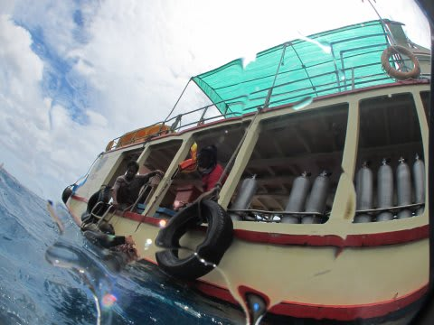
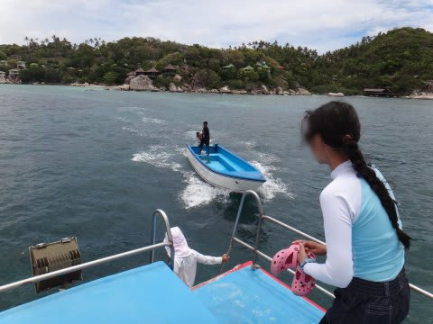
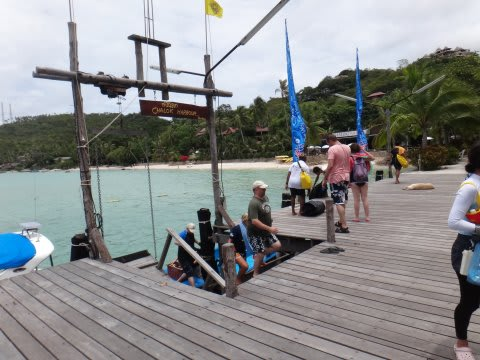
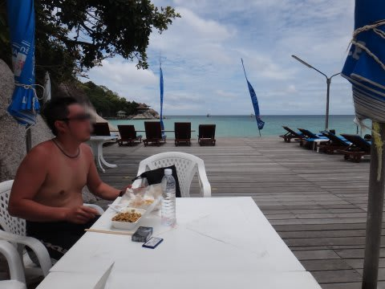
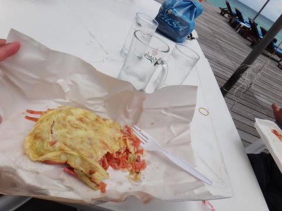
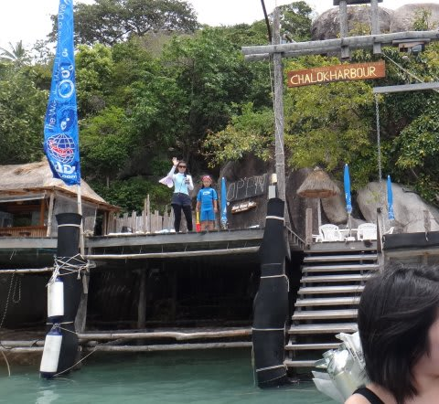
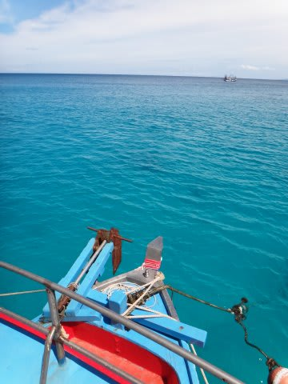

# 2013年9月　子連れタイ・タオ島ダイビング旅行記　その9…さすがの娘も懲りたのか？

📅 投稿日時: 2013-10-14 01:23:19

ってことで．

午前中の2本目が終わると．

船は港へ戻り，

迎えに来た水上タクシーで，桟橋へ．

桟橋に降り立ったら…

桟橋のテーブルでお弁当タイム．

このお弁当．何種類かあるメニューから前日に選んで，

ダイビングショップに申し込んでおけば，準備してもらえます…

お値段は60バーツ程度(180円くらい)とお安く．

見た目もそれ相応な感じでチープな感じのお弁当だけど．

結構おいしい！

いやー．タイ料理って悪くない．

って感じで，お弁当を食べ終わったら，

午後のダイビングに向かうわけですが…

…ですが．

娘「お船，乗りたくない」

ええええええ～！

ど，どうした！

船大好きの娘が！

娘「プールで遊びたい～っ！！！！！！」

…確かに．

今日は，船はかなり揺れて，最初ちょっと気持ち悪がってたし．

さらに，あの船，遊ぶところないし．

その上波が高くて，今日は海で泳ぐのは不可能だったから．

…退屈だったのね．

ってことで．

船にそんなに強くない妻が残って．

娘をプールで遊ばせることに…

娘に見送られて，私一人，午後のダイビングへ向かいます．

…うーん．

…娘．

明日から，船に乗ってくれるんだろうか…

もう，船には乗りたくない～，

って言わないだろうなぁ…

…と，心配しつつ．

船は午後の1本目のポイントへ向かいます．

…なんだか．

今になって天気が良くなって，風も止んで．

波もおさまってきたんですが…

…午前中がこんな天気なら，外洋に出れたかもしれないのに！

外洋に出ない午後に限って風が収まるとは…

なにか，呪われているのかなっ？？
