# 今日の志賀高原は曇り時折晴れ間のいい状況だったみたいだけど…次の週末の天気は雨！？？

📅 投稿日時: 2021-01-18 01:39:34

えー．

本日の志賀高原．

特派員からのレポートによると．

やはり，朝の積雪はそれほどでもなかったようで…

せいぜい10cmほどですかね？

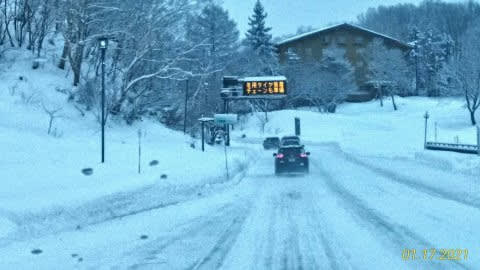

水曜の予想では，もっとモサモサ積もるかと

思ってましたが．

直前に西風に変わり，それほど積もり

ませんでした．（涙）

で．

朝も雪は降っておらず，曇り空でスタート．

私にとっては悔しいことに，

槍もミサイルも降らなかったようですが…

でも．

朝の気温は-10℃以下とかなりの冷え込み！

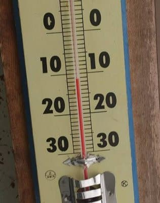

そして，朝イチはかなり締まったシマシマバーン！

重めの雪がしっかり圧雪されて，ガッツリエッジが

効く，かなりいい感じの硬さのバーンだったようです！

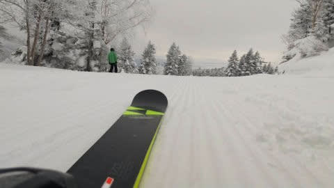

そして，午後に向かって雲に切れ間が

出始めてきて，

昼ごろにはゲレンデの一部に日も射して…

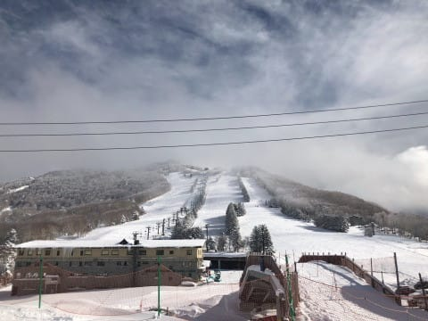

すっきり晴れる瞬間もあったようです！

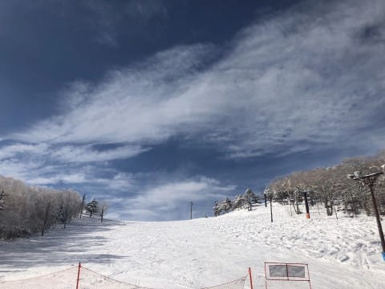

ううううう．

うらやましい！

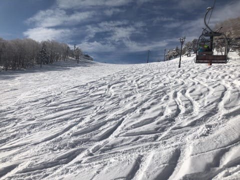

ただ，ずっと晴れていたわけではなく．

時折晴れ間が…という程度だったようですが．

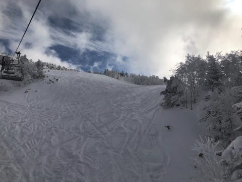

とりあえず，

本日も，槍もミサイルも降らず．

いいコンディションだったようです…（涙）

で．

18日の志賀高原も冷えて曇り~パラパラ雪で

それほど積もらなさそうですが．

19日の地上天気図を見ると…

をを！

見事な縦縞の冬型の天気図で，

降水域も志賀高原にかかってます！

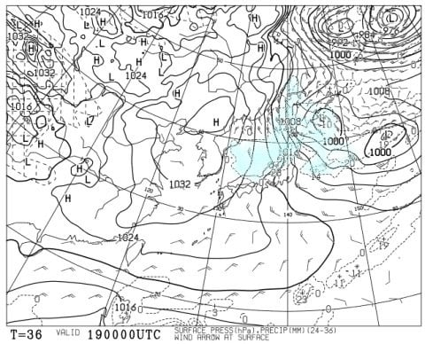

そして，19日の850hpa図でも，

水色の-12℃の線が志賀にかかっているので…

これは，19日朝は-15℃くらいまで

冷え込む，激冷えです！

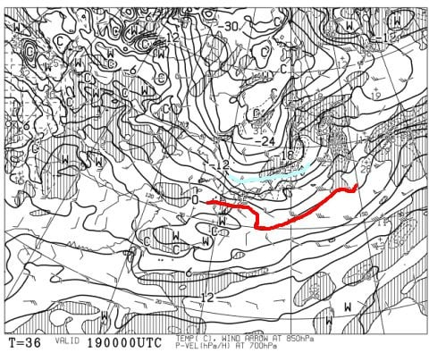

だもんで．

19日（火）は，朝は20cmほどの冷え冷え

　新雪デーになりそう！

　そして，午前中も雪が降り続くので，圧雪バーンも

　朝は新雪が乗ってるでしょう…

で．

20日の地上天気図を見ると．

…見事に高気圧が覆ってます！！

これは，晴れそう！

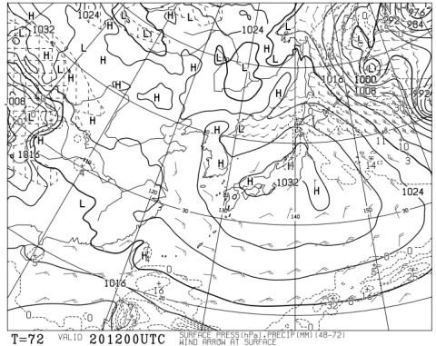

20日（水）は，昨日積もった冷え冷え雪が圧雪された

　最高バーン！

　一日晴れて，気温も上がらず，

　冷え冷え最高雪を晴天で楽しめそうな

　ラッキーデー！！

って感じになりそうですね…

…こんないい天気なのに．

志賀高原は，今週以降も寺子屋の平日休業を

決めたようで．

さらに，タンネの森のリフトも2月7日までの期間，

月曜から木曜までは止めちゃうようです…（涙）

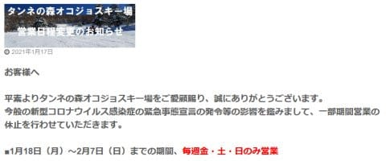

（[志賀高原中央エリアホームページ](http://shigakogen.co.jp/archives/9220)より）

あぁ…残念…

で．

その先の週末ですが…

…んんん！？？

23，24日，何か危険な傾向が…っ！？

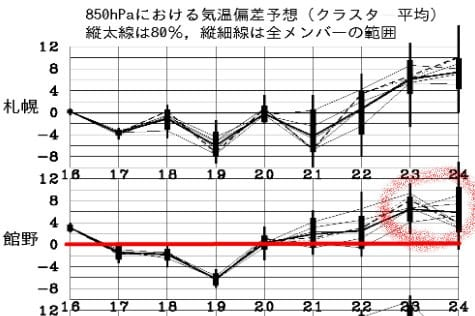

慌てて850hpa気温を確認すると．

…うむむ！

23日，赤い0℃線がかなり北まで上がり，

志賀には+3℃線がかかってるよ？

24日もヤバい感じ…

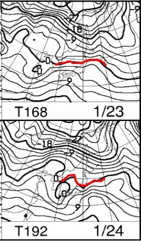

一見，24日は0℃線が志賀にかかっていて，

ギリギリセーフっぽく見えるけど．

このFXXN519の850hpa図は，GSMの

コントロールランなのだ．

…どういうことかというと，

このFZCX50の気温傾向グラフ．

水色で塗った点線と，赤色で塗った

太線があるけど…

赤色の太線がアンサンブル平均．

確率的に，このあたりになる可能性が

高い，予想ばらつきの中心値．

水色の点線はGSMコントロールラン．

初期値の中心値から予測される値．

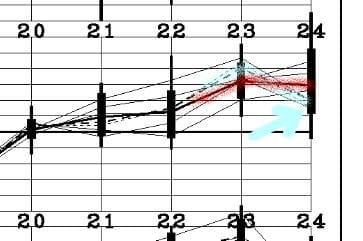

ってなことで，本来赤線の気温の

当たりに収束する確率が高いんだけど…

さっきの24日の850hpa図は，それより低い

水色の矢印部分の予測図．

おそらく実態は赤色の線に近づくと

思うので，この予想図より気温は

上がるはず…

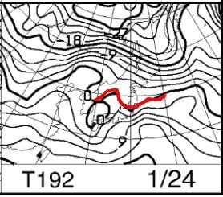

となると．

ヤバい．

23日，24日とも揃って，

おそらく0℃線は志賀高原より北に

なる可能性が！

…これで降ったら，ヤバいんですけど…

…

…

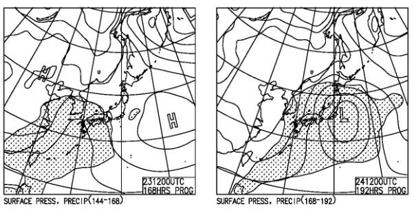

…あう（屍）

ということで．

この週末，スキーに行こうとしている人は

覚悟してください．

そうです．

空から液体が落ちてくる覚悟を…

…いや．

週末，槍かミサイルが降らないかな…とは思っても．

雨が降ると雪がダメになるので，

液体は降らないでほしい…

と，身勝手な願いをするSkier_Sだったのでした…

## 💬 コメント一覧

### 💬 コメント by (かず)
**タイトル**: Unknown
**投稿日**: 2021-01-18 03:44:31

来れないSさんになかなかコメントしづらいですね…… 

本日奥志賀のパウダー16時まで 人も少ないのでのんびり昼とっても残有有！

20日はSのお告げ調整日です！夜までは振らないんですね…今のところ微妙ですが…週末雨ならいようかな

### 💬 コメント by (ほっぽ)
**タイトル**: Unknown
**投稿日**: 2021-01-18 11:58:01

Ｓさん

24日は雨ですか😭

野沢に行こうと思ってましたが、

雨なら少しでも標高の高い志賀高原ですね。

野沢、なかなか都合が合わないなぁ😭

### 💬 コメント by (レインボー73)
**タイトル**: Unknown
**投稿日**: 2021-01-18 12:04:29

月曜日の志賀高原情報

朝の湯田中はさらさら雪が1センチ、ニゴンでも２センチ。太板は必要なし。今日もニューフィッシャーです。

白樺カラマツは柔らかい雪。オリンピックも朝圧雪になったみたいで、明日の新雪は期待薄。三高が動かないので、明日はミドルもだめ。

今日のオリンピックは向かい風が強くて一本でやめ。

奥志賀ダウンヒルはリフト一人乗りが多くて、人が少なくても待ちが発生。ほぼ無人のエキスパートでは、一人が普通に滑ってたのに111km/hを達成。週末ではこんなことできませんよね。

ファミリーの上で写真を撮ったあと、前を閉め忘れたため、ファミリーではだんだん開いて全開、スーパーマン状態。

あ、

### 💬 コメント by (レインボー73)
**タイトル**: Unknown
**投稿日**: 2021-01-18 16:25:36

月曜日の志賀高原情報

あ、で終わってごめんなさい。高天原ホテルでピザを食べながら第一報をかいていたら、一緒に行ったヤケビの従業員君のまわしが速くて（まわしとは名古屋では手廻し、用意のこと）、もう出るとのこと。あ、

東館経由でパルスゴンドラまで案内して最後に汗かいて、ふわふわ快適な西館様を二本。ヤケビに戻ってみると、やっぱりヤケビです。期待を裏切りません。カラマツ、ＧＳは人が少ないから相変わらず好調。きっちりレインボーあがりでした。

自粛中のエス様の神経を逆なですることを一つ。

スキーを終了する時はいつも残念ですよね。もうしばらくの間スキーができないんですから。エス様はその残念さを味あわなくてすむから幸せです。私なんぞ毎日味あわなければならないんですから。（読者？の皆様、お気を悪くなさらないでくださいね）

### 💬 コメント by (Skier_S)
**タイトル**: 19日はパウダーデー！
**投稿日**: 2021-01-19 02:25:56

＞かずさま

おそらく，19日は夕方に雪は弱まって，20日朝までにはそんなに積もらないかと…

でも，19日に積もった冷え冷え雪が圧雪され，天気も良さそうなので，

20日は最高のバーンコンディションだと思いますよ！

＞ほっぽさま

24日，野沢はやめた方がいいです…

なるべく標高が高い志賀をおススメしておきます．

＞レインボー73さま

今日もレポートありがとうございます～！

明日の新雪はSGSコース⇒イースト＆ミドル連絡が完全非圧雪になるようなので，

ミドルじゃなくイーストで新雪を楽しめますよ！

そして，スキーの終了の残念さを少しでも緩和するためには，やっぱり

リフト終了まで滑り続けないと…（笑）．

