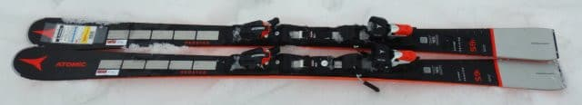
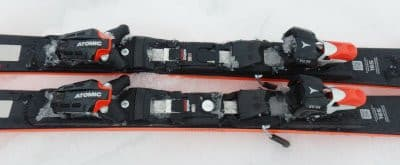
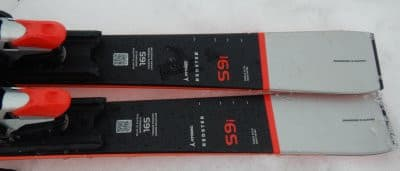
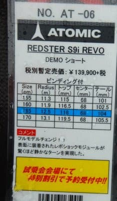
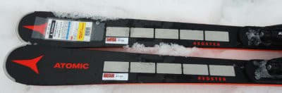

# 2022シーズンモデルのスキー板，試乗レポートその11…ATOMIC Redster S9i REVO

📅 投稿日時: 2021-06-26 01:10:29

えー．

今週も激務でした…

ってなことで．

今こんなの時間にBlog記事を書いていますが．

私の記憶が確かなら…

たしか土曜日は．

激務のストレス解消に某所に遊びに行くため，

朝3時に家を出発するはずだが？？？

あと2時間もないのだが…？？

ということで．

スキーシーズンが終わったにもかかわらず．

今日もほぼ徹夜で出かけることになりそうです…

で．

今日は2022シーズンモデルのスキー板の

試乗レポート．

今回もアトミック編です．

では，どうぞ～！

○ATOMIC Redster S9i REVO 165cm

基礎小回り用

出ましたよ～！

2022シーズンから新たに採用された，

ATOMICの新兵器，Revo Shock．

来シーズンのATOMICの競技＆上級モデルは，

S9 FISとS9i PROを除くと，ほぼ全てが

この謎の(？)重りをトップに仕込んだモデルと

なります…

ロング用の板なら，振動吸収や安定性の

ためにトップに重りを入れるのはありと

思うけど…

スイングウエイトの軽さが必要な小回り

板のトップに，こんなに重りを入れるのは

ありなのか？？

果たして，REVO Shockの効果や如何に？？

とりあえず．

このモデルは基礎小回り用として，

S9i PROの一つ下になるモデル．

S9i PROに比べると，フレックスなど

優しく設定されている板なのですが…

履いてみると，重さを感じるS9i PROと違い，

かなり軽く感じます．

そして，比較的低速から板が良くたわみ，

たわみに沿ってきれいにカービング小回りが

決められる感じ．

それでいてグリップが強すぎて，板なりに

回されてしまう…ということは無く．

ターンの途中で弧をゆがめたり，

板を動かしてラインを変えていく

自由度も高いです．

ただ，逆に言うと．

山回り部分でも板を動かせる

自由度があるくらいなので．

山回りのグリップはガッツリ強烈

グリップというより，ちょっと

優し目に感じます．

ターン前半からすっとたわんでターンが

始まり，ターン後半までたわみに乗って

きれいに小回りで回っていきます．

サイドカーブもきつく，しっかりたわんで

旋回力も強いので，小回りから中回りが

やはりメインになります．

スピードを出しての大回りはきびしい感じ…

ばね感もそこそこ感じられるけど，

私の普段履いているSXよりばね感は

弱いかな．

そして，トップスピードを出した時の

安定性，グリップ感はやっぱりS9i PROの

方がいいです．

でも．

スピードを出してもしっかりカービング

していくグリップがありながら，

優し目のグリップで板を動かす自由度が

高いので，荒れた斜面，コブ斜面含め

いろんな斜面で小技が使えるため，

ゲレンデ普段履きとしてはいい感じで

使えそう！

そこそこしっかりカービング小回りを

やりたいけど，いろんな斜面でカービング

小回り以外の，いろいろつぶしが効く

滑りもしたいという人にはいいんじゃ

ないかな…

あ，そうそう．

気になったREVO shockの効果ですが．

私にはあまり分かりませんでした．

REVO shockがついてないS9i PROの

方が，高速安定性あるんじゃないかな？

と思ったので…

S9i PROのあとに乗ったのが

悪かったかな？

でも，重りの重さは全く感じず，

履いた感じはS9i PROよりずっと軽くて，

スイングウエイトの重さも感じ

なかったので．

小回り板にこんな重りをつけて

大丈夫かな…？

という心配は完全な杞憂でした～！

## 💬 コメント一覧

### 💬 コメント by (ikkun)
**タイトル**: Unknown
**投稿日**: 2021-07-01 20:34:19

確かに順番ってありますね？  重さを使える人はいいかもしれませんね  ?

