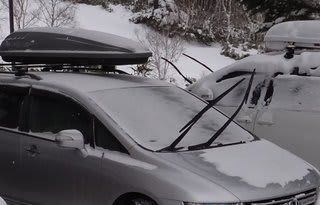
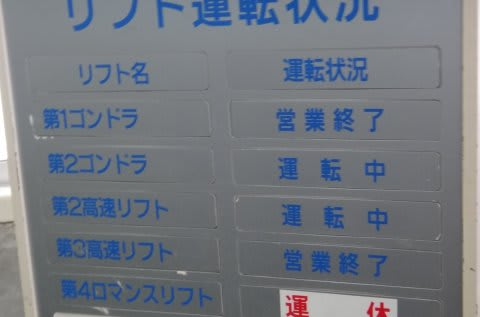
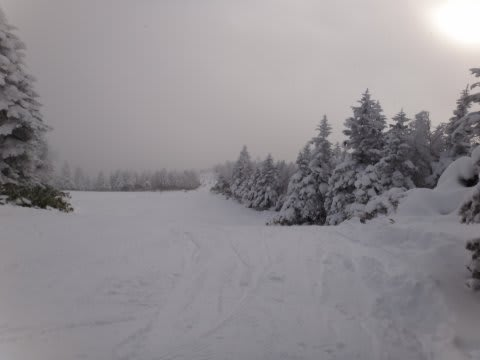
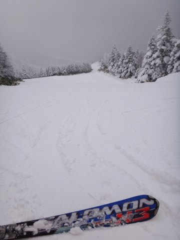
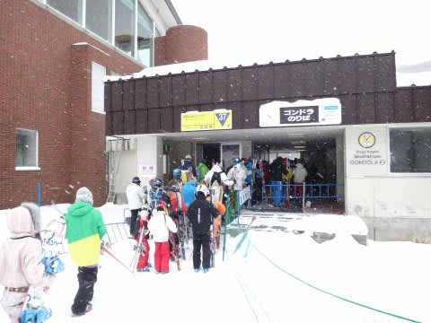
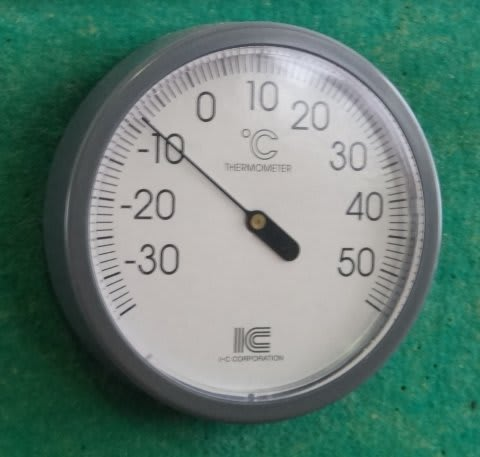
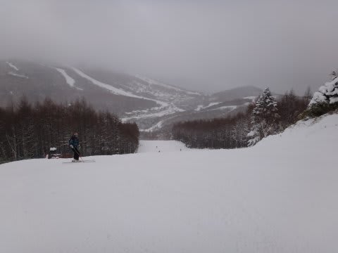

# 12月18日の志賀高原…焼額第2ゴンドラがオープン！

📅 投稿日時: 2011-12-19 01:48:03

🏷️ カテゴリ: [2012スキー滑走日記](cca3a0e9524e0203150f790b1fc3c71ad.md)

ということで．

残念ながら，土曜の夜から日曜にかけての積雪は1-2cmってところでしょうか．

ほとんど積もらなかった…（涙)

（昨晩からの積雪はこの程度)

でも．

金曜夜から土曜午前にかけての積雪のおかげで．

本日から焼額第2ゴンドラオープン～（ぱちぱちぱち）

しかし．

焼額ゴンドラ以外で日曜に新たに動いたリフトは

一の瀬クワッド（迂回路の天狗コースしか滑れません…）だけ．

山の神はオープンしてないから，一の瀬方面から焼額へスキーでは

移動できませんよ～．

車で行かないと…

という感じで．

ついに，わがホームゲレンデのゴンドラが運転開始！

雪の状況は，第1高速降り場付近の急斜面にわずかにブッシュが

出ている場所もあるけど，大体安心して降りれる積雪量は

ありますね～．

予想よりいいコンディション．

ゴンドラ待ちは，午前中に最大7分くらい．

結構ムラがあって，ドドっと来てる時は5分，

人がいないと1分程度…という感じで，予想より待ち時間は短め．

一の瀬とまだつながってないから，人が流れ込んでこないんでしょうね…

天気は一日ちらちらと雪が降ったり止んだり．

ごくわずかに日も射す程度．

気温は寒かったよ～！

朝はマイナス10度，昼間でもマイナス5度くらいまでしか

あがらなかったので，雪質は最高！

…あとは，もう少しがばっと雪が降ってくれれば…

という感じで．

雪もよく，人も（比較的）少なく，ゴンドラ運転開始ということで．

やっと，がんがん飛ばせるスキーができるようになった，という感じですか．

## 💬 コメント一覧

### 💬 コメント by (コロネ)
**タイトル**: こんばんわ
**投稿日**: 2011-12-19 17:22:34

昨日はかぐらは激混みだったようで… 

なので丸沼に行きましたが、丸沼も

かなり混んでました(´Д｀)

午後からはサイレン鳴らしたスノーモービルが

頻繁に走ってました(´Д｀)

あそこは結構飛ばしやが多いです。

午前中はずっと雪でした。

午後からは降りが弱まりました。 

しかし寒かったわぁ～ 

言われたとうり、クリスマス寒波、来ますね！ 

寒いから、行かない(笑)

### 💬 コメント by (Skier_S)
**タイトル**: 焼額はそれほど混んでなかったです…
**投稿日**: 2011-12-20 00:32:11

焼額はそこそこ混んでましたが，滑走距離が長い

ゴンドラが平均待ち時間3分程度だったし，

第2高速は待ち時間0だったので，そんなに

混んでなくてよかったですよ…．

こっちも寒かったけど，やっぱりもうひと雪欲しい感じですよね…

クリスマス寒波，来ますね～！

22日夜からは数日間，どかっと

積もりそうです！

…寒いから行かないってもったいなく無いですか（笑）．

