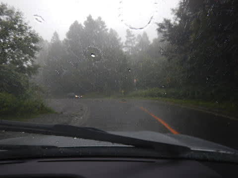

# 夏の志賀高原に行ってみた…初日のトレッキングは雨（涙）．

📅 投稿日時: 2017-08-31 01:30:33

えー．

そう，本日は．

パラオの直前に行ってきた，夏の志賀高原の

レポートを行ってみようかと…

とりあえず．

毎年8月お盆の次の週末に開催される，

志賀高原の大蛇祭り．

2日間にわたり，ミス志賀高原コンテストやら，

花火大会やら，いろいろなイベントが開催される

結構大きなお祭りなわけで．

これに合わせて志賀高原に行こう，

ということで…←スキーシーズンが終わってから

志賀高原もう2回目．志賀高原への忠誠度高すぎ！！

座間味旅行からパラオ旅行まで，中9日

この間に1泊2日旅行を入れるという，

かなり強引な日程で突っ込んだ，

今回の志賀高原ツアーだったわけですが．

出発の土曜日．

ええ．やはり．

志賀高原に行くときは，やはり午前4時に

家を出ないと，落ち着かない…

ということで，いつも通りの早朝出発．←感覚が何かおかしくなっている

そして，草津越えでやってきました，真夏の志賀高原．

…でも，天気があんまりよくない…（ちょっと涙）

って感じで．

全く雪が無い横手山を横目に見て，やってきたのは…

はい．

木戸池です．

木戸池スタートで，蓮池方面に抜ける

トレッキングルートを歩こう…というのが

今日のプラン．

…どうでもいいのですが．

これまで腐るほど志賀高原にスキーに来ている私ですが．

実は，木戸池スキー場ですべったこと，

一度も無かったりします…

そんな，朝のガスが掛かり気味のスキー場を

娘と一緒に歩いていき．

そこらじゅうに咲く花を眺めつつ…

湿原を抜けて…

ちょっと山道っぽいところに入り…

とことこと歩いていきましたが…

え？

なに？？

雨？？

ぱらぱらと雨が降ってきたので，

コース途中ですが，散策を切り上げて，

慌てて帰ることに…（涙）．

うーむ．

天気予報だと，午前中は晴れのはずだったのに…！

残念…っ！！

降ったりやんだりの微妙な天気の中，車に戻ると…

Oh！ちょうどどしゃ降りにっ！！！

きわどいタイミングだった…

どしゃ降りの志賀高原を降り，

上林までやってくると．

なんだか．

もう，そこはすっきり晴れてるんですが…

…雨が降ってるのは，志賀高原の上だけだったのね…（涙）．

ってことで．

上林まで下りてきたのは，ちょうど昼だったので．

お昼ご飯は上林で有名なお蕎麦屋さん，

「羅臼庵」に寄ってみることに．

山の上を見ると，モクモクと怪しげな雲が

かかっているのですが．

上林では，もう憎らしいくらいに

晴れてますね（泣）．

なぜ，トレッキングしていたタイミングで，

志賀だけ降るかな～．

で．お蕎麦屋さんに入りますが．

ちょいとお値段お高めですが．

そばしかない，このお店．

こういう前菜と，

お蕎麦がやってきます…

あ，しっかりと蕎麦がきも

いただきました…

さて．

お昼ご飯も食べたし．

次なる目的地へ向かいましょうか．

## 💬 コメント一覧

### 💬 コメント by (Goku)
**タイトル**: 須賀川そば
**投稿日**: 2017-09-01 19:27:54

次回はぜひ『須賀川蕎麦』を食べてみてください。

おススメですよ。http://sugakawa.com/eat.htm

### 💬 コメント by (Skier_S)
**タイトル**: Gokuさま
**投稿日**: 2017-09-02 01:21:31

いや，須賀川そばも行きたいところターゲットに

入っていたのですが…

ちょっと遠くて，小布施と反対方向だし．

今回は見送りました…

次に行ってみたいと思っています～！

おススメのお店，ありますか？

### 💬 コメント by (Goku)
**タイトル**: お薦めは
**投稿日**: 2017-09-02 20:27:56

私が行った中では『英忠』さんですかね。

ここはけっこう盛りがいいです。

### 💬 コメント by (Skier)
**タイトル**: Gokuさま
**投稿日**: 2017-09-03 11:01:18

おススメのお店，ありがとうございます～！

でも，スキーシーズンにお蕎麦屋さんに行けるわけが

ないので．

つぎに行けるのはいつのことか…

って感じですが（笑）

