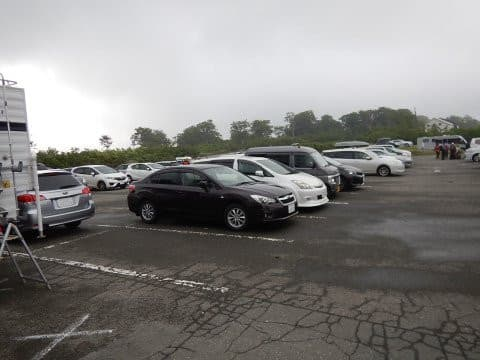
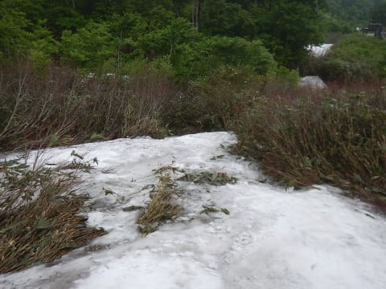

# 7月2日，日曜日の月山詳細モード…大斜面もついに終了．そして私の2017シーズンも終了…

📅 投稿日時: 2017-07-04 03:18:39

そうです…

ついに，終わってしまいました．

わがスキーシーズンが…

っていうより．

どうやら本日．

月山の大斜面．

公式に終了になったようです…

（[月山朝日観光協会HP](http://www.gassan-info.com/)より）

沢コースがつい数日前まで滑れたというのに．

一気に大斜面まで終了になるとは…！

普通は沢コースが滑れなくなってから，

大斜面は2週間ほどもつんですけどね～…

ってことで．

まだリフト上のTバーは滑れるものの．

月山のリフトが滑れなくなったこの時点で，

私のシーズン終了です（泣）．

あぁ…

シーズンが…

スキーシーズンが，終わってしまった…（遠い目）．

なんと，スキーシーズンとは短いものか…っ！！！←いや，10月から7月頭までの

8か月半って，普通の人に比べれば異常に長いでしょ（誰もが思うつっこみポイント）

というわけで．

短いシーズンは儚く終わってしまいましたが．

この日曜の月山の，詳細レポートをば…

まず．

昨日レポートしたように．

日曜の朝，月山の麓の西川町はすっきり晴れていたものの．

姥ヶ岳駐車場まで登ってくると…

うーむ．

曇り空…（泣）

そして，月山は雲の中…（涙）

…まぁ．

ここまでは，数日前の天気予想通りなので．

予想の範囲内だな．（ということにしておこう）

朝7時40分ごろには動いていたリフトに乗って，

山頂へ向かいますが…

天気が悪いので．

当然，リフトもガラガラです．

って感じで．

誰も乗ってないリフトで山頂に着くと…

Oh！ The ガス山っ！！！

山頂は全く見えず．

「これが有名なガス山でございます」

というような月山です…

この日．

山頂で数人の方に，

「月山初めてなんですが，どこを滑ればいいんですか…」

と聞かれたので．

非常に優しい私（ここ重要なので強調するポイント）は，

全く見えないトラバースラインを先導して，

コースをご案内させていただきました…

いや，5月ごろの，全面雪に覆われて，

どこを滑ってもリフトに滑りこめる…

って状況ならいいんですけど．

こんな感じで，視界の先にいきなり藪が現れ，

変なところに滑りこむと，藪に行く手を阻まれたり，

行き止まりに迷い込んだり．

水没した沢コースに突き当たってしまう，

この時期の月山．

初めての人が．ガスで全く見えない状況で

あてずっぽうで滑って，大斜面まで無事

たどり着ける確率は限りなく0ですので．

…ご注意ください．

お連れした方も，

「一人だったら絶対ここまでたどり着けなかった…」

ということなので．

マジメに遭難可能レベルですので，

月山初めての方は，晴れている日に滑ることを

おススメします…

＃なんだか，すごい怖い山みたいに書いちゃったけど．

＃晴れて見えてたら全然怖くないよ

で．

朝のうち，ガラガラで他に誰も滑ってなかったこの日．

途方に暮れていた二組ほど，ご案内いたしました…（笑）．

って感じで．

大斜面までくると，そこから下の視界は晴れていたので．

そこからは安心だった，この日の月山ですが．

リフトを降りてからゲレンデまで，

これだけの距離離れていて…

こういう道を登っていかないといけない，

最終形態の月山で．

さらに，雪面に出てから，

これだけのトラバースラインをひたすら

漕ぎ続けないと大斜面に出られない状況で．

（トラバースラインをひたすら進むスキーヤー）

…このトラバースラインの，この部分．

拡大するとこんな感じで…

ここ，もうそろそろ切れそうです．

実際にここに立つと，こんな感じで．

もうかなり藪が立ち始めているので．

トラバースラインも，あとわずかで

切れてしまいそうな状況で．

そして，トラバースラインを無事超えて

やってきた大斜面も…

まぁ，一見そこそこ滑れそうですが．

実際，一か所だけかなりやばい

ボトルネック部分があって．

ここ，下から見るとこんな感じなんですが…

多分これも，あと1-2日もたない感じ…

大斜面全景で見ると，このボトルネック部分は，ここ．

ここが切れたら，大斜面は実際終わりなんですが…

まぁ，今日「大斜面終了」の案内があったので．

本日，切れちゃったんでしょうね．ここ．

そして，さらにここから下に下りると…

リフト乗り場手前部分．

そう．この部分の藪漕ぎ．

昨日より悪化してて，

距離がかなり伸びた感じ…（泣）．

昨日もこの写真を載せましたが．

この部分の藪をかき分けて行かないと，

ゲレンデの続きに出られないという．

…そう．

それはまるで．

スキーというより，何かのサバイバル訓練です．

この時期の月山を知らない人が，間違って

来てしまったら．

「藪をかき分けながら，水がザーザー流れている

　すごい段差がある流れる岩場を，手足を

　使って降りていかないと，滑れないんだよ～！！！」

って感じで．

少なくとも3か月は話のネタに困らないほどの

インパクトを与えること，間違いなしです…

そこまでやって，最後はさらに．

はい．

次は，リフト小屋まで，この泥道をよじ登りましょう…

ってのが待っているので．

ご案内した，月山初めての方．

「ここまでしないと，滑れないんですね…！！」

と．

かなり感動されていたようです．←それは感動というのか？？

まぁ．

この方もしばらく，話のネタには困らないでしょう…（笑）．

って感じで．

かなりの末期症状を呈していた，日曜のゲレンデ状況でしたが．

そういった苦労をして滑る，

ごくわずかだけ楽しい大斜面．

…ええ．

これだけ苦労したわりに，

一瞬で終わるんですけど．

でも．

この時期に滑れるだけでシアワセなのだ．

この時期に，こんな斜面を滑れるだけ，

感謝せねばならぬのだ…っ！！←自分に向けての暗示

とりあえず．

山頂ではガスがひどかったこの日も．

大斜面は終日，視界がそこそこあったので．

長さ200～300mほどは，楽しく滑れましたよ～！！

＃苦労に見合ってるのか微妙だけど

そして，リフト上のTバーですが．

この日は，午前11時くらいから，

山頂の視界が開けてきましたね…

で．

この写真を見て分かるように．

…リフトを降りてから，Tバー乗り場まで．

かなり歩いて登らなくてはいけません…

矢印の先がTバーに並んでいる人の列ですが．

結構遠いです．

Tバー2本，こんな感じでかかっています．

…わかりにくいので，Tバーに並んでいる列を

矢印で示し，Tバーのラインを線で描くと

こんな感じになります．

待ち時間はそこそこありそうでした…

＃私はTバーは滑らなかったので，

＃どんな感じか詳しくは分かりませんが

って感じで．

末期的症状ながら．

7月まで，大斜面が滑れた今シーズンの月山．

「楽しむ」というより，

「自分のスキー好きの精神がくじけないか試すための修行に来た」

というレベルのコンディションだったので．

もう，こんなしんどい思いするなら，

しばらく滑らなくていいな…

と，納得できましたので．

これで，思い残すことなく，

無事シーズン終了できる…

と思った，Skier_Sだったのでした…

これでしばらく，スキー板ともお別れです！

＃と言いながら，この日はリフト11本ぐるぐるしたけど

## 💬 コメント一覧

### 💬 コメント by (Goku)
**タイトル**: シーズン終了、ご苦労様でした。
**投稿日**: 2017-07-04 20:37:17

コレはもう修行と呼ぶのがふさわしい状況ですね。

ここまでして滑りたい人がＳさん以外にも大勢いるってのがまた凄い。

で、あの藪って根曲がりっぽく見えるんですが？？？

あそこも雪が消えれば根曲がり竹が採れそうですね。

### 💬 コメント by (Skjer_S)
**タイトル**: Gokuさま
**投稿日**: 2017-07-05 00:47:15

いや，まさに修行です…

リフトを降りてすぐスキーを履いて滑れて，

リフトまで滑りこめる時期なら，月山も

かなり楽しいのですが…

やはり，終了間際はかなりの修行場と

化します．

で．

月山は「月山筍」という名で根曲り竹を

売っていて．

この時期は，月山の麓でもいっぱい

タケノコを売ってました…

おそらく，この竹藪も根曲り竹が

採れそうな感じです～！

