# 2017年8月，小学生の子連れで座間味でダイビングその7…ダイビング初日，午後のダイビング！

📅 投稿日時: 2018-07-04 01:23:11

えー．

スキーネタから，一気にダイビングネタになり．

このBlogの切り替えについて行けなくなっている

スキーヤーの方が大勢いそうな今日この頃．

皆様いかがお過ごしでしょうか．

とりあえず．

そういう人に向けて，スキーネタも入れて

いくわけですが．

なんと．

月山．

まだTバーリフトが滑れるようですね…！

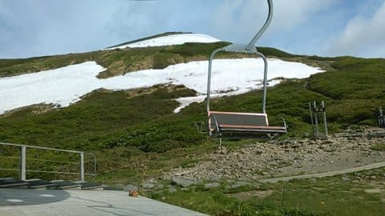

（[月山朝日観光協会Blog](http://gassan-blog.sblo.jp/archives/20180703-1.html)より）

…この，手前の雪の島じゃなくて．

奥の山頂側に見える雪面に，Tバーが

かかっているようです…

うーむ．

距離もすごく短そうだし．

リフトを降りてからTバーまでも

すごく遠そう…

こんなになっても滑ろうという人がいるとは，

信じられませんね！←お前が言うか！？？

って感じで．

月山はリフトは滑れなくなったものの．

まだTバーが滑れるようですが．

でも．

私のスキーシーズンはもう終わっちゃってるので．

今日もダイビング日記です！

---

…ということで．

きれいなビーチでお昼休みのあとは．

また泳いで，ボートに戻って…

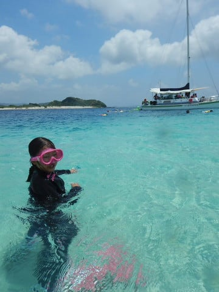

そして，午後のダイビングポイントへ移動！

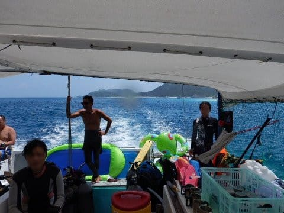

…しかし，今回のこのボート．

ホントに子供が多いなぁ…

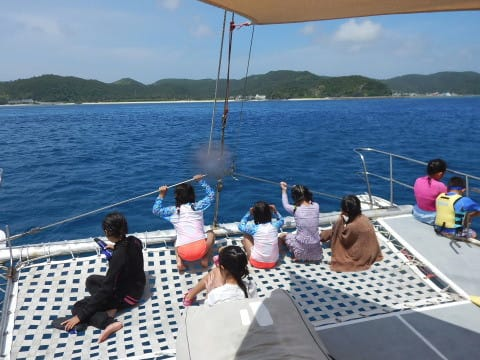

で．

到着した午後のポイントは，

「アマノエダサンゴ」

…その名の通り，見事なサンゴの群生がある

ポイントなのですが…

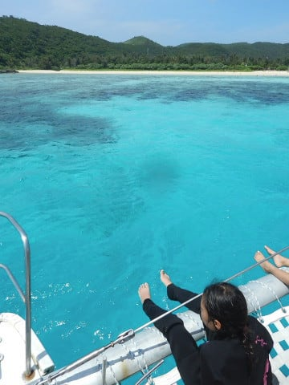

潜る前から，いかにもきれいそうな

海ですね…

ってことで．

いざ，2本目へエントリー！

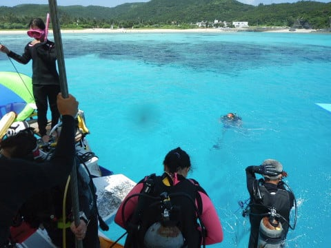

エントリーすると…

いや～．

透明度も高いし．

いい感じの海ですよ～！

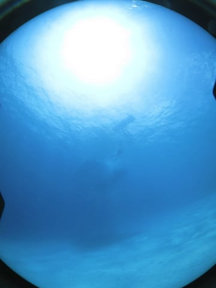

しばし，砂地の海底を進むと…

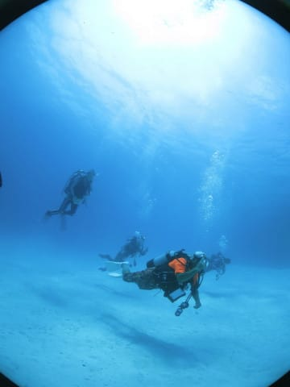

こんな感じで，ポツポツと小さな

根が点在していますね…

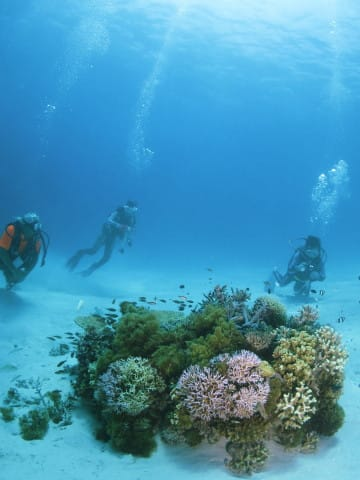

結構こういう小さな根に魚がいっぱいいるの，

好きなんですよね…

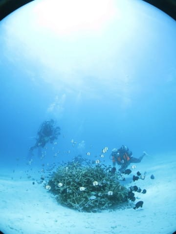

デバスズメがサンゴの周りを漂ってるのも好きだし…

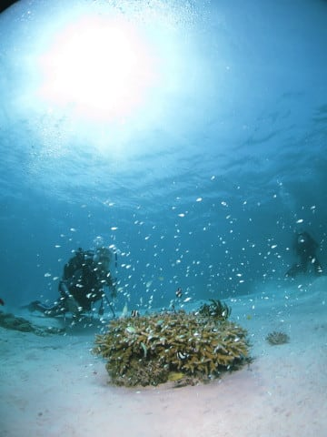

こーゆーのを，ぼーっと眺めているだけで．

かなり平和な気分になります…

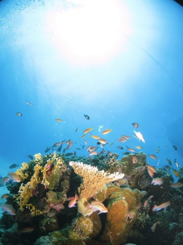

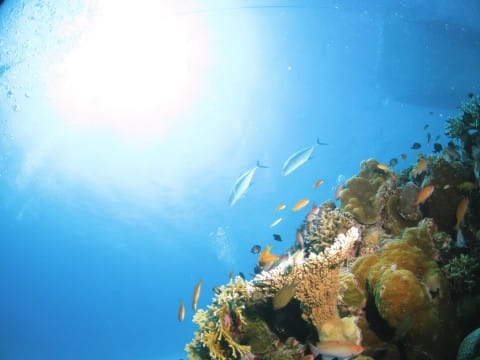

で．

砂地をしばらく進むと…

出ましたー！

すごいサンゴの群生！

ここが，このポイントの目玉！

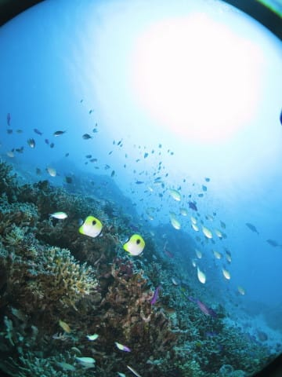

見事なサンゴが広がり，その上に

ごっちゃりといろんな魚が群れてます…

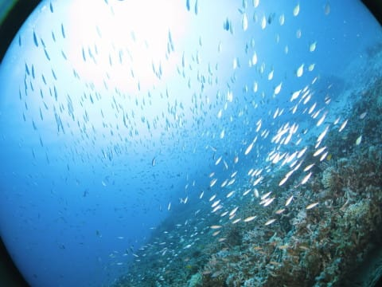

あぁ…なんて癒しポイント…

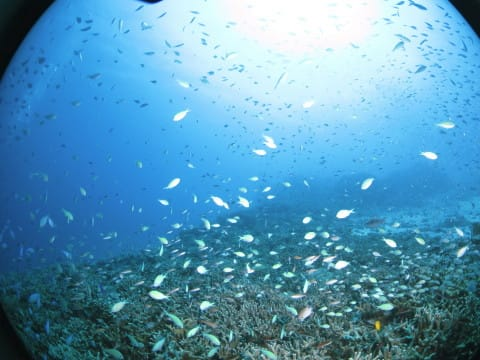

こんなサンゴの上をゆったりと漂いつつ…

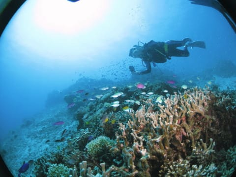

サンゴと魚が作り上げる景色を

眺めるだけで，癒されます…

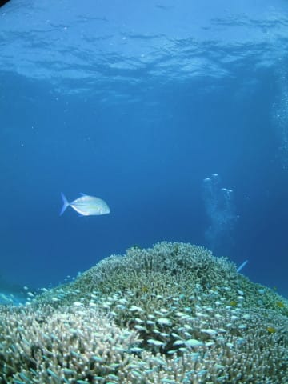

こういうのんびりダイブ．

これが慶良間のいいところ…

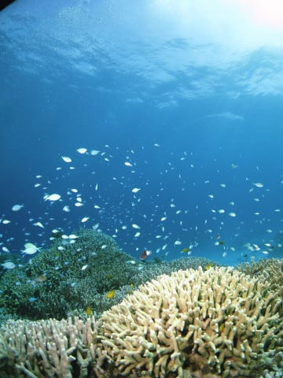

こんな感じで，サンゴの群生の上を漂って，

いかにも南国の海って感じを満喫したら…

そろそろボート下に戻っての安全停止タイム．

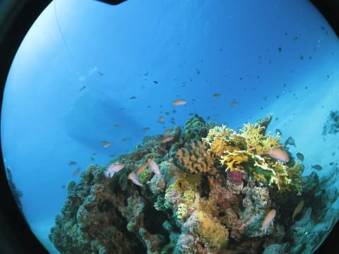

ってな感じで．

たっぷりダイブタイム65分のロングダイブだった

本日の2本目，終了！

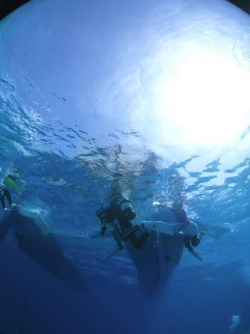

## 💬 コメント一覧

### 💬 コメント by (hiro)
**タイトル**: スキーシーズン中はお世話になりました
**投稿日**: 2018-07-04 21:13:14

夏モードに突入ですね！

今年も２回も潜りに行けるなんてうらやましい限りです。S様ファミリーの行動力に脱帽です。私達は、スキューバには踏み込んでおらず、伊豆辺りで野猿の恐怖におびえながらスキンを少々やる程度です。

引き続きブログ楽しみにしております。

### 💬 コメント by (Skier_S)
**タイトル**: hiroさま
**投稿日**: 2018-07-05 00:56:00

スキーシーズンはお疲れ様でした！

とりあえず，このBlogは夏モードに突入ですが．

初ダイビングまで，あと1か月ほどあります…

スキーシーズン終了から初ダイビングまで，

ストレス発散の手段がなく苦しい時期です（笑）．

今年は娘のCカード取得に付き合うと，まともに

潜れない可能性があるし．

Cカードを取って，なるべく続けて潜らせた方が

いいので，

また年2回計画としました…

一度ダイビングをしてみると，はまると思いますよ．

…でも，お財布のことを考えると，

知らない方がいい世界かもしれませんが…（笑）

また夏シーズン中もご愛読ください～！

