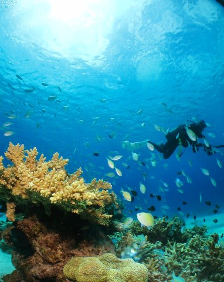

# 子連れで座間味に行ってみた　その9

📅 投稿日時: 2011-08-19 00:14:13

🏷️ カテゴリ: [ダイビング日記](ce3a7a8d424d112fce83ee85c81a0e344.md)

まだコモドの船の上…

予約投稿，続き(笑）．

----

で．

ここからはちとマニアックな話題をば．

今回のダイビング．

私がこれまで一度もチャレンジしなかった．

S90の「水中モード」での写真撮影にチャレンジ．

深度5m程度で晴れている，自然光メインの場合は…

こんな感じで，結構使えることが判明．

なぜ，これまで水中モードを使わなかったかというと．

水中モードを使うと，深度が深いところでは海のブルーが

あまりきれいに出ないし，フラッシュ光メインだとカラーバランスが

崩れるんですよ．

ちなみに，

これが私が常用している，普通の絞り優先AEモード．

んで…

こっちが水中モード．

バックのブルーの出方が明らかに違うのがわかるかと．

絞り優先モードの方が，私の好きな感じの，ブルーが濃い

写真になります．

水中モードの時は，水中で弱まる赤い光を補償するため，

ちょいと赤みを強めた写真に仕上げてきますね…

まぁ，きれいなブルーバックではなくていい時は，

深度5m以下という限定つきで使えるかな．

とりあえず，そのほかにも…

こっちが水中モード

こっちが絞り優先モード．

やっぱり，Canon機の水中モードは青をきれいに出すより，

カラフルな色をきれいに出す方向になってるなぁ．

って感じで．

いろいろ混ぜて使ってみました．

…しかし．

この1本．

テストもかねていろいろ撮影したから，1本で150枚以上

撮影してしまった…

ダイブタイム50分だから，1本3枚，

20秒に1枚のペースか…

で．1本目終了．

いやー．

相変わらずきれいな海でした．
