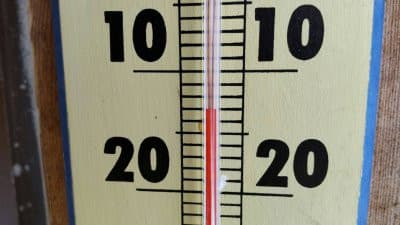
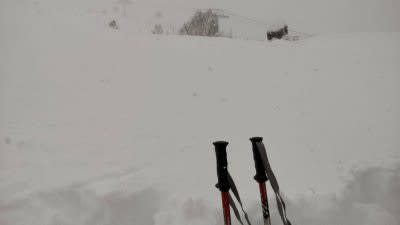
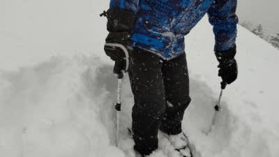
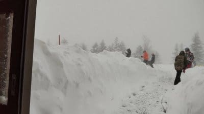
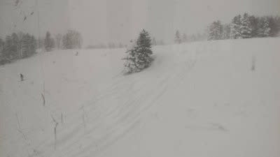

# この週末の志賀高原は天気は良さそう…！明日も志賀高原に行くんだけど…

📅 投稿日時: 2022-01-22 00:01:52

えー．

本日の志賀高原．

あさイチではなく，朝9:30頃の

気温ですが，-13℃と結構冷えて…

なんと．

朝までの積雪は，50cmを超えていた

ようです！！

さらに，

オリンピックコースは70cmくらいの積雪

だったようで…

これはすごい…っ！！！！

そして．

分かる人なら，この1ゴン降り場を見て

「すごい…」と思うはず．

いや，ホントにすごい！！

かなりの長きにわたって焼額に

通った私も，ここまですごいのは

見たことがない！

そして．

昼間も雪が降り続け．

昼間だけでさらに20cmくらい

積もったみたいですが…

この木がここまで埋もれてるのも

見たことないですね…

ってなことで．

地上天気図では12時間で降水量10mm程度（積雪10cm）の予想となってるけど，

500hpa図の湿数＆風向きのパターンからはそこそこの積雪になるように読める…

と．

地上天気図と500hpa図が矛盾した今日の

予想天気図だったわけですが…

結果は500hpa図から読み取った，

大雪傾向の勝ち！！

ってなことで．

大雪傾向に掛けた，

21日(金)：朝までの積雪は50cm？

　非圧雪は太ももパフのパウダー！

　朝の気温は-15℃くらいの冷え冷え．

　この日は終日雪が激しく降り続け，

　昼間も20cm以上積もるか？

という昨日の予想，大当たりでした～！！

すごい！すごいぞ，自分の予想！←自画自賛

…しかし．

地上天気図の降水量10mm以下って予想，

おかしいと思ったんだよな…

なんであんな予想図になってたん

だろう？？

ってなことで．

本日金曜は大雪だったわけですが．

…ただ，夕方には雪も止み．

今は降っていないようなので．

明日の朝イチは，圧雪バーンは

いい感じのシマシマが楽しめそう！

明日土曜は朝は雲が多そうだけど…

運がよければ，リフト営業開始時には

日が射してます！！

…運が悪ければ，昼ごろまで

曇りかも…

でも，午後は基本的に晴れて，

柔らかめながらも，冷え冷えの

いい感じの圧雪バーンを滑れそう！

で．

明後日日曜は…

朝は晴れて，土曜よりは締まり気味の

シマシマを滑れそう！

日曜の朝イチは，最高の冷え冷えバーン！

…ただ，昼ごろから雲がちょっと増えて

行くかも…

でも，日曜もバーンコンディションは

良さそうですね…！！

ただ…

コロナの状況が…（涙）

とりあえず．

この週末．移動は車だし．

宿も1人部屋で，食事抜きにしたけど…

そろそろお出かけは慎まないと

ヤバい感じですね…（泣）

早く通常モードに戻ってほしい（祈）

そして，いつも通りあと3時間後に出発．

また，睡眠時間3時間以下です…（涙）

## 💬 コメント一覧

### 💬 コメント by (地元民)
**タイトル**: Unknown
**投稿日**: 2022-01-22 05:47:19

平地も午後〜夜中まですごい降りでした。中野市内、飯山みたいな風景になってます。雪を片付ける場所がなくなってきて、道が狭いので気をつけてください。

### 💬 コメント by (新米パパ)
**タイトル**: Unknown
**投稿日**: 2022-01-22 18:41:53

今日は中野市街から道がやばかったですねー。

そして、ヤケビもすいてましたが、Sさんの御姿を拝む事は出来ずでした。

明日も、奥志賀スタートで頑張ります。

### 💬 コメント by (Skier_S)
**タイトル**: 今日も最高だったよ！！
**投稿日**: 2022-01-23 00:25:57

＞地元民さま

いや．中野市街も積もってますね…

夜は片側通行止めにして除雪してたところもあるくらいで，，確かに路肩に雪が溜まって

道がせまくなってました…

＞新米パパさま

あれ？

私は今日も一日ヤケビ滑ってましたよ～！

タイミングが合わなかったんでしょうか…？

