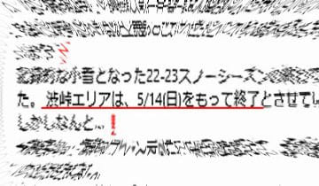

# 5月11日(木)の志賀高原・渋＆横手山スキー場とかぐらスキー場の特派員情報！…渋＆横手＆かぐらとも今週末まで問題なさそう

📅 投稿日時: 2023-05-12 00:57:55

えー．

本日も各スキー場から，特派員情報が’送られて

来ました～！

まずは渋峠スキー場からですが…

GW明けから，営業時間が7:00～14:30になった

渋＆横手山．

晴天なのに，朝7時の段階では-2℃と結構冷えて，

しっかり締まったいいバーンだったようです！！

いやー．

一見，かなり良さそうに見えますね…！！

ただ，ゲミュートコースのS字部分は

ちょっと雪が少なくなってきてるかな…

でも，リフト降り場もまだ雪はついてるし．

コース幅は狭いながらも，もう少し

行けそうな感じで，

今週末まではもつだろうなぁ…

ただ，すでにウェイバーコースに雪は無く．

こちらのコースをゲミュート側に運んで，

コースを維持しているようです…

そして．

今度は横手山の海和ゲレンデ．

こちらも，横手山のコース維持の努力は

すさまじく．

まだリフト乗り場も雪がついてるし…

リフト降り場付近も，まだ行けそうな感じ！

そして，こちらの方が渋峠よりコース幅が

広いです！！

南斜面だけど，さすが人工降雪をつけている

だけはある…

渋峠が緩んできた9時ごろになっても，海和ゲレンデ

の方が雪が締まっていたみたいで…

人工降雪のおかげか，渋峠よりこちらの方が

雪がいいみたいです！！

ってな感じで．

渋峠は今週まではもちそうだなぁ…と思っていたら．

本日の横手山のFacebookを見てみると…

（[横手山Facebook](https://www.facebook.com/yokoteyama2307/)より）

え，え，ええええ～！！！

渋峠，今週日曜の5月14日で終了！？？？

がーーーーん．

昨年は6月まで営業したのに…！！

昨年より3週間も早い終了とは…（泣）

でも．

よく見てみると…

なんと．

海和ゲレンデの方は，14日以降も雪が

ある限り営業するみたいですっ！！

すばらしいっ！！

昨年も海和ゲレンデは人工降雪をつけてた

けど，渋よりかなり早く終わってたけど…

今年はかなり気合を入れて雪を盛ったのか，

渋峠より長持ちするとは…！！

いやー．

ホントにすばらしい！！！

で．

かぐらからも写真が送られてきましたが…

こちらも一見，幅広く滑れるように

見えますが．

かぐらは，あさイチから雪が緩かったようです…

そして，下半分も真っ白に見えるものの，

結構雪は薄かったとのことですが…

でも，今週末までの営業は問題なさそう！

ただ…

本日まで，ゴンドラコースを滑って下山

できていたけど．

明日以降は，ゴンドラコースは滑って

下りられなくなり．

往復ともゴンドラ乗車になったようです（涙）

（[かぐらスキー場ホームページ](https://www.princehotels.co.jp/file.jsp?id=409767)より）

ってなことで．

渋，横手海和ゲレンデ，かぐらメインバーンは

今週末まではもちそうですが．

でも，今週は下の図の水色矢印で示したように，

この時期としては平年比で2℃程度低い，

比較的冷えた1週間だったので良かったけど…

来週15日以降，赤矢印で書いたように気温が

上がりそうです…（泣）

うーん．

13，14，15日の3日間，雨も降るし．

16，17，18日は気温が上がって日差しも

強そうなので…

今週末がラストと覚悟しておいた方が

いいかも…？

もし，20，21日の来週末に滑れたとしても．

板を履いてリフト降り場からリフト乗り場まで

移動するだけ

に近い状況になりそうな予感…←それでも滑りに行くよね．当然
