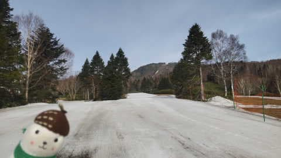
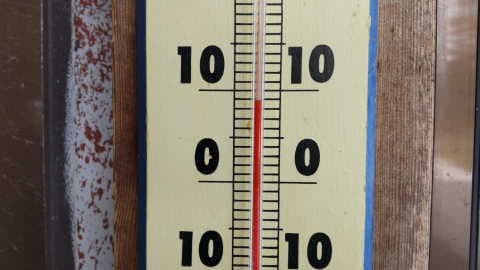
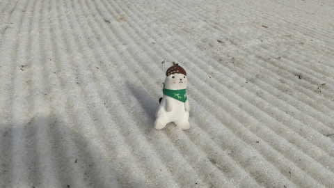
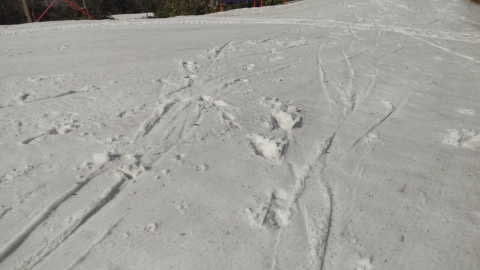
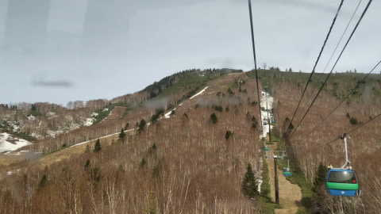
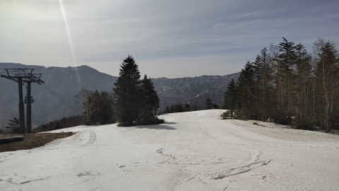
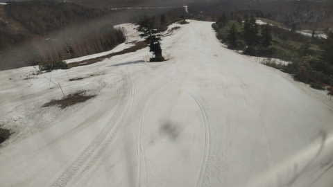
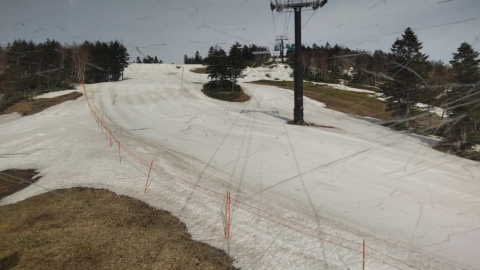
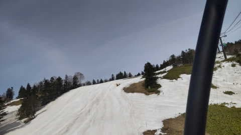
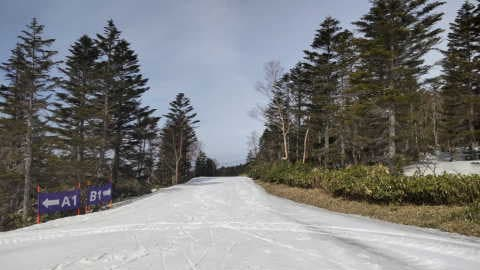

# 今週末も志賀高原で滑ってます！まともに滑れるのは今週がラストか？…そして4月21日(金)の特派員ゲレンデ写真

📅 投稿日時: 2023-04-22 00:56:27

ということで．

昨日は深夜12時まで会議があって．

さらに今日は朝8時半から会議が始まり，

そして昼から出張に出かけ，深夜0時

直前に出張先から帰宅したばかり

というのに．

あと2時間半後に志賀高原に向けて

出発しようとしているSkier_Sです．

…無事，志賀高原に着けるのだろうか…

とりあえず，いつものおこみん特派員による

志賀高原焼額山の写真を見ると…

今日も晴れて，気温は朝から+8℃（涙）

まぁ，都内も異常に暑かったから…

だもんで．

あさイチのバーンは一見シマシマだけど．

朝から雪は足が埋もれていくほどの

ザブザブ雪だったようです（泣）

18日から続いた高温で，雪はかなり解けちゃい

ましたが…

ゲレンデはどんな状態かというと．

焼額スタッフの必死の努力で，何とか

GSコースとパノラマコース，パノラマイン

コースの3コースが滑れるように

維持されているようです！

まだこのあたりは，何とか滑れそうな

幅がありますね…

GSコースは，オリンピックコースや

イーストコースから雪出しして，まだ

滑れるレベルを維持しているみたいです．

明日は気温がそんなに上がらないので，

突き当りを右に曲がる落ち込み以外は

なんとか滑れそうかな…

パノラマコースも，上部は

まだ問題ないみたいですが…

下部の2ゴン側から1ゴン側へ戻る

連絡路からプリンスホテル前がきわどい

みたいです…

まぁ，山頂付近はまだ大丈夫っぽい

ですよね．

てなことで．

今週がまともに滑れるギリギリラストか？？

という感じの志賀高原．

土日とも，気温は低いですよ～！

朝はどちらもマイナス気温．

ヘタすると，-3～5℃くらいまで冷えそうなので，

早朝滑る人は真冬の格好をしていった方が

良いですよ！！

昼間も0℃程度，ギリギリプラスに行くかどうか…

という，結構寒い気温です！

…日が射すので，そこまで寒いと感じないと

思いますが…

日が陰ると寒いですよ！

だもんで．

今週末は比較的いい雪で滑れるはず…！！

ってなことで．

おそらくまともに滑れるラストになりそうな

今週末．

志賀高原で滑ってます～！！

…そしてあと2時間後に出発．

2時間寝られない…（涙）
