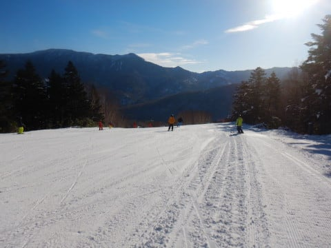
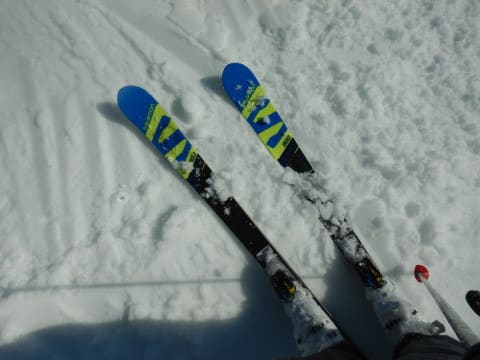
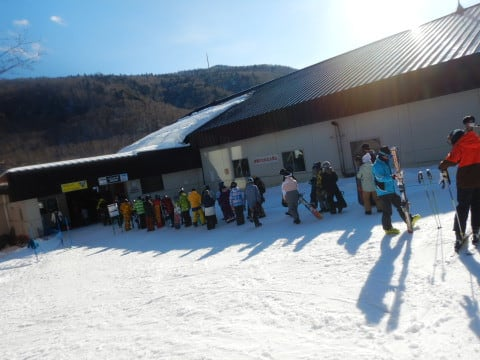
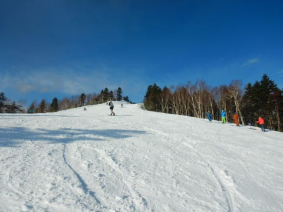
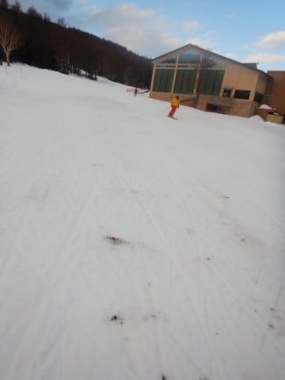
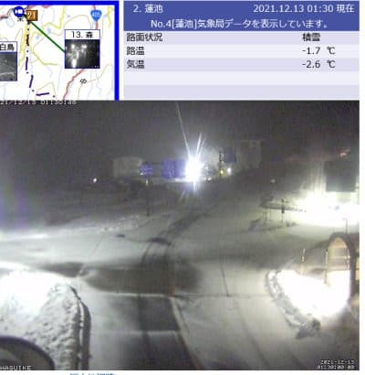

# 2021/12/12(日)の志賀高原焼額山スキー場，速報レポート！…午前晴天，雪は緩み気味．ゴンドラは混んだよ…

📅 投稿日時: 2021-12-13 01:50:01

ということで．

体調不良を気合で一日で快復させ．

今日の日曜，日帰りで志賀高原へ

行ってきました～！

で．

今日は朝3時に家を出て．

帰宅が深夜12時過ぎ…(涙）

病み上がりで，いきなり

一日活動時間21時間越え

で死にそうなので．

今日は速報モードにて…←いや…多分疲れて体調崩したのに，快復すぐにそんなことやっちゃダメでしょ

えー．

今日は朝から晴天！

そして，午後まで晴天！

晴天…

晴天でした…

そうです．

天気予想，外しました（激涙)

で．

最高気温は+2度まで上がり，晴天だったので…

雪は昼ごろには一部しっとりした雪に(涙)

焼額のゴンドラは，待ち時間にかなり

波はあったものの，終日だいたい駅舎の

外まで出るくらいの待ち行列が並び…

午前最大15分，午後になっても

大体5～10分程度の待ち時間でした(泣）

あ，第2高速は待ちはほとんどなかったです！

でも，午後まで日差しがあたり，雪が

緩んだおかげで…

オープンしたてでまだ人工雪がしっかり

乗せられてない第2高速側唐松コースは，

ところどころ土が顔を出すところも

ありました…(泣）

惜しい…

本来なら，今日は雪のはずなのに．

思いっきり西風で，晴れてしまったのが

惜しい…

晴天で，ゴンドラ＆第2高速を滑れる

12月2週と考えればいい状況だったけど．

雪が重かったのと，ゴンドラ待ちが

長かったのが残念…

ちなみに現在の志賀高原は，

降り始めはちょっと雨だったものの．

今は雪になり，積もり始めているようです！！

（[北信建設事務所道路状況カメラ](http://hokushin.pref-nagano-roadcamera.jp/)より）

これが，明日までに10cmくらい積もって

くれるといいんだけどなぁ…

とりあえず．

今日得られた教訓は．

病み上がりに日帰り志賀高原に行くものじゃない

ということでした．←病み上がりじゃなくても，片道約5時間

かけて日帰り志賀は普通やろうと思わないから

## 💬 コメント一覧

### 💬 コメント by (かず)
**タイトル**: Unknown
**投稿日**: 2021-12-13 11:12:13

週末はパスして正解！！ 笑 今週末のいちごんの情報ありますか？

### 💬 コメント by (アリス)
**タイトル**: 21時間活動お疲れ様でした
**投稿日**: 2021-12-13 11:43:57

S様

一日24時間の中を21時間活動はかなりハードですね・・・

しかも病み上がりで。

休日にダイヤモンドが営業して、山の神リフトが動いてないのは、不便ですね・・・

PASEのアドバイスありがとうございました。

購入時の操作指導に合わせて感謝申し上げます♪

次回は、12/20からの参戦を予定しております。

### 💬 コメント by (レインボー74)
**タイトル**: Unknown
**投稿日**: 2021-12-13 15:42:38

月曜日の志賀高原情報

湯田中は目覚めると、車にうっすら雪が。期待感が高まる。上林0℃　蓮池-6℃。ニゴン駐車場積雪は7~8cm。

強風だけどゴンドラ正面からなので大丈夫。

圧雪の上に3cm程のさらさら雪！気持ちよか！

2高が週末用に温存するようで、休止。４ロマも休止。ニゴンのみの営業なのが残念！

昨日までの暖かさに慣れた若き御曹司(？)には、急な寒さが身にしむ。

視界がいまいちで、意外と人が多いので、今日も昼前に業務終了しました。昼はリッチにすき家。移動手段が断たれるとレインボー(２時)までもたない。レインボー隊、失格ですよね。

### 💬 コメント by (Hide)
**タイトル**: わかります・・・・
**投稿日**: 2021-12-13 17:06:15

S 様

>病み上がりじゃなくても，片道約5時間かけて日帰り志賀は普通やろうと思わないから

→よ～くわかります。

私も横○から日帰りすると帰宅後は廃人状態です（笑）

車が運転サポートしてくれるのでまだ良いですが、全て人が運転するならマジで無理です！

### 💬 コメント by (ヒータロゥ)
**タイトル**: Unknown
**投稿日**: 2021-12-13 18:07:41

病み上がりでK県から日帰りとはさすがですね～

私は抜釘手術から10日余りでようやく今シーズン初滑りしました。流石にあまり無理できないと思い、昼であがりました。今日通院して問題ない診断でしたので来週から徐々にエンジンかけていきまーす。

### 💬 コメント by (m&t m)
**タイトル**: Unknown
**投稿日**: 2021-12-13 23:52:34

我々もようやくホームアサマでシーズンインしました

不景気なこの時代にアサマは尾根までリフト架替し、ちょっとですがコースが伸びました

びっくりな事に降雪機も増設されてます

渡辺パイプ気合いが入ってます

残念ながら、我々の志賀高原参戦は年末年始になりそうです

SASの皆様、その際はよろしくお願いします

### 💬 コメント by (m&t m)
**タイトル**: Unknown
**投稿日**: 2021-12-13 23:56:59

すみません

YASの間違いでした

### 💬 コメント by (Skier_S)
**タイトル**: 今週末はパウダー警報発令！？？
**投稿日**: 2021-12-14 00:45:56

＞かずさま

今週末のイチゴン情報はないです…

ただ．このままの天気図だと．

17日午後から降り出して．

18朝までかなり積もりますよ～！！！

＞アリスさま

活動時間21時間は大変でしたが，実は今回，3人で乗りあって

運転手が私以外に2人もいたので楽でした…

20日から参戦ですか！

私は18，19の土日参戦なので，ここもまたすれ違いですね…

＞レインボーさま

今日の雪でゲレンデ状況がちょっとでも改善されたなら…

しかし，2高が動かないのはお客さんがいないからじゃなく，雪の温存なんですね…

＞Hideさま

ホントに一人で運転して日帰り志賀はきついですよね…

昨シーズンも数回一人運転志賀往復をやって，うち1回はナイターまでやったので，

その時は活動時間24時間を超えて死にそうでした．

＞ヒータロゥさま

ゲレンデ復活おめでとうございます！

初滑りはどこで滑ったんでしょうか？

また志賀に復活お待ちしています～！

＞m&t mさま

アサマ，週末混んだという噂が…

でも，第3架け替えたみたいですね．

コースの名前も変わったし，いろいろ新しくしてるみたいですね．

志賀もジャイアントリフト高速に架け替えてくれないかな…

