# 緊急事態宣言解除！6月にスキーに行けるかな？？…そして横手山終了．渋峠は今週末まではもってくれそう…

📅 投稿日時: 2020-05-27 06:59:43

🏷️ カテゴリ: [日記](cc4b5682fb7b8b144980957a978653fb0.md)

ということで．

昨日夕方に，全国の緊急事態宣言が解除され，

今シーズン中のスキー復帰に向けて，

かなりいいニュースとなったわけですが．

…うーん．

まだ，完全に全て元通りになるわけでなく．

一部の長距離移動などは，引き続き自粛が

求められるようで…

果たして，一体いつになったら私は

スキーに行けるのかな？？

ってことで．

先日の日曜日，志賀高原の横手山のスキー場が

終了となり．

残るは，渋峠と月山のみ…

その横手山営業最後の週末の土曜，23日の

横手山＆渋峠の写真を，特派員の方から

送っていただいていたのですが．

ちょいと仕事がばたばたしていて，

紹介できてませんでした…

ってなことで．

本日は，いまさら感がありますが，

5月23日土曜日の渋＆横手の写真です！

まず，これは朝の横手第2ゲレンデ

ですね…

早朝営業の時間は，すっきり晴天で

雪もまだきれいだし，ガラガラですね！

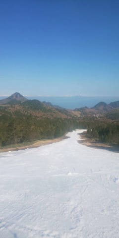

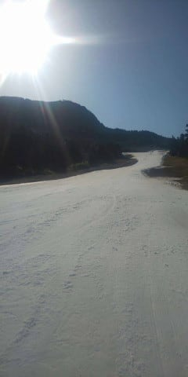

横手第2リフト降りてから第2ゲレンデ

までの廊下通路ですが…

ここも朝は人が少なく，雪もまだきれいだし．

景色もいいですね～！！

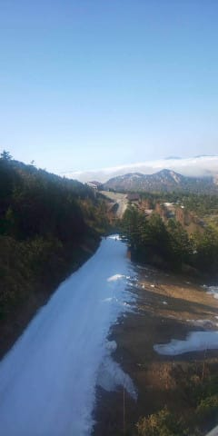

そしてこちらは…渋峠，ウェーバーコース

ですかね…

渋峠側は，ちょっと

雲が出ていたようです…

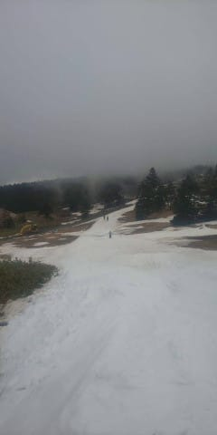

ウェーバーは，ちょっとコース幅が狭くて，

雪も薄くなっているようですが…

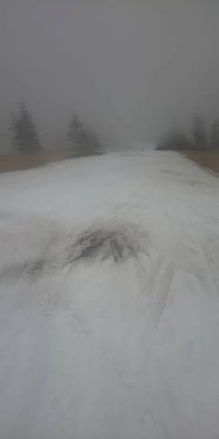

渋峠，ゲミュートコース側ははまだ

幅も広く，雪の厚みも大丈夫なようです！

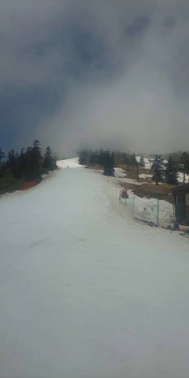

そして．

渋峠と横手を繋ぐ，キングコースも…

雪が薄いながらも，何とか最後まで

滑って来れたようです！

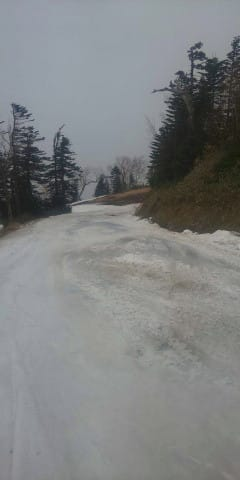

…いや．

横手山．

今シーズンはなかなかの執念じゃないですか…！

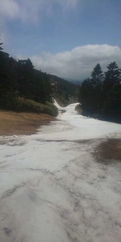

そして，午後の横手山．

ピカピカに圧雪されていた朝と違って，

やっぱり雪が薄くなってきてます…

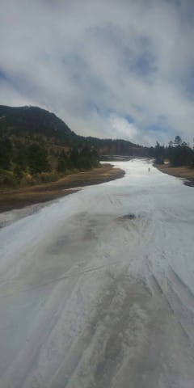

ところどころ水が浮いて，

やっぱりもう終わりげな感じですね…

コース端に，コブができてますが．

もう，完全に土が出てます…

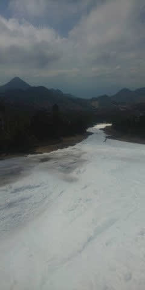

うーむ．

まぁ，5月24日まで横手山が滑れたんだから．

今シーズン，春スキーは恵まれてたんだなぁ…

この日曜日が本来のファイナルデーのはずだった

かぐらも，ライブカメラを見るとまだ雪は

残っていて．

整備してないにもかかわらず，これだけ

雪があったから，今シーズンはファイナルデーまで

ちゃんと滑れただろうなぁ…

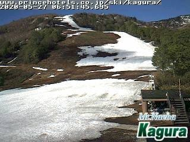

ってことで．

写真送っていただいた特派員のかた，

ありがとうございました～！！

そして．

横手山は終わっちゃいましたけど．

渋峠はまだ滑れます！

スキー場の案内を見ると．

昨日から渋峠のペアリフト，

山頂駅（横手側）からはもう滑れず，

中間駅から下に雪を集中

させることになったようですが…

…まだまだ今週末までは，

問題なく滑れそうですよ～！！

## 💬 コメント一覧

### 💬 コメント by (Seeker.NT)
**タイトル**: 戻ってきました
**投稿日**: 2020-05-27 14:36:05

ご報告遅れましたが、GW前に無事帰国しましたが、例の規制で約２週間の軟禁状態でした。

でも、彼の地の状況に比べれば日本は良い方だと実感しました。彼の地はかなり緊張感があって日用品の買い物にもかり制約がありました。もうホテルでの軟禁状態はうんざりです。

その中でも数少ない気分転換の一つがSさんの記事で、以前の記事もゆっくり読み返したりしていました。

スキーはできていないけど、今後も楽しい記事をお待ちしております。

### 💬 コメント by (Skier_S)
**タイトル**: ＞Seeker.NTさま
**投稿日**: 2020-05-27 22:36:36

お帰りなさい～！

いや．日本はかなりいい状況だと思いますよ…

こちらが相手している西海岸な会社たちは，

そろそろstart relaxing Lockdown rulesって言い始めてきましたが，

向こうはかなり厳しかったみたいですね…

この記事が，気分転換になったのであれば良かったです．

最近はちょっと仕事に余裕が無くて，記事に面白いネタを仕込む余力が

あまりないですが…（涙）

