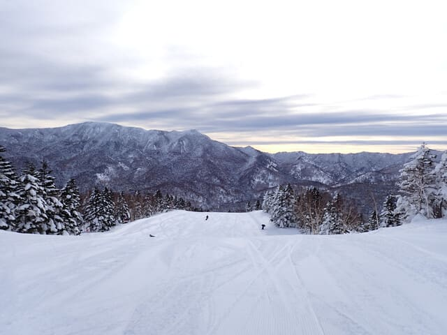
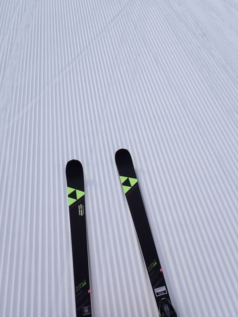
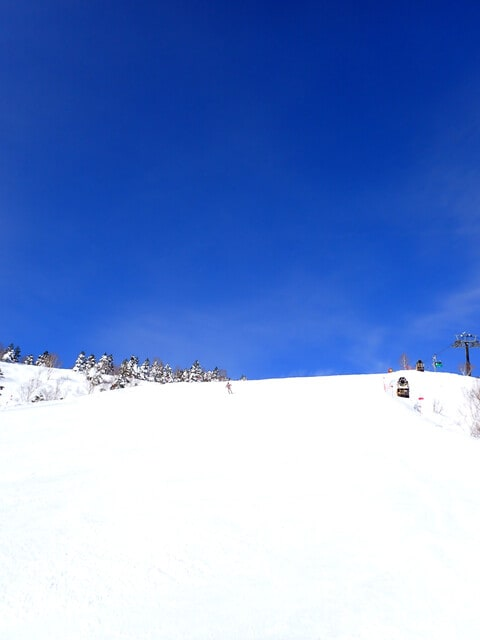
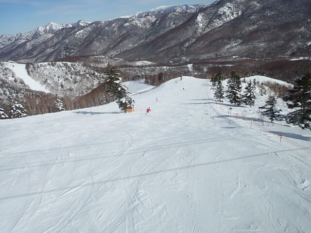
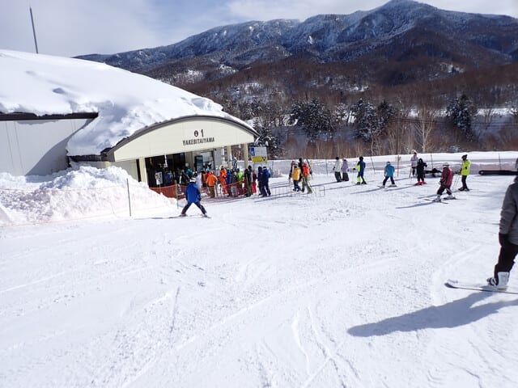
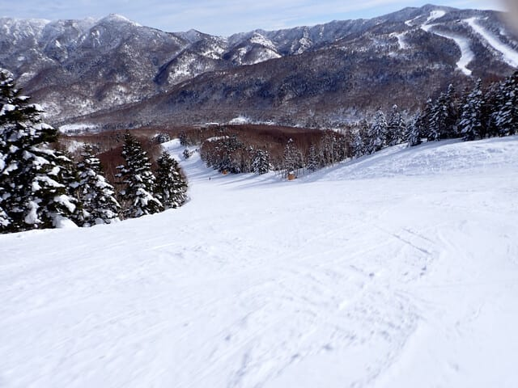
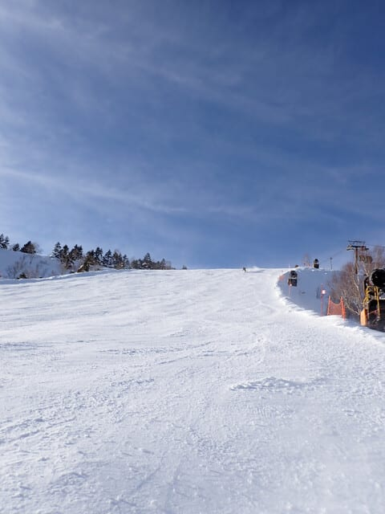
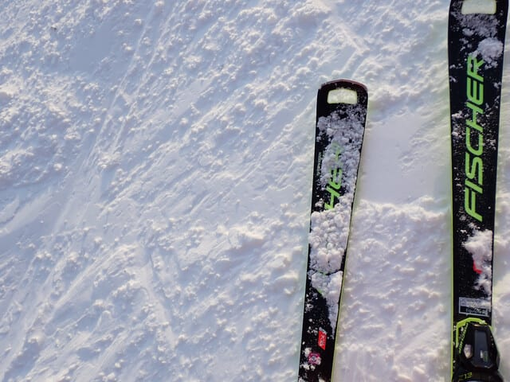

# 2025/1/19(日)の志賀高原焼額山スキー場，速報レポート！…天気よし，雪よし，ガラガラの3拍子すべてそろった最高の1日！

📅 投稿日時: 2025-01-20 01:58:27

🏷️ カテゴリ: [2025スキー滑走日記](cacd3fbf84d4a679ee61a5894c3f95e14.md)

ってなことで．

今日もラストリフトまで滑って帰って

くると12時前で．

いろいろやっていると早くも2時(泣)

明日もいつも通りの仕事に行かねば

ならないので，今日の志賀高原レポート，

帰宅日恒例の速報レポートにて…！

まず．

朝イチは薄曇りで始まった本日ですが．

朝の気温はそこそこ寒かったこともあり，

朝イチの雪は冷え冷えでいい感じに

締まった，ハイスピードシマシマバーン！

ぐほーーーーー！！

これは最高…っ！！

そして，10時ごろには空もすっきり晴れて

くれましたよ…！！

で．

雪もいいし，すっきり晴天なのに…

なぜこんなに人が少ないの？？

こんなガラガラでいいの…？？？

今日はリフトもゴンドラも混まず．

ピークだった午前10時にこのくらい

待った程度で，あとはそれほど待たずに

乗れる，週末と思えないガラガラ具合！

雪が比較的締まり気味で．

それで人も少ないので…

午後になっても，バーンが全く

荒れないのですが！？？？

もう，営業終了のころまで，

オリンピックコースもこんなに

フラットなんですが！？？？

ということで．

今日はガラガラで晴天で，雪質最高で

フラットバーンのスキー場を，

営業終了まで楽しみつくしたのでした…

いやーーー．

良かった．

一年365日，毎日こんなだったらいい

のに…！！←夏もこんなだったら異常気象で大変だから

とりあえず，最高の一日でした…

また明日，余裕があったら詳細レポート

書きます…

今日はもう眠いので，おやすみなさい…

## 💬 コメント一覧

### 💬 コメント by (Hara)
**タイトル**: Unknown
**投稿日**: 2025-01-20 11:13:39

素晴らしい1日だったようでなによりです。

ただ、週末なのにそんなにお客さんさんが少ないことが心配です。

リフト券の値上げ、宿泊費の高騰が客離れを招いているのかもしれません。

白馬やニセコほど志賀はインバウンドも少ないため、各種値上げがスキー場経営に恩恵をもたらしているかどうか、懸念します。

### 💬 コメント by (レインボー77)
**タイトル**: Unknown
**投稿日**: 2025-01-20 14:51:55

月曜日の志賀高原情報

朝の蓮池+4℃。春かと思う暖かい晴れの日。

ニゴンから満足の白樺経由で、甥の家族とダイヤで合流。ファミリーB線からタンネ経由で西舘へ。この時の高天の橋で、タイミングが合わずに疲労！

西舘の下部はコロコロもあって楽しくない。ジャイアントへの登りでまた疲労！

蓮池、丸池を経てサンバレーに到着。自分達の住む湯田中の眺望を目に焼き付けるも、この後に試練が。蓮池の道路を横切る手前のトンネルに「板を脱いで」と書いてある。去年までは滑って通ったのに、歩いたら滑るし疲れるし。もう二度とサンバレーには行かないと、かたく誓ったのでした。

毎日ヤケビに生息している翁によると、オリンピックは朝イチはカチンカチンで、昼からはズクズクガタガタで楽しくなかったとか。

### 💬 コメント by (富山県民)
**タイトル**: Unknown
**投稿日**: 2025-01-20 19:05:00

こんばんは。

昨日は志賀高原の奥志賀、焼額山、中央部を滑走しました。

ルートは宿→徒歩→山の駅→シャトルバス→奥志賀ゴンドラ前→奥志賀→焼額山→一ノ瀬→高天ヶ原→東館山→寺子屋→一ノ瀬→高天ヶ原→西館山→ジャイアント→宿でした。

去年は志賀高原でも熊の湯と横手山しか滑走してないので奥志賀、焼額山、中央部は2年ぶりの滑走になりました。

1月18日と19日は2日とも晴れて大当たりの週末になりました。

### 💬 コメント by (RC4RC)
**タイトル**: Unknown
**投稿日**: 2025-01-20 23:20:04

日曜日の午後，最高のコンディションでしたね。

いつもすれ違っていましたが，こちらの影響でRC185（これまでは，175や170）を手に入れておろした日にゴンドラでご一緒でき，緊張してしまいました。Sさんの熱意で，風で減速しているゴンドラが加速したように感じました。

Sさんの所作を見ていて，昔ヘリでやってきてガーっとすごい勢いで滑り，乗り場につくや流れるようにゴンドラへ乗っていった某オーナーの様だなと思っています。

ヤケビ情報，これからもよろしくお願いいたします。

### 💬 コメント by (大阪のK)
**タイトル**: Unknown
**投稿日**: 2025-01-21 02:41:45

この土日はセンター試験の影響か、志賀高原全体的に空いていたような気がします。

今シーズンも焼額山に帰ってきましたKです。

見かけても雪を投げつけたりしないでくださいね🙇

本当は寂しがり屋でナイーブな……………気持ち悪😅

### 💬 コメント by (Skier_S)
**タイトル**: コメント回答遅れてごめんなさい
**投稿日**: 2025-01-22 01:30:18

＞Haraさま

素晴らしい一日でしたよ～！！最高でした…

やっぱりリフト券値上げで，お客さん，特に地元の人が来なくなったように思います…

ガラガラなのは，滑っている分には混んでいるよりいいんですが，

人が少ないせいでリフトやコースがクローズになるようなことが無いようにお願いしたいところです…

経営大丈夫なのかなぁ？？

＞レインボー77さま

月曜はそこまで暖かかったんですか…

そして，ヤケビも朝は硬くて昼間は緩んだんですね(泣)

これから数日，あまり雪が降らなさそうなので，これから何日かは雪が硬いのが続くかも…

＞富山県民さま

奥志賀から中央エリアのジャイアントまで縦断したのですか…

焼額で私を見かけているのかも…？？

＞RC4RCさま

ゴンドラの中ではお世話になりました～！！

いろいろお話できてよかったです．しかし，2020モデルのRC，おろしたてだったんですね…！

RCは名機ですから，思いっきり楽しんでやってください．

また焼額でお会いしましょう！！

＞大阪のKさま

日曜に見かけたのですが，声をかけるチャンスがなく…

焼額へお帰りなさい！

また毎週焼額に通われるのでしょうか．

お会いしたら一緒に滑りましょう…！！

