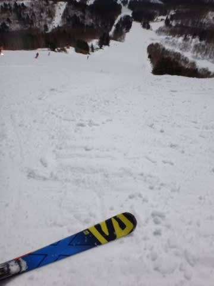

# あれ…？人として超えてはいけないレベルを，ついに超えちゃったのかな？？？

📅 投稿日時: 2016-03-16 01:25:50

うーーーーむ．

うーーーむ．

19日の土曜日…

相変わらずの天気図だ…

…あえて，何も言うまい．

何も…

ただ．

20日以降は．

をを！

意外と冷えそうな感じになってきたかも…！？？

とりあえず．

この週末，どんな天気になるかは，

明日，詳細天気予想やりますので…

しばしお待ちを…

…ってことで．

ちょっと前の話ですが．

そう，それは，

先週の[3月5日の週末](e1ee1e2d4f043280df67670f1c576a04e.md)のこと…

この土曜日，

午前中はいつも通り焼額第1ゴンドラをグルグルしていた

私でしたが．

気温がぐんぐん上がり，強い日差しを浴びる東南斜面の

焼額のゲレンデが，張り付いて滑らない雪になったので，

…午後は，強烈なアウェー感を感じつつ．

比較的雪が良かった，一の瀬ファミリーを

グルグルしたわけなんですね～．

…しかし．

やっぱり，このスキー場．

[20000mクラブ](ea8a953c4b60b5eec845669ca5ba7bf0f.md)な方々が，それはそれは恐ろしい素晴らしい勢いで

ひたすらぐるぐるしていて．

…やっぱり，焼額とは違う雰囲気のスキー場だよなぁ…

でも．やはり，強烈に効率がいいこのスキー場．

午後だけでも，一の瀬でびっちり張り付いて滑っていると，

かなり効率良く標高差が稼げますね～…

で．

この日の記録は．

ふーむ．17644mとな…

焼額に張り付きだと，絶対実現できない数字だな…

次の[3月6日も焼額ゴンドラ運休の影響](eab5f7262b2e3ddafaf42637be36191a4.md)で，

一の瀬を結構滑ったんだけど．

この2日間，滑走距離も120km超えと，

他の日より圧倒的に滑走距離も多いし．

やっぱり焼額より，圧倒的に効率よく滑れるなぁ…

…

…

あれ？でも．

この日，土曜日ってことは…

Skilineの記録が，昼間で終わらずに．

ナイターにつながっていますね…

…ナイター記録は…

え？

あれ？

ってことは，この日のトータルは…

…

…

！！！！！！！！！

しまった！

やっちゃったよ…っ！！！！

…で，でも．

あれだ．やっぱり．

そう．昼間だけで20000mを超えないと，

真の20000mクラブ会員と呼べないのだっ！！

ナイターを足さないと20000mを超えられないような，軟弱なスキーヤーは

せいぜい，

20000mクラブ（ニセ）会員

または

20000mクラブ会員（仮）

って感じなのだ…！！

ってことで．

まだ，私は．

昼間だけで滑走標高差20000mを超えられるサイボーグな方々と違い，

人間レベルであることを強く主張したい，Skier_Sなのだった…

＃真の20000mクラブな方々には，まだ足元にも及ばない…

＃昼間だけで20000m超えるってのが，やっぱり信じられない…

## 💬 コメント一覧

### 💬 コメント by (マルハバ)
**タイトル**: 20000mクラブ関連記事・・・
**投稿日**: 2016-03-16 10:29:15

物欲選手権関連と並んで

興奮する記事ですね～

読んでいてワクワクしちゃいます（笑）

「しっかし・・スゲエなぁ～」

の連発です！

### 💬 コメント by (Skier_S)
**タイトル**: マルハバさま
**投稿日**: 2016-03-17 02:08:14

あ，そうなんですね…

ワクワクするところがあるというのが

ちょっと予想していませんでした(笑)

しかし，ホントにすごいですよ～，

20000mクラブな方々．

普通の人は，1本だけでもついて行くのが

大変かと思います（＾＾;

それを朝から晩まで休まず止まらず，

そのペースで滑り続けるんですから…

