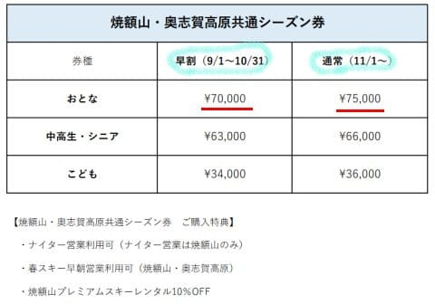

# 志賀高原焼額山スキー場の2024シーズン券の情報が出たよ！…やっぱり値上げ（涙）．そしてBIG2シーズン券は来シーズン発売されず

📅 投稿日時: 2023-09-01 05:13:20

え？

なに？もう9月？？

今日から9月？？

え？？

…1年って，20か月くらいあるんだったけ…

…って思ってしまうほど早くに，

1年の2/3が終わってしまいました

いや…やっぱり時空が歪んでるよね…？？

ってなことで．

8月32日に突入しつつある私を除いて，

この世は9月1日に切り替わる世界線に

いるようですが．

…そうです．

9月となると，そろそろ次のシーズンの

スキー情報がいろいろ出てくるところ…

で．

本日．

我がホームゲレンデ，焼額山スキー場の

シーズン券情報が出てきました！！

…昨シーズンは[10月になるまでシーズン券情報が
出てこなかった](e3b7070c258f58ff5fe9f87572a70cda9.md)けど．

今シーズンは順当に9月に出ましたね…

([焼額山スキー場ホームページ](https://www.princehotels.co.jp/file.jsp?id=421313)より，以下同)

ってなことで．

じっくり見てみると…

来シーズンも焼額・奥志賀の2スキー場で

使えるヤケオク券が出ますね！！

…でも．

昨年のヤケオク券，

早割で60,000円，通常料金で65,000円

だったのに…

1万円ずつ値上がりしてますね（涙）

そして．

焼額限定券は…

うーん．やっぱりこっちも値上げか！！

昨年の焼額限定シーズン券，

早割で46,000円，通常料金で55,000円

だったのに…

こちらも1万円ずつ値上げです（涙）

同じ1万円値上げでも，元値が低いこちらの

ほうが値上げ率は高くなりますね…

4万円代だとすごいリーズナブルに感じるんだけどな～

ついに早割でも6万円に近づいたか…（泣）

そして，いつもはシーズンが始まってから

案内がある2ndシーズン券も，今シーズンは

この時期にお値段公表されてますね…

こちらは昨年の29,000円から5000円アップの

34,000円です…

ナイター・早朝が使えることを考えると，

こちらはまだリーズナブルかも…

しかし．

焼額限定券が1万円アップとなると．

これ，志賀全山共通シーズン券はいくらになるん

だろう？？

昨シーズンから1万以上値上がりするのかな…

83000円が1万以上アップしたら，

10万円近いよ！！（戦慄）

うーん．

いろいろ値上がりしていく…（涙）

そういえば．来シーズンは，

志賀・野沢・斑尾・タングラム・戸隠・竜王で

使える6スキー場共通シーズン券

が販売になるようですね…

（[野沢温泉スキー場ホームページ](https://nozawaski.com/report/17096/)より．以下同じ）

こちらは…12万円かっ！！！！

ちょっと買える値段じゃないですよね…（涙）

で．

このページを見てちょっと驚いたのは…

このページの下のほう．

え！？？？？

志賀・野沢のBIG2シーズン券，なくなるの！！？

志賀高原全山シーズン券＋7000円で

野沢も滑れたお得なリフト券だったBIG2，

来シーズンは残念ながら発売されない

ようです…

BIG2を買おうと思っていた方は，ご注意ください．

うーーーーん．

ガソリン代も上がったし．

スキー道具も値上がりしたし．

リフト券代も上がって，

あらゆるものが値上がりしていく…

あぁ…

宝くじでもあたるか，

どこかに10億円くらい落ちてたり，

道端で困っているおばあさんを助けたら

100億円くらいの遺産もらえたり

しないかな～←どれも期待薄だ…

## 💬 コメント一覧

### 💬 コメント by (ヤケビででたまにお会いしています)
**タイトル**: Unknown
**投稿日**: 2023-09-01 12:38:54

全山のシーズンパスが早割有りで発表されてます。

https://shigakogen-ski.or.jp/winter/news/2023/09/post-28.html

### 💬 コメント by (カンタロス)
**タイトル**: Unknown
**投稿日**: 2023-09-01 13:31:35

Sさまこんにちは。

今年もリフトの値上げラッシュですね…（泣）

私がよく行く白馬エリアも軒並み値上げの情報です。

ざっくり1割は値上げかな？て感じです。

電気代、人件費など考えると仕方ないのかな…。とは思いますが、それでも痛いですね…。

今年もウェルカム信州割、やってくれないかな、と祈るばかりです。

### 💬 コメント by (Skier_S)
**タイトル**: 明日土曜は山に行かずじっとしてます
**投稿日**: 2023-09-02 00:23:00

＞ヤケビででたまにお会いしていますさま

情報ありがとうございます～

ヤケビメンバーの間でも，速攻で情報が共有されてました．

今シーズン，全山共通券の情報が珍しく早くに出ましたね！！

明日記事にする予定です…

＞カンタロスさま

値上げラッシュです（涙）

5万のリフト券で1万上がったので，ヤケビ券は2割のアップの感じですね…（泣）

物価高，資源高でやむなしですが，円安だからそれでもインバウンドな方々には

やすく感じるんでしょうね～…

