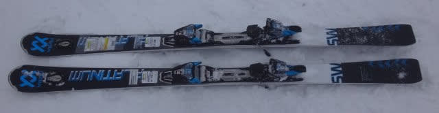
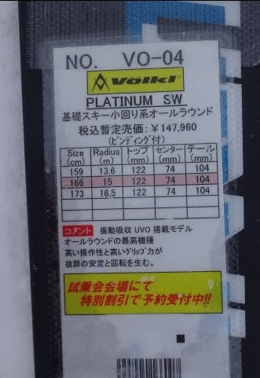
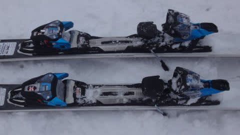
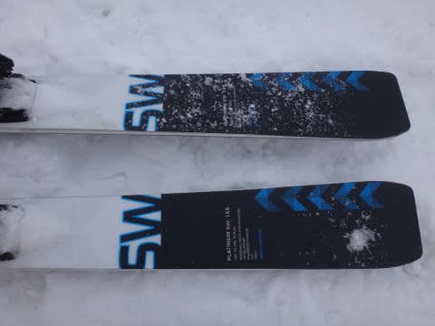

# 2018シーズンモデル，スキー試乗レポート第7回…Volkl編その1

📅 投稿日時: 2017-04-26 07:08:25

昨晩，なんだか気づいたら寝ててしまってました（涙）．

だもんで．

本日は急ぎ朝に更新…

引き続き2018シーズンモデルのスキー板，

試乗レポート．

今日はフォルクルの板です…

ただ，ちょっとこの板，チューンナップが

おかしかったのかな？

とりあえず，どうぞ～！

VOLKL Platinum SW 166cm

基礎オールラウンド

Volklでおそらく一番人気であろうSW．

小回りベースは，SDとSWの2機種ありますが，

小回りに特化し，フレックスが強いSDにくらべ，

ちょっとマイルドにしてオールラウンド性を強めた

SWですが…

滑り始めると，チューンナップがおかしいのか．

エッジ手入れしないまま，かなりの日数

固い斜面を滑った板みたいな感じで．

私にとっては，「エッジが立ってない状態」

に感じました．

これがこの板の本来の性能なのか，

それとも本当にエッジが丸まっちゃってるのか，

イマイチ良く分かりませんでしたが…

ただ，そのおかげで，

かなりルーズなグリップの板に感じます．

軽くてかなり動かしやすく，

板を好きなところに動かせます．

板の振動は少なく，荒れた斜面でも

それほどばたつかずスピードを上げて

行けるのですが…

でも，スピードを出していくと板が耐え切れず

外にズルズル逃げていく感じです．

トップ・テールのエッジがあまり頑張らないので，

グリップして板のたわみが出る前に，

板が優しくずれていく感じ．

また，板が軽く，エッジグリップが甘めの板なので，

スピードを出していくとちょっと板がキョロキョロ

する感じを受けます…

…うーむ．

[去年の試乗](ecd0a5e057af1ca98ab4f1f00fb79295a.md)では，かなりグリップの強い，カービング嗜好の

板に感じたのですけど…

今年の板は，全く違う感じですね．

うーん．

エッジの仕上げなのかなぁ？

軽くて動かしやすいので，低速～中速で，

ズラシを伴った滑りで気楽に滑るのに

いい感じの板に思えるけど…

ちょっと高速耐性や安定感に欠ける感じ．

この板，エッジの仕上げが適切じゃなかった

可能性も高いので．

今回の試乗で本来の性能が発揮できていたのか

ちょっと不明です…
