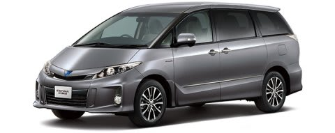

# プロジェクトX…最後の候補はいったい何？

📅 投稿日時: 2013-05-29 01:41:49

🏷️ カテゴリ: [車](cba0e8330b3f2ded7c1addfacc75d4547.md)

ってことで．

プロジェクトXシリーズ．

全部で4種類の候補車種．

そのうち…

[レガシィツーリングワゴン](ec9532ac507ed012a0f7f04d3a2c46687.md)

[アテンザワゴン](ebc1539d448d9ca6eccbae60ec5c23ef9.md)

[オデッセイ](e0bad54e3cfd4c4ea0787004877c33890.md)

…と，3車種出てきたところで前回が終了し．

んだば，候補の最後の1車種はなんじゃいな…？

というのが今回なわけですが．

最後の候補車は．

これまでとまったく毛色が違うんですね～．

それは…

なぜか．

エスティマ

なんです…

(トヨタ公式HPより拝借)

…

…

なぜ，エスティマ…？

という疑問があるかと思いますが．

…いや，それは自分でも疑問が残るところですが．

まぁ，これまでもオデッセイっていう7人乗りの車に乗っていて．

いざというときに大人数乗れる便利さを知っているというの

もありますし．

あと．

我が家には，妻と娘というお目付け役がいるわけで．

物事の決定には重大な権限をもってます．

エスティマの7人乗り．

3列シートを床下に隠してしまい．

2列目シートまでしか使わなければ．

究極の4人乗りの車として，

これほどリヤシートが快適に使える車も無いんですね～．

アルファードやヴェルファイヤなども広いですが，

3列目をたたむと2列目のスライドやリクライニングに制限がつくし，

3列目をたたまないと荷物の収容に問題が…

＃あと，ルーフボックスを載せると高さ制限にひっかかって

＃うちのそばのショッピングセンターの駐車場に入らない

ということで．

後ろ座席がメインの妻と娘から評判がいいこの車．

ただ．

ただ．

はっきり言ってこの車．

楽しいのは，リヤシートに乗っている人です．

運転手が楽しむための車ではありません．

ハンドルを握る人は，後ろに座る妻と娘のための

運転手として奉仕する人になっちゃう…

でも．

スキー途中の休憩で，車で寝るときとか．

車の中で着替える時とか．

車が広いと，まぁ，いろいろ便利ではある．

うーーん．しかし．

お値段が高いし．

なんてったって，フルモデルチェンジからもう7年．

ちょいと古いよな～．

とりあえず．

娘と妻の推しも強く．

この車が候補に残ってるんですが…

運転を楽しみたい私と，

スキー場までの長時間を後ろで快適に過ごしたい妻＆娘の．

両者の力関係の勝負ということで．

これから，最終決戦が待っているのであった…

＃妻と娘のための「バスの運転手」になるという，心の

＃整理がまだ付いてない…のかもしれない

## 💬 コメント一覧

### 💬 コメント by (miya)
**タイトル**: Unknown
**投稿日**: 2013-05-29 09:21:40

なんと！こっち方面でしたか。

てっきり舶来品なのかと思ってました。。

奥様は運転はされないんですか？

うちも後席重視は大前提ですが、妻も日常の

買い物などで運転するし、本人が取り回しを

考えてワゴン推奨でしたので、

当初からミニバンは落選してました。。

でも確かにミニバンの後席は魅力的ですねー。

### 💬 コメント by (Skier_S)
**タイトル**: miyaさま
**投稿日**: 2013-05-29 23:30:24

いやー．

我が家の家計で舶来ものは無いです(笑）．

でも，やっぱり予想外の方面でしたか(^^

うちは，嫁さんは運転しません．

平日も，私が通勤で車を使っちゃってる

ので，嫁さんが運転する機会が無いんですね～．

ミニバンの後席，特にエスティマ7人乗りの広さは

異常ですので(笑），魅力的ではあります…

