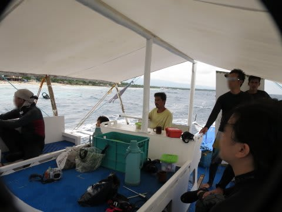
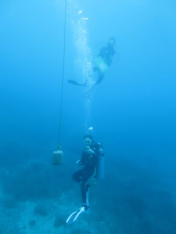
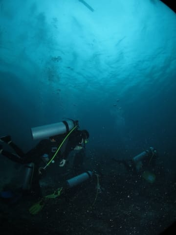
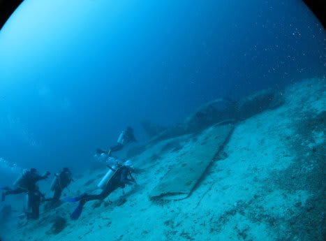

# 2015年8月　子連れでモアルボアルでダイビングその5…2015年の初ダイブ！

📅 投稿日時: 2015-10-28 01:05:41

🏷️ カテゴリ: [ダイビング日記](ce3a7a8d424d112fce83ee85c81a0e344.md)

ってことで．

1本目が終了したボートは

2本目のポイントへ移動します．

…次の1本は，私が潜る番だな！

ポイントに到着して，しばし休憩のあと，

次のダイビングのブリーフィングが始まりました．

ガイド「次のポイントは，沈潜ならぬ，飛行機が沈んでいるポイントです」

なぬ？？

沈船ポイントは数多くあるけど…

沈飛行機ポイントはそれほど多くないぞ？？

私「何かで墜ちたんですか？その飛行機！？？」

ガイド「いえ…ダイビング用に沈めた飛行機です」

おっとっと．

そうですか．

まぁ，そうですよね．

海岸線近くに，墜落した飛行機が沈んでるって

そうそうないですよね…

…しかし，ダイビング用に，漁礁にするとかの目的で船を沈める…

ってのは聞いたことがあるけど．

飛行機を沈めるのは初めて聞いたなぁ…

ってことで．

ブリーフィング終了後．

わがフィリピンの1本目…

というより．

今年の初ダイビング．

で．毎度のことですが．

8か月のスキーシーズンを誇る我が家にとって．

シーズン1本目のダイビングは，すごい久しぶりの

ダイビングになるわけで．

…実に，じつに10か月ぶりのダイビング．

完全なブランクダイバー（笑）．

いつものネタですが．

器材のセッティングで，レギュを逆につけてしまうとか．

スキーのゴーグルみたいに，鼻を出してマスクをつけちゃうんじゃないかとか．

レギュでなく，シュノーケルをくわえたまま潜っちゃうんじゃないかとか．

手袋と間違えてフィンを手につけちゃうんじゃないかとか←ありえないから

もう，そういうレベルのブランクダイバーです．

とりあえず．

そんな久しぶりのダイビングに，

いざ，潜行！

いや～．

実に，実に久しぶり．

10か月ぶりの，海の感触だなぁ～！

＃パラオ旅行記が終わった直後に，このモアルボアル旅行記が続いているので，

＃読者には久しぶり感が全く分かってもらえない気がするが

…ただ，天気が悪く．

海の中が，ちょっと暗いのが，惜しい！

とりあえず，一応は450本程度は潜っているダイバーではあるので．

すぐに水中での感覚は取り戻して．

あとは，[今回がデビューのS120](d20150804.md)の操作に慣れるべく，

必死にいろいろ操作しているうちに…

どうやら，沈船ならぬ，沈飛行機にたどり着いたようです．
