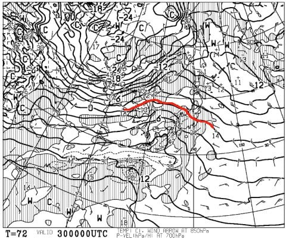

# 明日から志賀高原の焼額山スキー場は第1，第2ゴンドラ運転！…だけど1ゴン側GSコースまだ滑れないのか…28日は小雪のち曇り，私は日帰り参戦！

📅 投稿日時: 2019-12-27 23:22:55

えー．

積もりました！！！

降りましたよっ！！！

…朝の段階で，焼額は積雪1cmとの

情報を見たときは，崩れ落ちそうに

なりましたが．

（[焼額山Facebook](https://www.facebook.com/yakebitaiyama/?hc_ref=ARQSncISbnci4JtLCFTqYLAtXCox0lDUysJwYcpke_Ye1EqmCwXDAWAMXRMt0f3r4-0&fref=nf&__xts__%5B0%5D=68.ARCsAqVHCCjaKX3WNV6iqTWqlatyR7wfrDsHqH_3hUQl_Tcw_TWw77hv5OPDcU3xb_MPfV479iFU02lVemthskbXQvSyjsdmAZWpE9Jh0RfhTcFLT74iUhYoUII6HlOputKib1JIM6hJbIbBMoH_eKZyK-rVXAbb9LX0Ylr7YAezQ5LKxEk-BQwn3UO-fSl7LuM6qng4nUcGGGhhnF8F_oQp2zGLjHch4TUQc0UrHm0L1OMoNdQstkMkrEmRoZm2qHk5Dc-NcHbUx4vFSSQEXCtmETy6homgApeGqrQrrX8mADgaS6cAX-mlr55BOtbSvFI3u3J2B6pmvMhNpwkSAVEXOQ&__tn__=kC-R)より）

予想通り，朝からかなり強い吹雪で，

12時ごろには15cmの積雪となって．

午後もさらに降り積もり続けたようですね…

ただ，強風のため．

予想していた，奥志賀ゴンドラ運休だけに

留まらず．

高天ヶ原クワッド，一の瀬クワッドも，

強風で運休になったようです…

（志[賀高原索道協会HP](https://www.shigakogen-ski.com/live-lift-status/detail?place-id=12)より）

しかし．

さすが半端ない吹雪の勢いはすごかった

ようで．

大体今日の昼間だけで，30cm以上

積もったようです…！！

…そのおかげで，明日から

焼額第1，第2ゴンドラの運転が決定しました！

（パチパチパチ）

あぁ…ようやくわが住み家が

動き始めたよ…←いや，1ゴンに住んでるわけじゃないから

（[焼額山Facebook](https://www.facebook.com/yakebitaiyama/posts/2608005059294824)より）

…って．

でも，1ゴン側のGSコースは滑れないのねっ！？？？（涙）

1ゴンに乗っても，2ゴン側のパノラマ～サウス

コースを滑ってこないとダメなのね…

うーむ．

明日，コース凄い混みそう…

でも．

今晩も雪が降り続けているようで．

上林でもこれだけ積もっていて．

（[北信建設事務所ホームページ](http://hokushin-camera.org/)より）

さらに明日の朝までに，あと

数cmの積雪の積み増しが

ありそうな気配なので．

…明日の朝までの積雪で，GSコース

オープンしないかな？？？

と，期待するのですが…

（[焼額山Facebook](https://www.facebook.com/yakebitaiyama/posts/2608263942602269)より）

全コースオープンは年越しになりそう，

と書かれちゃってますね…

オープンが年越しになるのが，

急斜面のSGSコースとオリンピックコースだけで．

GSコースと第3高速沿いのイーストコースは

早いうちにオープンしてくれるならまだいいのですが…

第1ゴンドラのメインコース，GSコースも

オープンは年越しとなっちゃったら，

それはショックがデカい…（涙）

しかし．

雪が積もるのは，明日の朝まで．

明日28日の午前中まで雪は降り続けるけど，

積もるほどではなく．

昼に向かって雪は小降りになり．

午後になると止んじゃうでしょう…

そのあとは，

29日は晴天で新雪の積み増し無し．

それどころか，30日は…

朝9時の段階の予想天気図で，早くも

赤い0℃線は志賀高原より北に上がり．

…午後に向かって，さらに気温が

上がるので…

…

…

ヤバいです．

やっぱり30日，ヤバいです（涙）

ただ．

30日の午後に雨になった後，夜中に雪に変わり．

それから31～3日まで，ひたすら

雪の日が続きそうなので．

そこに期待…っ！

とりあえず．

私は日程の都合上，29日に

帰宅せねばならないので．

明日28日，日帰りで焼額を

滑ってます～！

…ってな感じで．

明日から年末年始休みで，

今日は仕事納めの日なのに．

なぜ帰宅が深夜23時を超えているのか…

また睡眠3時間半で出発です．

明日，志賀高原でお会いしましょう～！

## 💬 コメント一覧

### 💬 コメント by (ターボイン)
**タイトル**: Unknown
**投稿日**: 2019-12-28 02:13:22

いつも詳しい天気に感心します!

### 💬 コメント by (まーくん)
**タイトル**: Unknown
**投稿日**: 2019-12-28 08:57:12

本日焼額来てます。積もりましたね！

朝イチグランプリは笑いが止まりません（笑）

s様のギアは板とブーツしか分かりませんが、もしそれらしき人がいたらお声がけさせていただきます

### 💬 コメント by (Skier_S)
**タイトル**: Unknown
**投稿日**: 2019-12-28 11:16:21

>まーくんさまに急ぎ返信

焼額激混みなので奥志賀ゴンドラ滑ってます

### 💬 コメント by (かず)
**タイトル**: Unknown
**投稿日**: 2019-12-28 11:45:14

自宅でライブカメラ見てます  奥志賀なかなかいい降りですね  ほぼ滑れそう 本日コースが少なくどこもすぐボッコボッコになると予測してましたがとうでしょうか？  GS側奇跡の明日からたどラッキー！

### 💬 コメント by (Skier_S)
**タイトル**: 今日は最高！
**投稿日**: 2019-12-29 06:30:26

＞ターボインさま

コメントありがとうございます～！

志賀高原に特化しすぎて，他のスキー場では

役に立ちませんが（笑）

＞まーくんさま

昨日は一日ありがとうございました～！

ちゃんとあさイチ焼額ゴンドラに行けたのでしょうか？？

＞かずさま

奥志賀，良かったですよ～！

確かにボコボコになっちゃいましたが，ちょい荒れくらいで，

それほどひどいコブコブ斜面じゃなかったです．

GSコース，驚きの28日オープンでした！！

次のねらい目は，元日の朝ですね…！

