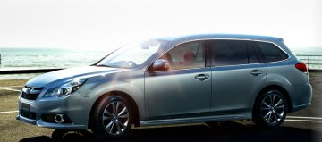
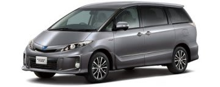

# プロジェクトX…レガシィv.s.エスティマ，決戦の方法は？？

📅 投稿日時: 2013-06-04 04:22:45

🏷️ カテゴリ: [車](cba0e8330b3f2ded7c1addfacc75d4547.md)

えー．

このBlog．

スキーのBlogだというのに．

…なぜだか最近人気が高い，プロジェクトXシリーズ．

…

このBlog，自動車ブログに変えようかな…

「徒然ドライバー日記」．

＃すごく面白くなさそうなタイトルだ…．

で．本題．

[前回](blog.goo.ne.jp.md)，最後の2車種に絞られて．

レガシィと，

エスティマの最終決戦…

つまり．

運転重視の私と，後ろでふんぞり返りたい妻＆娘との代理決戦…

ってことになったわけですが．

この決着をつける，最終決戦方法を考えなきゃいけない訳ですね…．

…この方法．

当然，

…私が有利になる方法をさりげなく提案しないといけないわけで．

かつ．

…これから，新しい車に乗る数年間．

妻に，「やっぱり後ろが広い車にしておけば…」

と言われつつ過ごすのは，きわめて精神衛生上望ましくないわけなので．

妻が自ら「やっぱりレガシィが良いよね～」

と言わしめる方法を考えないといけない，と．

…ここで．

私が有利になり，かつ妻も納得する決戦方法を考え付かない限り．

レガシィ…私1人

エスティマ…妻＆娘の2人

と，多数決で負けているこの勝負（悲）．

民主主義にのっとり，エスティマに決まってしまうのだっ！

ということで．

3日と17時間ほど悩んだ挙句．

なんとか．

これなら上手くすればいけるかも？？（失敗したらアウトだけど）

…っていう，一か八かの方法を思いついたのだった…．

ということで．

その決戦方法を提案した結果．

何の疑問も持たない妻は，

「それはいい方法だよね」

と納得してくれたので．

週末に，この方法によって．

…最終決戦を実行してきたのだった…

（続く）

詳細を書きたかったけど，今日は帰宅がとんでもない時間だったので

もう書く元気が無い…

また明日…

＃明日ちゃんと朝起きて仕事にいけるかな～？（心配）

## 💬 コメント一覧

### 💬 コメント by (mari)
**タイトル**: おおお！
**投稿日**: 2013-06-04 06:59:08

続きが気になります！

早く知りたい～(*^^*)

### 💬 コメント by (miya)
**タイトル**: Unknown
**投稿日**: 2013-06-04 08:45:17

決着が見られると思ったら続きになってたー。

もう1日ガマンですねー。

それにしてもとんでもない時間に

ブログアップしてるんですね。。

### 💬 コメント by (ひろりん)
**タイトル**: Unknown
**投稿日**: 2013-06-04 12:28:37

民主主義とは暴力である（爆）

ウチがエスティマとか後席重視の車にさせられたら、間違いなくロータスエリーゼとか増車すると思う（汗）自分用とか言って（汗）

で、4:22て(滝汗）

夜更かしなんでしょうか、早起きなんでしょうか・・・

### 💬 コメント by (ゆうこ)
**タイトル**: 続きが…
**投稿日**: 2013-06-04 23:50:20

続きが気になります。

楽しみにしています。

うちの車も14万キロ超えて、7月に車検なんですが、

いくらかかるか怖いです。

なんか、気が付かないうちに悪くなっているところが車検で見つかる気がして。

足回りもエンジンもいろいろ部品交換したし、エアコンも一回壊れたし、これ以上壊れたら車維持できないです。今回はまだ買い換えるお金も駐車場もないし。

忙しいみたいですが、体壊さないでくださいね。

### 💬 コメント by (Skier_S)
**タイトル**: 皆さん結果が気になるようですね…（^^;
**投稿日**: 2013-06-05 01:47:26

>mariさま

意外と結論はしょうもないんですが…

昨日はあまりにも帰宅が遅く，長い記事を書く

パワーが無かったので．

結論をお楽しみにっ！

>miyaさま

一日ガマンさせてしまって申し訳ないです～．

いやー．

ホントは昨日は記事をアップしないでおこうか…

って思ったんですけど．

前回の記事で「明日に続きを…」って感じで

書いちゃったので，書かざるを得なかったという．

今朝はちゃんとおきて仕事に行けました（笑）．

>ひろりんさま

多数決は必ず正解を導く手法ではない，という誰かの教訓が

思い出されます…

しかし，エスティマとロータスエリーゼですか…．

家計が破綻しちゃいます（笑）．

…でも．

10年くらいスキーに行かなきゃ買える気が…（汗）．

4:22は，夜更かしです～

>ゆうこさま

毎晩遅いですが，がんばって記事書いてます…

＃えらい！←自画自賛

14万kmですか～

そろそろ買い替え時ですね～．

うちの車は23万km以上，壊れた部品は水温センサーのみ．

交換したのは，ブレーキパッドやらライトバルブ，

エアクリーナーエレメントやプラグといった

消耗品のみです…

＃ファンベルトすら変えてません

維持費の安い車でした…

