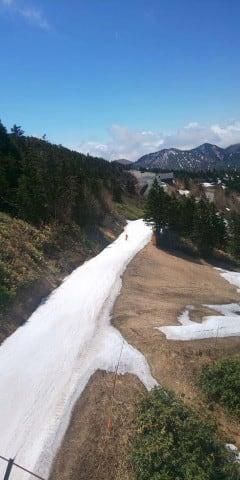
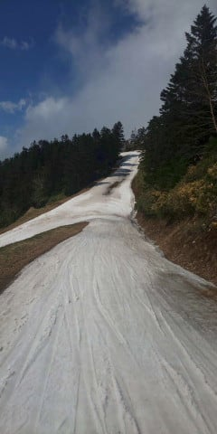
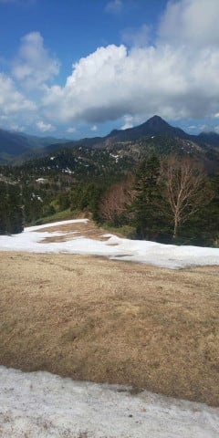
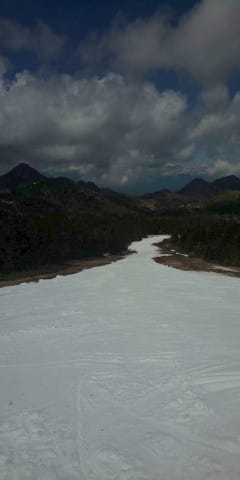
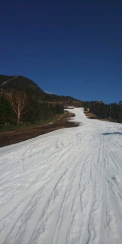
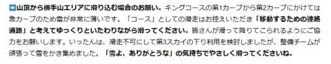
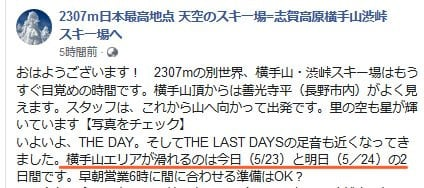

# 5月22日（金）の横手山，特派員からの写真

📅 投稿日時: 2020-05-23 10:06:54

🏷️ カテゴリ: [日記](cc4b5682fb7b8b144980957a978653fb0.md)

えー．

このBlogの明け方更新が続いていたので，

気づいていた方もいるかもしれませんが．

今週はちょいとヘビーな日程が続き．

…その疲れが出たのか，昨日は夜10時に

撃沈していました…

だもんで，

更新がちょっと遅れてしまい，

今さら感もありますが，

昨日の横手山の写真を特派員の方から

送ってもらっていたので，

それを掲載します～！

本日も天気がいいみたいですが，昨日も横手山は

天気が良かったようですね～…

しかし，第2スカイリフト降りてから

メインバーンに出るまでのルート，

もう廊下1本の感じで…

ショートカットパスは完全に

雪が消えてますね…

メインバーンも雪が薄くなってきてますし…

一番狭いところでは，幅7-8ｍに狭くなっちゃってる

ようです…

本日は，横手第2，第3，渋峠が動いてますが，

この状況で，何とかぎりぎり横手第3のキングコースも

滑って降りられるようにしているようで…

横手・渋のスタッフの執念を感じる…

（[横手山スキー場ホームページ](https://yokoteyama2307.com/news/9080/)より）

…そして，横手山の営業も今週末までと

正式にアナウンスがありましたね…

（[横手山Facebook](https://www.facebook.com/yokoteyama2305/posts/2573107472789146?__tn__=-R)より）

横手山は終わっちゃうけど．

渋峠は雪がある限り営業するみたいなので…

8月くらいまでもってくれると嬉しいな！！！←だから，そうなったらもう異常気象でヤバいから
