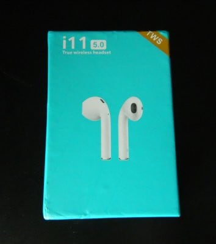
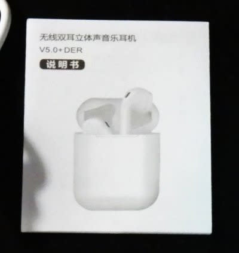

# AirPodsコピーの800円の激安Bluetooth TWSイヤホンを買ってみた…音質・性能は予想以上．普通に通話もできるよ！

📅 投稿日時: 2020-06-11 04:06:34

🏷️ カテゴリ: [PC,カメラ&小物](c0d8caed13e597efe97b661a8ae56bed0.md)

えー．

最近，在宅勤務で自宅にいることが多く．

スマホでの通話や音楽を聴く頻度が

以前より高くなり．

…で，スマホ通話用には有線のマイク付き

イヤホンを使ってたのですけど．

…有線だと，コードが邪魔だなぁ…

無線のヘッドセットがいいかなぁ…

と，Bluetoothヘッドセットを興味本位で

探し始めてしまい．

どうせならAppleのAirpodsみたいに，

左右が独立したイヤホンタイプで

マイク付き…ってのが．

外で音楽を聴くときにも使えるし．

そのまま通話できれば便利だよな…

ってな感じで．

だんだん違う方向に走り，

AirPodsコピーみたいな，TWS（完全左右独立タイプ）

Bluetoothイヤホンマイクを探し始めてしまい…

私がスマートウォッチを買った通販サイト，

Gearbest．

ここで，なんとAirPodsのパチもん（関西風表記）が，

$7以下で売ってますよ！！？？

700円ちょい！？？

これ，ホントにBluetoothでつながるの？？

マイクもついてるの？？

それで，この値段？？

…そして，送料もわずか$0.73．

これって…送料込みでも$7.32．

800円くらいじゃないですか！！

…変な日本の通販だと，国内の送料だけで

この値段超えるよね…

とりあえず．

ホントにBluetoothのTWSイヤホンなのか．

マイクが付いているのか．

使い物になるのか．

…全く分かりませんでしたが．

失敗しても800円．

Blogネタになるのなら，

全く使えなくても惜しくない金額っ！

と．

ついついポチってしまったのでした…

ふむ．

どうやら中国からの送付になり．

赤線部分を見ると，到着まで12~25日くらい

かかるようですね…

まぁ，送料$0.73．中国から日本まで，

100円以下の送料で送ってもらうのだから．

そのくらいの日数は気長に待ちますか…

で．

到着するまでの間に調べてみると．

どうも，今回私が買ったこの商品．

AirPodsコピーを作っている

Gocommaという中国メーカーに，

[i11TWS](https://www.gearbest.com/headsets/pp_009561380399.html?wid=1433363)という商品があり．

今回私が買ったのは，さらにそれの

ニセ物みたいで．

商品名を同じi11TWSとしているようです…

コピー品ながらも，Gearbestサイトでの

表記スペックは，

・Bluetooth 5.0

・イヤホンの連続音楽再生時間，2-3時間

・マイク付き，通話時間4時間

・ケースの電池でイヤホン4回充電可能

・ケースの充電1時間

・タッチコントロール

など，必要な機能は一通りそろっているように

見えます…

で．

購入したのが5月22日．

その後．荷物追跡をすると…

うーむ．

5月23日に運送会社に渡されて，

5月24日に運送会社の施設から出たみたいですが…

それ以降追跡情報が全く更新されず．

一体いつ日本に入るんだろう…

と思っていたら．

6月9日に，いきなり到着しました～！！

$0.74の送料では，個別追跡はサポートしてない

ようですね…

…注文から到着まで，18日．

まぁ，標準的な日数で到着ですかね．

梱包は，郵送用のプチプチ袋に…

そのまま箱が入ってました～！

ということで．

送料込み800円のBluetooth TWSイヤホン．

いざ開梱…！

内容物はこんな感じですか…

まず，本体ケース．

フィルムで保護されているので，

フィルムは剥がしちゃいましょう…

ケースを開けると，イヤホン本体が入ってます…

そして，説明書…

表が中国語，裏が英語です．

そして，充電ケーブル．

…って，これ，USBじゃなく，Lightningケーブルなのね…！

とりあえず．

800円のBluetoothイヤホン．

[使ってみた感じは，次回](e82da2424447d2edf1e16e8f583884283.md)！

## 💬 コメント一覧

### 💬 コメント by (アリス)
**タイトル**: AMAZFIT PACEについて
**投稿日**: 2020-06-11 07:49:22

skier_ s様

初めましてGokurakuさんのブログ愛読者のアリスと言います。

s様のブログも毎回読ませていただいており大変参考になっております。

ぶしつけながら質問させてください。

s様のスマートウオッチの説明ブログを拝見させていただき、『これは便利だ』と思い私も早速AMAZFIT PACEを香港の代理店から購入しました。初期化、スマホとのペアリングも終了し運動記録モードを確認したところ8種類しかなく、スキー、テニス、サッカー、縄跳びモードがないようです。

設定が悪いのか、不良品なのかs様の想定をお聞かせください。

誠に勝手ながらいきなりで申し訳ありません。

### 💬 コメント by (Skier_S)
**タイトル**: ＞アリスさま
**投稿日**: 2020-06-12 02:34:34

はじめまして～！

コメントありがとうございます．

Amazfit PACEは，時計のファームを最新版にしないとスポーツは8種類しか出てきません．

設定メニューから「update」を選んでください．

時計のファームウェアアップデートが始まると思います…

ファームウェアアップデートが完了したら，スキーモードがあるはずです！

