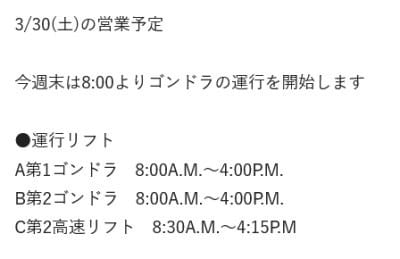
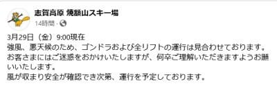
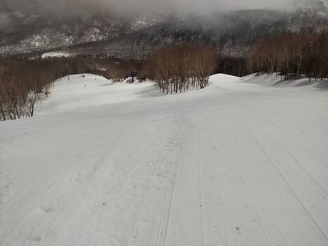
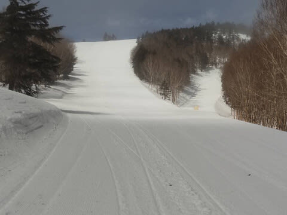
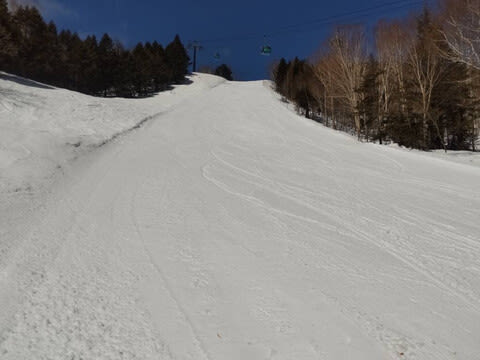
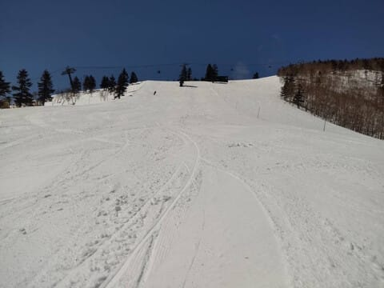
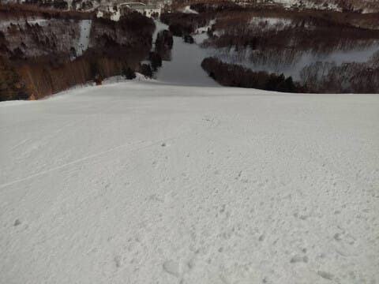
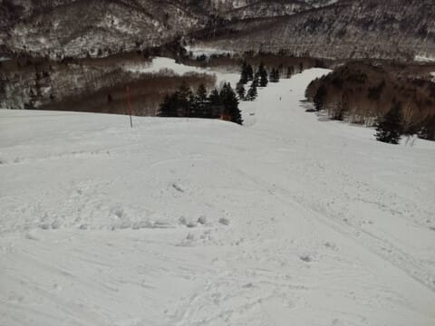

# 3月29日(金)の志賀高原スキー場は，特派員によると天気は雨の荒天のち好転して好天に！午後は晴れたけど気温が高く滑りの悪い雪に…

📅 投稿日時: 2024-03-30 00:48:12

ということで．

今週末が3月最後の週末になりますが…

どうやら今週末の焼額山スキー場．

いつもより30分早く営業開始するようです！！

そして，終了時間はいつもと一緒なので，

営業時間が30分伸びます！！

素晴らしい！！

（[焼額山スキー場ホームページ](https://www.princehotels.co.jp/ski/shiga/winter/)より）

で．

週末に滑りに行く身にとっては，

果たして昨晩から今日午前にかけての雨で，

ゲレンデがどうなっているのか気になる

ところですが…

とりあえず．

本日29日(金)の朝は，ひどい雨＆風で

始まったようで…

あさイチは焼額を始め，志賀高原のほとんどの

リフトが運休になる暴風雨だったみたいです(泣)

あぁ…高温の雨＆風で雪が解けていく…（涙）

（[焼額山スキー場Facebook](https://www.facebook.com/yakebitaiyama/posts/pfbid02FWo1NX2J6QZS6ndbJAX8sLfKUpaFdYzCUsvGBazb3RNZ72cwWBhkzeyAhokK3ArDl)より）

でも．

11時半ごろに風と雨がやみ，焼額は一気に

全リフト・ゴンドラが運転開始！

ちょっと雨で融けた感じのシマシマですが，

ほとんどだれも滑ってませんね…

そして．

午前中は多少雲が残っていたものの．

じきに日が射し始め…

昼過ぎには，すっきり晴れに！

晴れてて結構気持ちよさそうですけど，

急斜面はいいけど，緩斜面は板に張り付く

滑りの悪い雪だったようです…（涙）

で．

やっぱり雨でちょっと雪は減ったものの．

一時クローズになったオリンピックコースも

積雪はまだまだあるようで．

2月末にクローズしたときはもうだめかと

思ったオリンピックコース．

無事4月までもちそうです…！！

そして．

雨を吸った後に日差しに照らされ，

ずっしり重い春の雪になった本日ですが．

人が少なかったので，夕方になっても

そこまでバーンは荒れなかったようです…！

ってなことで．

かなりの雨は降って雪は減ったものの，

バーンに土が出るほどの壊滅的な

状況ではなく，まだまだたっぷり

雪が残っている感じの志賀高原ですが．

今週末は，土日とも晴れますよ～！！

…って，気温が高いこの時期，

ホントは晴れよりも曇りのほうが

嬉しかったりする…

とりあえず．

明日土曜日も，あさイチは多少締まり

気味で気持ちいいバーンだと

思いますが．

営業開始しばらくでかなり緩み，

午後はバーンが荒れそうな感じ…

そして，日曜も晴れます！

ちょっと雲が多くなる時もあるかも

しれないけど，この日も気温が高く

強い日差しで，朝はちょっと締まり

気味の雪もすぐに緩んで，

昼間はかなりザブザブ雪になりそう．

ただ，黄砂にやられたら…

かなり滑らない雪になるかも…（泣）

とりあえず．

天気は良さそうだから，気温が上がろうが

滑る雪ならそこそこ楽しめると思うので．

黄砂で滑らない雪にならないよう，

今週末に志賀高原に行く人は，

全身全霊で激しいビートの

黄砂来るな来るな踊りを

踊って，板が滑るよう祈りましょう…！！←どんな踊りだ

ってなことで．

今週末も志賀高原で滑ってます～！！

いつも通り，あと2時間45後に出発…

2時間しか寝られない…（涙）
